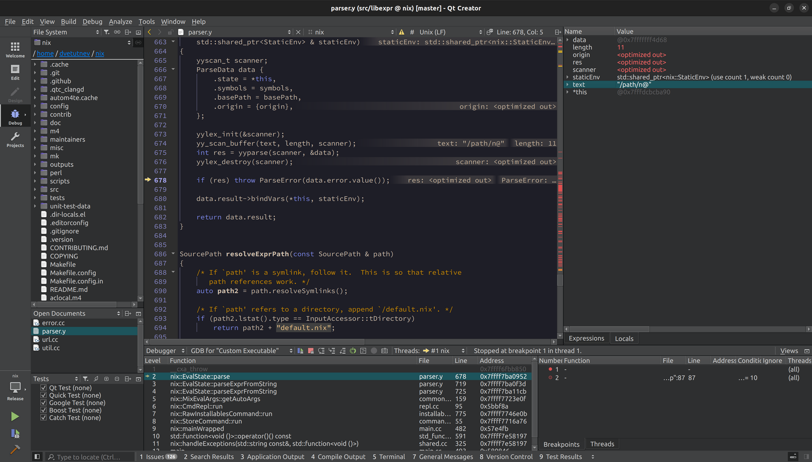
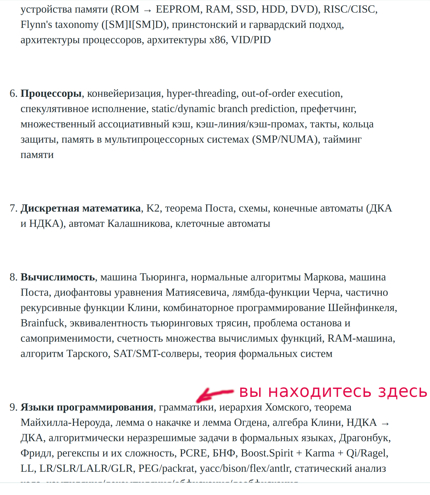

# First header

## Second header

* list 1
* list 2

Text

*italic*

**BBBBBB**

Русский






# Run tests

```
nix eval --impure --expr 'import ./test.nix {}'
```

```
nix-build -A tests.fetchurl
```