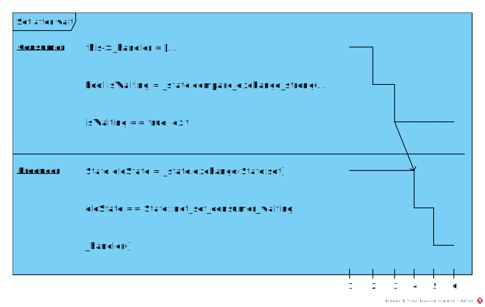
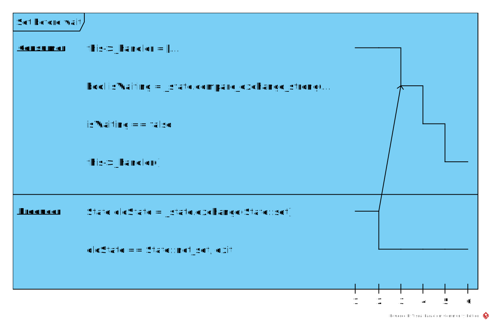
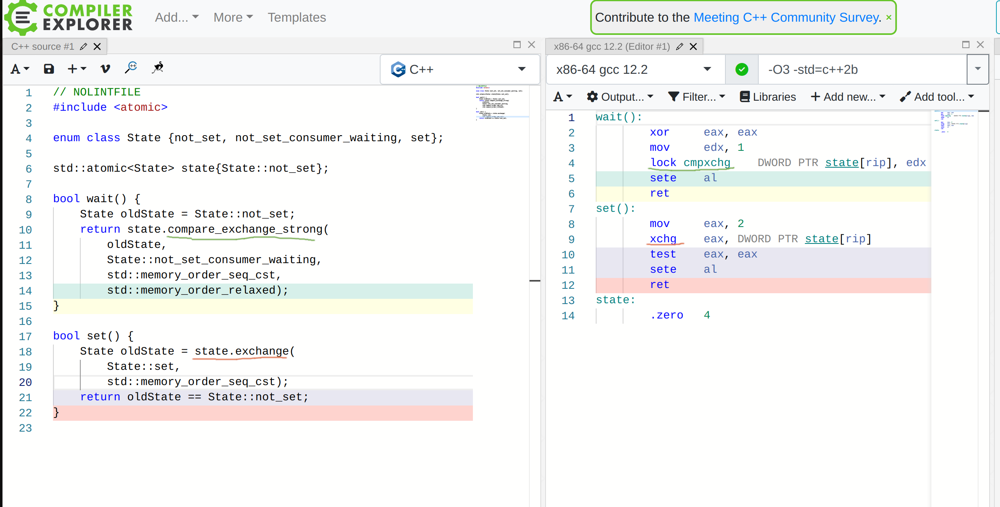
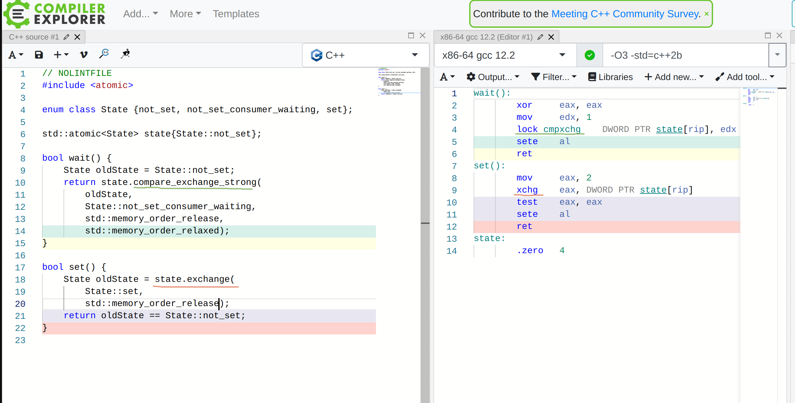
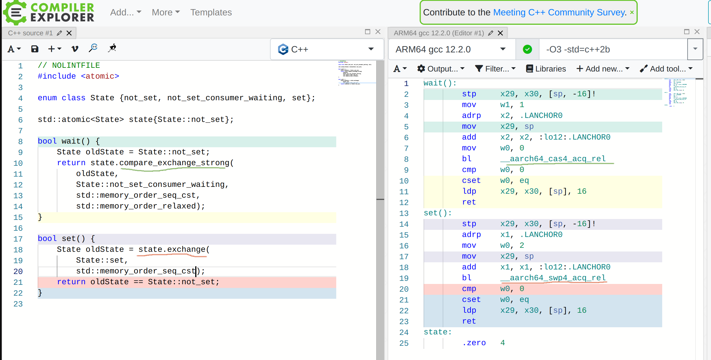
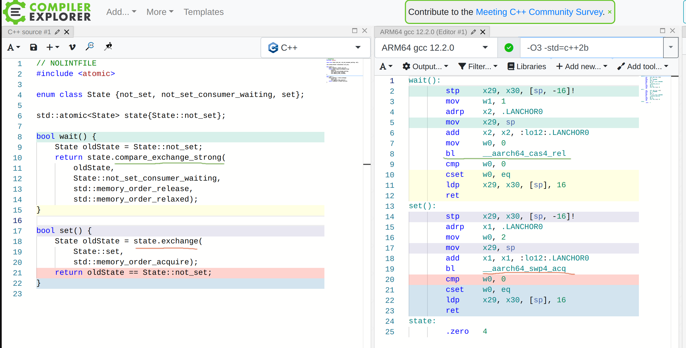
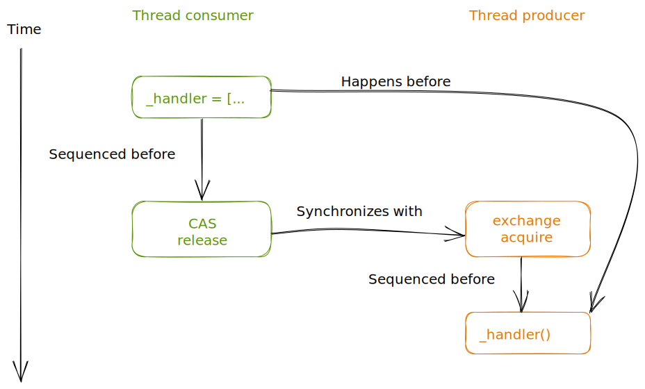

В предыдущей [статье](https://kysa.me/boost-asio-coroutines-event/) был описан элемент синхронизации **Event**, аналогичный оному из [cppcoro](https://github.com/lewissbaker/cppcoro?ref=kysa.me#single_consumer_event). Ошибка была в том, что весь механизм синхронизации был перенесен из **cppcoro** в другую среду без какой-либо валидации. Правильным бы на тот момент решением было бы использовать в атомарных операциях **memory order** по умолчанию ([std::memory_order_seq_cst](http://en.cppreference.com/w/cpp/atomic/memory_order?ref=kysa.me)) тем самым обеспечивая [sequential consistency](https://en.wikipedia.org/wiki/Sequential_consistency?ref=kysa.me)_[.](https://en.wikipedia.org/wiki/Sequential_consistency?ref=kysa.me)_

```cpp
class Event
{
    enum class State { not_set, not_set_consumer_waiting, set };
    std::atomic<State> _state;
    std::move_only_function<void()> _handler;

public:
    Event() : _state{State::not_set} {}

    boost::asio::awaitable<void> wait(boost::asio::any_io_executor executor) {
        auto initiate = [this, executor]<typename Handler>(Handler&& handler) mutable
        {
            this->_handler = [executor, handler = std::forward<Handler>(handler)]() mutable {
                boost::asio::post(executor, std::move(handler));
            };

            State oldState = State::not_set;
            bool isWaiting = _state.compare_exchange_strong(
                oldState,
                State::not_set_consumer_waiting);

            if (!isWaiting) {
                this->_handler();
            }
        };

        return boost::asio::async_initiate<
            decltype(boost::asio::use_awaitable), void()>(
                initiate, boost::asio::use_awaitable);
    }

    void set() {
        State oldState = _state.exchange(State::set);
        if (oldState == State::not_set_consumer_waiting) {
            _handler();
        }
    }
};
```

В этом случае обеспечивается упорядоченность операций с общими, для нескольких потоков, переменными (в нашем случаи полем `Event::_handler`): операции не могут быть переупорядочены, и выше, и ниже атомарной операции. Т.е. выполнение операции запись/чтение какой-то переменной, которая (операция) в исходнике выше атомарной операции, не может быть выполнена (для всех потоков) позже этой атомарной операции. Аналогично и для другой стороны: операции чтение/запись не могут быть переупорядочены выше атомарной операции. Это и есть [sequential consistency](https://en.wikipedia.org/wiki/Sequential_consistency?ref=kysa.me).

В итоге возможны ровно два пути выполнения. В первом случаи в лямбде `initiate` метода `Event::wait` операция `_state.compare_exchange_strong` выполняется раньше, чем операция`_state.exchange` в методе `Event::set` запишет новое значение и завершается успешно. На этом планирование пробуждения лямбдой `initiate` завершается. В дальнейшем операция `_state.exchage` в методе `Event::set` записывает новое значение и возвращает в качестве предыдущего значения `State::not_set_consumer_waiting` (записанное [**CAS**-ом](https://en.wikipedia.org/wiki/Compare-and-swap?ref=kysa.me) в методе `Event::wait` на строке 18). Т.к. предыдущее значение поля `Event::_state` равно `State::not_set_consumer_waiting` выполняется вызов `_handler()`, который отправляет на исполнение в экзекьютор аргумент-функтор `handler` лямбды `initiate`, тем самым пробуждая (на следующей итерации цикла событий) короутину, приостановленную на операции `co_await event.wait()`.



Во втором случаи операция `_state.exchange` в методе `Event::set` выполняется раньше, чем операция `_state.compare_exchange_strong` запишет новое значение и соответственно возвращает в качестве предыдущего значения `State::not_set` (присвоенное конструктором). Т.к. предыдущее значение поля `Event::_state` не равно `State::not_set_consumer_waiting`, выполнение метода `Event::set` на этом завершается **без** вызова `_handler()`_._ Далее в лямбде `initiate` метода `Event::wait` завершается операция `___state.compare_exchange_strong` и завершается она **неуспешно**, т.к. метод `Event::set` уже записал в поле `Event::_state` значение `State::set` вместо ожидаемого `State::not_set`. Неудачное завершение **CAS**-а является сигналом для вызова `this->_handler()` и пробуждения короутины.



Выше были рассмотрены оба возможных пути выполнения при обращении к методам `Event::set` и `Event::wait` из разных потоков. Первый путь обычный, в котором _подписчик_, которого нужно приостановить, записывает в поле `Event::_handler` обработчик пробуждения и засыпает, а _издатель_ через какое-то время запускает этот обработчик пробуждая _подписчика_. Во втором пути _издатель_ успевает эмитировать сигнал на пробуждение раньше, чем _подписчик_ запишет в поле `Event::_handler` обработчик пробуждения и этот обработчик запускает уже сам _подписчик_. Т.к. пробуждение осуществляется отправкой функтора на исполнение в заданный экзекьютор не важно из какого потока будет вызван обработчик `Event::_handler`. Важно чтобы он вызывался не раньше чем он будет записан в поле `Event::_handler` и не раньше чем _издатель_ вызовет метод `Event::set`.

# ThreadSanitizer

Теперь опробуем инструментальную верификацию синхронизации. Для этого в компиляторах GCC и Clang есть анализатор [ThreadSanitizer](https://github.com/google/sanitizers/wiki/ThreadSanitizerCppManual?ref=kysa.me), который динамически отслеживает несинхронизированный доступ к переменным из разных потоков. Этот анализатор как обычно не серебряная пуля и может давать сбои:

- false-positive - из-за того, что [не поддерживает](https://github.com/google/sanitizers/issues/1415?ref=kysa.me) функцию [atomic_thread_fence](https://en.cppreference.com/w/cpp/atomic/atomic_thread_fence?ref=kysa.me). Об этом компилятор сразу говорит в своих предупреждениях. [Настройки](https://github.com/google/sanitizers/wiki/ThreadSanitizerCppManual?ref=kysa.me#suppressing-reports) анализатора позволяют подавить это.
- false-negative - эти сбои возможны из-за его динамической природы: TSan отслеживает несинхронизированный доступ к данным только если над ними производятся операции чтение/запись из разных потоков во время выполнения. Если в коде возможен такой путь выполнения, но тестами он не покрывается то TSan его не обнаружит. Поэтому при планировании тестов этому стоит уделить повышенное внимание.

Запустить его достаточно просто: нужно передать компилятору и компоновщику ключи `-fsanitize=thread` и просто запустить тесты. Чтобы видеть в логах имена исходных файлов и номера строк нужно также добавить ключ `-g`.

<details><summary>Пример для CMake</summary>

```shell
$ cmake -S . -B build_tsan -G Ninja \
-DCMAKE_BUILD_TYPE=Debug \
-DCMAKE_CXX_FLAGS="-fsanitize=thread" \
-DCMAKE_C_FLAGS="-fsanitize=thread" \
-DCMAKE_EXE_LINKER_FLAGS="-fsanitize=thread" \
-DCMAKE_MODULE_LINKER_FLAGS="-fsanitize=thread"
```

</details>

Тест будет таким:

```cpp
void multithread_test_func(std::size_t count) {
    thread_pool tp{2};
    any_io_executor executorA = tp.get_executor();
    any_io_executor executorB = tp.get_executor();

    for (std::size_t i = 0; i < count; i++)
    {
        Event event;
        std::atomic_bool consumerDone{false};
        std::atomic_bool producerDone{false};

        auto consumer = [&]() -> awaitable {
            co_await event.wait(co_await this_coro::executor);
            consumerDone.store(true);
            co_return;
        };

        auto producer = [&]() -> awaitable {
            event.set();
            producerDone.store(true);
            co_return;
        };

        co_spawn((i % 2) ? executorA : executorB, consumer(), detached);
        co_spawn((i % 2) ? executorB : executorA, producer(), detached);

        while (!consumerDone.load() || !producerDone.load())
            ;
    };

    tp.join();
}

BOOST_AUTO_TEST_CASE(multithread_1) { multithread_test_func(1); }
BOOST_AUTO_TEST_CASE(multithread_10k) { multithread_test_func(10'000); }
```

перед этим отключаем упорядочивание операций с полем `Event::_state` (чтобы увидеть срабатывание TSan):

```diff
--- a/include/event.h
+++ b/include/event.h
@@ -23,7 +23,9 @@ public:
             State oldState = State::not_set;
             const bool isWaiting = _state.compare_exchange_strong(
                 oldState,
-                State::not_set_consumer_waiting);
+                State::not_set_consumer_waiting,
+                std::memory_order_relaxed,
+                std::memory_order_relaxed);
 
             if (!isWaiting) {
                 this->_handler();
@@ -36,7 +38,8 @@ public:
     }
 
     void set() {
-        const State oldState = _state.exchange(State::set);
+        const State oldState = _state.exchange(State::set,
+                                               std::memory_order_relaxed);
         if (oldState == State::not_set_consumer_waiting) {
             _handler();
         }
```

запускаем тест и получаем приблизительно такой лог:

<details><summary>под катом</summary>

```shell
[nix-shell:~/boost_asio_awaitable_ext]$ build_tsan/test/tests -t tests_Event/multithread_10k
Running 1 test case...
==================
WARNING: ThreadSanitizer: data race (pid=200541)
  Read of size 8 at 0x7ffea05d29c8 by thread T2:
    #0 std::move_only_function<void ()>::operator()() /nix/store/jx7mp3znhndb6idpyqff2wh7mg8jkmaw-gcc-12.2.0/include/c++/12.2.0/bits/mofunc_impl.h:185 (tests+0x44b12e)
    #1 boost::asio::awaitable_ext::Event::set() /home/dvetutnev/boost_asio_awaitable_ext/include/event.h:44 (tests+0x44b12e)
    #2 operator() /home/dvetutnev/boost_asio_awaitable_ext/test/test_event.cpp:117 (tests+0x44b12e)
    #3 std::__n4861::coroutine_handle<void>::resume() const /nix/store/jx7mp3znhndb6idpyqff2wh7mg8jkmaw-gcc-12.2.0/include/c++/12.2.0/coroutine:135 (tests+0x42fa2b)
    #4 boost::asio::detail::awaitable_frame_base<boost::asio::any_io_executor>::resume() /home/dvetutnev/.conan/data/boost/1.79.0/_/_/package/1671931156455a119d7c3f14d951ac5fdbc5cd10/include/boost/asio/impl/awaitable.hpp:455 (tests+0x42fa2b)
    #5 boost::asio::detail::awaitable_thread<boost::asio::any_io_executor>::pump() /home/dvetutnev/.conan/data/boost/1.79.0/_/_/package/1671931156455a119d7c3f14d951ac5fdbc5cd10/include/boost/asio/impl/awaitable.hpp:713 (tests+0x42fa2b)
    #6 boost::asio::detail::awaitable_handler<boost::asio::any_io_executor>::operator()() /home/dvetutnev/.conan/data/boost/1.79.0/_/_/package/1671931156455a119d7c3f14d951ac5fdbc5cd10/include/boost/asio/impl/use_awaitable.hpp:73 (tests+0x42fa2b)
    #7 boost::asio::detail::binder0<boost::asio::detail::awaitable_handler<boost::asio::any_io_executor> >::operator()() /home/dvetutnev/.conan/data/boost/1.79.0/_/_/package/1671931156455a119d7c3f14d951ac5fdbc5cd10/include/boost/asio/detail/bind_handler.hpp:60 (tests+0x42fc65)
    #8 void boost::asio::asio_handler_invoke<boost::asio::detail::binder0<boost::asio::detail::awaitable_handler<boost::asio::any_io_executor> > >(boost::asio::detail::binder0<boost::asio::detail::awaitable_handler<boost::asio::any_io_executor> >&, ...) /home/dvetutnev/.conan/data/boost/1.79.0/_/_/package/1671931156455a119d7c3f14d951ac5fdbc5cd10/include/boost/asio/handler_invoke_hook.hpp:88 (tests+0x42fc65)
    #9 void boost_asio_handler_invoke_helpers::invoke<boost::asio::detail::binder0<boost::asio::detail::awaitable_handler<boost::asio::any_io_executor> >, boost::asio::detail::awaitable_handler<boost::asio::any_io_executor> >(boost::asio::detail::binder0<boost::asio::detail::awaitable_handler<boost::asio::any_io_executor> >&, boost::asio::detail::awaitable_handler<boost::asio::any_io_executor>&) /home/dvetutnev/.conan/data/boost/1.79.0/_/_/package/1671931156455a119d7c3f14d951ac5fdbc5cd10/include/boost/asio/detail/handler_invoke_helpers.hpp:54 (tests+0x42fc65)
    #10 void boost::asio::detail::asio_handler_invoke<boost::asio::detail::binder0<boost::asio::detail::awaitable_handler<boost::asio::any_io_executor> >, boost::asio::detail::awaitable_handler<boost::asio::any_io_executor> >(boost::asio::detail::binder0<boost::asio::detail::awaitable_handler<boost::asio::any_io_executor> >&, boost::asio::detail::binder0<boost::asio::detail::awaitable_handler<boost::asio::any_io_executor> >*) /home/dvetutnev/.conan/data/boost/1.79.0/_/_/package/1671931156455a119d7c3f14d951ac5fdbc5cd10/include/boost/asio/detail/bind_handler.hpp:111 (tests+0x42fc65)
    #11 void boost_asio_handler_invoke_helpers::invoke<boost::asio::detail::binder0<boost::asio::detail::awaitable_handler<boost::asio::any_io_executor> >, boost::asio::detail::binder0<boost::asio::detail::awaitable_handler<boost::asio::any_io_executor> > >(boost::asio::detail::binder0<boost::asio::detail::awaitable_handler<boost::asio::any_io_executor> >&, boost::asio::detail::binder0<boost::asio::detail::awaitable_handler<boost::asio::any_io_executor> >&) /home/dvetutnev/.conan/data/boost/1.79.0/_/_/package/1671931156455a119d7c3f14d951ac5fdbc5cd10/include/boost/asio/detail/handler_invoke_helpers.hpp:54 (tests+0x42fc65)
    #12 void boost::asio::detail::executor_function::complete<boost::asio::detail::binder0<boost::asio::detail::awaitable_handler<boost::asio::any_io_executor> >, std::allocator<void> >(boost::asio::detail::executor_function::impl_base*, bool) /home/dvetutnev/.conan/data/boost/1.79.0/_/_/package/1671931156455a119d7c3f14d951ac5fdbc5cd10/include/boost/asio/detail/executor_function.hpp:116 (tests+0x42fc65)
    #13 boost::asio::detail::executor_function::operator()() /home/dvetutnev/.conan/data/boost/1.79.0/_/_/package/1671931156455a119d7c3f14d951ac5fdbc5cd10/include/boost/asio/detail/executor_function.hpp:64 (tests+0x42e204)
    #14 void boost::asio::asio_handler_invoke<boost::asio::detail::executor_function>(boost::asio::detail::executor_function&, ...) /home/dvetutnev/.conan/data/boost/1.79.0/_/_/package/1671931156455a119d7c3f14d951ac5fdbc5cd10/include/boost/asio/handler_invoke_hook.hpp:88 (tests+0x42e204)
    #15 void boost_asio_handler_invoke_helpers::invoke<boost::asio::detail::executor_function, boost::asio::detail::executor_function>(boost::asio::detail::executor_function&, boost::asio::detail::executor_function&) /home/dvetutnev/.conan/data/boost/1.79.0/_/_/package/1671931156455a119d7c3f14d951ac5fdbc5cd10/include/boost/asio/detail/handler_invoke_helpers.hpp:54 (tests+0x42e204)
    #16 boost::asio::detail::executor_op<boost::asio::detail::executor_function, std::allocator<void>, boost::asio::detail::scheduler_operation>::do_complete(void*, boost::asio::detail::scheduler_operation*, boost::system::error_code const&, unsigned long) /home/dvetutnev/.conan/data/boost/1.79.0/_/_/package/1671931156455a119d7c3f14d951ac5fdbc5cd10/include/boost/asio/detail/executor_op.hpp:70 (tests+0x42e204)
    #17 boost::asio::detail::scheduler_operation::complete(void*, boost::system::error_code const&, unsigned long) /home/dvetutnev/.conan/data/boost/1.79.0/_/_/package/1671931156455a119d7c3f14d951ac5fdbc5cd10/include/boost/asio/detail/scheduler_operation.hpp:40 (tests+0x424c7a)
    #18 boost::asio::detail::scheduler::do_run_one(boost::asio::detail::conditionally_enabled_mutex::scoped_lock&, boost::asio::detail::scheduler_thread_info&, boost::system::error_code const&) /home/dvetutnev/.conan/data/boost/1.79.0/_/_/package/1671931156455a119d7c3f14d951ac5fdbc5cd10/include/boost/asio/detail/impl/scheduler.ipp:492 (tests+0x424c7a)
    #19 boost::asio::detail::scheduler::run(boost::system::error_code&) /home/dvetutnev/.conan/data/boost/1.79.0/_/_/package/1671931156455a119d7c3f14d951ac5fdbc5cd10/include/boost/asio/detail/impl/scheduler.ipp:210 (tests+0x430b74)
    #20 boost::asio::thread_pool::thread_function::operator()() /home/dvetutnev/.conan/data/boost/1.79.0/_/_/package/1671931156455a119d7c3f14d951ac5fdbc5cd10/include/boost/asio/impl/thread_pool.ipp:39 (tests+0x43cec2)
    #21 boost::asio::detail::posix_thread::func<boost::asio::thread_pool::thread_function>::run() /home/dvetutnev/.conan/data/boost/1.79.0/_/_/package/1671931156455a119d7c3f14d951ac5fdbc5cd10/include/boost/asio/detail/posix_thread.hpp:86 (tests+0x43cec2)
    #22 boost_asio_detail_posix_thread_function /home/dvetutnev/.conan/data/boost/1.79.0/_/_/package/1671931156455a119d7c3f14d951ac5fdbc5cd10/include/boost/asio/detail/impl/posix_thread.ipp:74 (tests+0x41dd6a)

  Previous write of size 8 at 0x7ffea05d29c8 by thread T1:
    #0 std::enable_if<std::__and_<std::__not_<std::__is_tuple_like<void (*)(std::_Mofunc_base*)> >, std::is_move_constructible<void (*)(std::_Mofunc_base*)>, std::is_move_assignable<void (*)(std::_Mofunc_base*)> >::value, void>::type std::swap<void (*)(std::_Mofunc_base*)>(void (*&)(std::_Mofunc_base*), void (*&)(std::_Mofunc_base*)) /nix/store/jx7mp3znhndb6idpyqff2wh7mg8jkmaw-gcc-12.2.0/include/c++/12.2.0/bits/move.h:206 (tests+0x456310)
    #1 std::move_only_function<void ()>::swap(std::move_only_function<void ()>&) /nix/store/jx7mp3znhndb6idpyqff2wh7mg8jkmaw-gcc-12.2.0/include/c++/12.2.0/bits/mofunc_impl.h:193 (tests+0x456310)
    #2 std::move_only_function<void ()>& std::move_only_function<void ()>::operator=<boost::asio::awaitable_ext::Event::wait(boost::asio::any_io_executor)::{lambda(auto:1&&)#1}::operator()<boost::asio::detail::awaitable_handler<boost::asio::any_io_executor> >(boost::asio::detail::awaitable_handler<boost::asio::any_io_executor>&&)::{lambda()#1}>(boost::asio::detail::awaitable_handler<boost::asio::any_io_executor>&&) /nix/store/jx7mp3znhndb6idpyqff2wh7mg8jkmaw-gcc-12.2.0/include/c++/12.2.0/bits/mofunc_impl.h:164 (tests+0x456310)
    #3 auto boost::asio::awaitable_ext::Event::wait(boost::asio::any_io_executor)::{lambda(auto:1&&)#1}::operator()<boost::asio::detail::awaitable_handler<boost::asio::any_io_executor> >(boost::asio::detail::awaitable_handler<boost::asio::any_io_executor>&&) /home/dvetutnev/boost_asio_awaitable_ext/include/event.h:19 (tests+0x456310)
    #4 boost::asio::detail::awaitable_handler<boost::asio::any_io_executor>* boost::asio::async_result<boost::asio::use_awaitable_t<boost::asio::any_io_executor>, void ()>::do_init<boost::asio::awaitable_ext::Event::wait(boost::asio::any_io_executor)::{lambda(auto:1&&)#1}>(boost::asio::detail::awaitable_frame_base<boost::asio::any_io_executor>*, boost::asio::awaitable_ext::Event::wait(boost::asio::any_io_executor)::{lambda(auto:1&&)#1}&, boost::asio::use_awaitable_t<boost::asio::any_io_executor>) /home/dvetutnev/.conan/data/boost/1.79.0/_/_/package/1671931156455a119d7c3f14d951ac5fdbc5cd10/include/boost/asio/impl/use_awaitable.hpp:276 (tests+0x456310)
    #5 auto boost::asio::async_result<boost::asio::use_awaitable_t<boost::asio::any_io_executor>, void ()>::initiate<boost::asio::awaitable_ext::Event::wait(boost::asio::any_io_executor)::{lambda(auto:1&&)#1}>(boost::asio::awaitable_ext::Event::wait(boost::asio::any_io_executor)::{lambda(auto:1&&)#1}, boost::asio::use_awaitable_t<boost::asio::any_io_executor>)::{lambda(auto:1*)#1}::operator()<boost::asio::detail::awaitable_frame_base<boost::asio::any_io_executor> >(boost::asio::detail::awaitable_frame_base<boost::asio::any_io_executor>*) const /home/dvetutnev/.conan/data/boost/1.79.0/_/_/package/1671931156455a119d7c3f14d951ac5fdbc5cd10/include/boost/asio/impl/use_awaitable.hpp:286 (tests+0x456310)
    #6 _ZZN5boost4asio6detail20awaitable_frame_baseINS0_15any_io_executorEE15await_transformIZNS0_12async_resultINS0_15use_awaitable_tIS3_EEJFvvEEE8initiateIZNS0_13awaitable_ext5Event4waitES3_EUlOT_E_JEEENS0_9awaitableIvS3_EESE_S8_DpT0_EUlPSE_E_EEDaSE_PNSt9enable_ifIXsrSt14is_convertibleINSt9result_ofIFSE_PS4_EE4typeEPNS1_16awaitable_threadIS3_EEE5valueEvE4typeEEN6result13await_suspendENSt7__n486116coroutine_handleIvEE /home/dvetutnev/.conan/data/boost/1.79.0/_/_/package/1671931156455a119d7c3f14d951ac5fdbc5cd10/include/boost/asio/impl/awaitable.hpp:389 (tests+0x456310)
    #7 initiate /home/dvetutnev/.conan/data/boost/1.79.0/_/_/package/1671931156455a119d7c3f14d951ac5fdbc5cd10/include/boost/asio/impl/use_awaitable.hpp:284 (tests+0x456310)
    #8 std::__n4861::coroutine_handle<void>::resume() const /nix/store/jx7mp3znhndb6idpyqff2wh7mg8jkmaw-gcc-12.2.0/include/c++/12.2.0/coroutine:135 (tests+0x42fa2b)
    #9 boost::asio::detail::awaitable_frame_base<boost::asio::any_io_executor>::resume() /home/dvetutnev/.conan/data/boost/1.79.0/_/_/package/1671931156455a119d7c3f14d951ac5fdbc5cd10/include/boost/asio/impl/awaitable.hpp:455 (tests+0x42fa2b)
    #10 boost::asio::detail::awaitable_thread<boost::asio::any_io_executor>::pump() /home/dvetutnev/.conan/data/boost/1.79.0/_/_/package/1671931156455a119d7c3f14d951ac5fdbc5cd10/include/boost/asio/impl/awaitable.hpp:713 (tests+0x42fa2b)
    #11 boost::asio::detail::awaitable_handler<boost::asio::any_io_executor>::operator()() /home/dvetutnev/.conan/data/boost/1.79.0/_/_/package/1671931156455a119d7c3f14d951ac5fdbc5cd10/include/boost/asio/impl/use_awaitable.hpp:73 (tests+0x42fa2b)
    #12 boost::asio::detail::binder0<boost::asio::detail::awaitable_handler<boost::asio::any_io_executor> >::operator()() /home/dvetutnev/.conan/data/boost/1.79.0/_/_/package/1671931156455a119d7c3f14d951ac5fdbc5cd10/include/boost/asio/detail/bind_handler.hpp:60 (tests+0x42fc65)
    #13 void boost::asio::asio_handler_invoke<boost::asio::detail::binder0<boost::asio::detail::awaitable_handler<boost::asio::any_io_executor> > >(boost::asio::detail::binder0<boost::asio::detail::awaitable_handler<boost::asio::any_io_executor> >&, ...) /home/dvetutnev/.conan/data/boost/1.79.0/_/_/package/1671931156455a119d7c3f14d951ac5fdbc5cd10/include/boost/asio/handler_invoke_hook.hpp:88 (tests+0x42fc65)
    #14 void boost_asio_handler_invoke_helpers::invoke<boost::asio::detail::binder0<boost::asio::detail::awaitable_handler<boost::asio::any_io_executor> >, boost::asio::detail::awaitable_handler<boost::asio::any_io_executor> >(boost::asio::detail::binder0<boost::asio::detail::awaitable_handler<boost::asio::any_io_executor> >&, boost::asio::detail::awaitable_handler<boost::asio::any_io_executor>&) /home/dvetutnev/.conan/data/boost/1.79.0/_/_/package/1671931156455a119d7c3f14d951ac5fdbc5cd10/include/boost/asio/detail/handler_invoke_helpers.hpp:54 (tests+0x42fc65)
    #15 void boost::asio::detail::asio_handler_invoke<boost::asio::detail::binder0<boost::asio::detail::awaitable_handler<boost::asio::any_io_executor> >, boost::asio::detail::awaitable_handler<boost::asio::any_io_executor> >(boost::asio::detail::binder0<boost::asio::detail::awaitable_handler<boost::asio::any_io_executor> >&, boost::asio::detail::binder0<boost::asio::detail::awaitable_handler<boost::asio::any_io_executor> >*) /home/dvetutnev/.conan/data/boost/1.79.0/_/_/package/1671931156455a119d7c3f14d951ac5fdbc5cd10/include/boost/asio/detail/bind_handler.hpp:111 (tests+0x42fc65)
    #16 void boost_asio_handler_invoke_helpers::invoke<boost::asio::detail::binder0<boost::asio::detail::awaitable_handler<boost::asio::any_io_executor> >, boost::asio::detail::binder0<boost::asio::detail::awaitable_handler<boost::asio::any_io_executor> > >(boost::asio::detail::binder0<boost::asio::detail::awaitable_handler<boost::asio::any_io_executor> >&, boost::asio::detail::binder0<boost::asio::detail::awaitable_handler<boost::asio::any_io_executor> >&) /home/dvetutnev/.conan/data/boost/1.79.0/_/_/package/1671931156455a119d7c3f14d951ac5fdbc5cd10/include/boost/asio/detail/handler_invoke_helpers.hpp:54 (tests+0x42fc65)
    #17 void boost::asio::detail::executor_function::complete<boost::asio::detail::binder0<boost::asio::detail::awaitable_handler<boost::asio::any_io_executor> >, std::allocator<void> >(boost::asio::detail::executor_function::impl_base*, bool) /home/dvetutnev/.conan/data/boost/1.79.0/_/_/package/1671931156455a119d7c3f14d951ac5fdbc5cd10/include/boost/asio/detail/executor_function.hpp:116 (tests+0x42fc65)
    #18 boost::asio::detail::executor_function::operator()() /home/dvetutnev/.conan/data/boost/1.79.0/_/_/package/1671931156455a119d7c3f14d951ac5fdbc5cd10/include/boost/asio/detail/executor_function.hpp:64 (tests+0x42e204)
    #19 void boost::asio::asio_handler_invoke<boost::asio::detail::executor_function>(boost::asio::detail::executor_function&, ...) /home/dvetutnev/.conan/data/boost/1.79.0/_/_/package/1671931156455a119d7c3f14d951ac5fdbc5cd10/include/boost/asio/handler_invoke_hook.hpp:88 (tests+0x42e204)
    #20 void boost_asio_handler_invoke_helpers::invoke<boost::asio::detail::executor_function, boost::asio::detail::executor_function>(boost::asio::detail::executor_function&, boost::asio::detail::executor_function&) /home/dvetutnev/.conan/data/boost/1.79.0/_/_/package/1671931156455a119d7c3f14d951ac5fdbc5cd10/include/boost/asio/detail/handler_invoke_helpers.hpp:54 (tests+0x42e204)
    #21 boost::asio::detail::executor_op<boost::asio::detail::executor_function, std::allocator<void>, boost::asio::detail::scheduler_operation>::do_complete(void*, boost::asio::detail::scheduler_operation*, boost::system::error_code const&, unsigned long) /home/dvetutnev/.conan/data/boost/1.79.0/_/_/package/1671931156455a119d7c3f14d951ac5fdbc5cd10/include/boost/asio/detail/executor_op.hpp:70 (tests+0x42e204)
    #22 boost::asio::detail::scheduler_operation::complete(void*, boost::system::error_code const&, unsigned long) /home/dvetutnev/.conan/data/boost/1.79.0/_/_/package/1671931156455a119d7c3f14d951ac5fdbc5cd10/include/boost/asio/detail/scheduler_operation.hpp:40 (tests+0x424c7a)
    #23 boost::asio::detail::scheduler::do_run_one(boost::asio::detail::conditionally_enabled_mutex::scoped_lock&, boost::asio::detail::scheduler_thread_info&, boost::system::error_code const&) /home/dvetutnev/.conan/data/boost/1.79.0/_/_/package/1671931156455a119d7c3f14d951ac5fdbc5cd10/include/boost/asio/detail/impl/scheduler.ipp:492 (tests+0x424c7a)
    #24 boost::asio::detail::scheduler::run(boost::system::error_code&) /home/dvetutnev/.conan/data/boost/1.79.0/_/_/package/1671931156455a119d7c3f14d951ac5fdbc5cd10/include/boost/asio/detail/impl/scheduler.ipp:210 (tests+0x430b74)
    #25 boost::asio::thread_pool::thread_function::operator()() /home/dvetutnev/.conan/data/boost/1.79.0/_/_/package/1671931156455a119d7c3f14d951ac5fdbc5cd10/include/boost/asio/impl/thread_pool.ipp:39 (tests+0x43cec2)
    #26 boost::asio::detail::posix_thread::func<boost::asio::thread_pool::thread_function>::run() /home/dvetutnev/.conan/data/boost/1.79.0/_/_/package/1671931156455a119d7c3f14d951ac5fdbc5cd10/include/boost/asio/detail/posix_thread.hpp:86 (tests+0x43cec2)
    #27 boost_asio_detail_posix_thread_function /home/dvetutnev/.conan/data/boost/1.79.0/_/_/package/1671931156455a119d7c3f14d951ac5fdbc5cd10/include/boost/asio/detail/impl/posix_thread.ipp:74 (tests+0x41dd6a)

  Location is stack of main thread.

  Location is global '<null>' at 0x000000000000 ([stack]+0x1c9c8)

  Thread T2 (tid=200544, running) created by main thread at:
    #0 pthread_create <null> (libtsan.so.2+0x62de6)
    #1 boost::asio::detail::posix_thread::start_thread(boost::asio::detail::posix_thread::func_base*) /home/dvetutnev/.conan/data/boost/1.79.0/_/_/package/1671931156455a119d7c3f14d951ac5fdbc5cd10/include/boost/asio/detail/impl/posix_thread.ipp:59 (tests+0x455799)
    #2 boost::asio::detail::posix_thread::posix_thread<boost::asio::thread_pool::thread_function>(boost::asio::thread_pool::thread_function, unsigned int) /home/dvetutnev/.conan/data/boost/1.79.0/_/_/package/1671931156455a119d7c3f14d951ac5fdbc5cd10/include/boost/asio/detail/posix_thread.hpp:46 (tests+0x455799)
    #3 boost::asio::detail::thread_group::item::item<boost::asio::thread_pool::thread_function>(boost::asio::thread_pool::thread_function, boost::asio::detail::thread_group::item*) /home/dvetutnev/.conan/data/boost/1.79.0/_/_/package/1671931156455a119d7c3f14d951ac5fdbc5cd10/include/boost/asio/detail/thread_group.hpp:82 (tests+0x455799)
    #4 void boost::asio::detail::thread_group::create_thread<boost::asio::thread_pool::thread_function>(boost::asio::thread_pool::thread_function) /home/dvetutnev/.conan/data/boost/1.79.0/_/_/package/1671931156455a119d7c3f14d951ac5fdbc5cd10/include/boost/asio/detail/thread_group.hpp:47 (tests+0x455799)
    #5 void boost::asio::detail::thread_group::create_threads<boost::asio::thread_pool::thread_function>(boost::asio::thread_pool::thread_function, unsigned long) /home/dvetutnev/.conan/data/boost/1.79.0/_/_/package/1671931156455a119d7c3f14d951ac5fdbc5cd10/include/boost/asio/detail/thread_group.hpp:55 (tests+0x455799)
    #6 boost::asio::thread_pool::thread_pool(unsigned long) /home/dvetutnev/.conan/data/boost/1.79.0/_/_/package/1671931156455a119d7c3f14d951ac5fdbc5cd10/include/boost/asio/impl/thread_pool.ipp:95 (tests+0x455799)
    #7 multithread_test_func /home/dvetutnev/boost_asio_awaitable_ext/test/test_event.cpp:100 (tests+0x452ea5)
    #8 boost::asio::awaitable_ext::test::tests_Event::multithread_10k::test_method() /home/dvetutnev/boost_asio_awaitable_ext/test/test_event.cpp:134 (tests+0x454524)
    #9 multithread_10k_invoker /home/dvetutnev/boost_asio_awaitable_ext/test/test_event.cpp:134 (tests+0x454883)
    #10 boost::detail::function::void_function_invoker0<void (*)(), void>::invoke(boost::detail::function::function_buffer&) /home/dvetutnev/.conan/data/boost/1.79.0/_/_/package/1671931156455a119d7c3f14d951ac5fdbc5cd10/include/boost/function/function_template.hpp:117 (tests+0x41b707)
    #11 boost::function0<void>::operator()() const boost/function/function_template.hpp:763 (tests+0x4b532e)

  Thread T1 (tid=200543, running) created by main thread at:
    #0 pthread_create <null> (libtsan.so.2+0x62de6)
    #1 boost::asio::detail::posix_thread::start_thread(boost::asio::detail::posix_thread::func_base*) /home/dvetutnev/.conan/data/boost/1.79.0/_/_/package/1671931156455a119d7c3f14d951ac5fdbc5cd10/include/boost/asio/detail/impl/posix_thread.ipp:59 (tests+0x455799)
    #2 boost::asio::detail::posix_thread::posix_thread<boost::asio::thread_pool::thread_function>(boost::asio::thread_pool::thread_function, unsigned int) /home/dvetutnev/.conan/data/boost/1.79.0/_/_/package/1671931156455a119d7c3f14d951ac5fdbc5cd10/include/boost/asio/detail/posix_thread.hpp:46 (tests+0x455799)
    #3 boost::asio::detail::thread_group::item::item<boost::asio::thread_pool::thread_function>(boost::asio::thread_pool::thread_function, boost::asio::detail::thread_group::item*) /home/dvetutnev/.conan/data/boost/1.79.0/_/_/package/1671931156455a119d7c3f14d951ac5fdbc5cd10/include/boost/asio/detail/thread_group.hpp:82 (tests+0x455799)
    #4 void boost::asio::detail::thread_group::create_thread<boost::asio::thread_pool::thread_function>(boost::asio::thread_pool::thread_function) /home/dvetutnev/.conan/data/boost/1.79.0/_/_/package/1671931156455a119d7c3f14d951ac5fdbc5cd10/include/boost/asio/detail/thread_group.hpp:47 (tests+0x455799)
    #5 void boost::asio::detail::thread_group::create_threads<boost::asio::thread_pool::thread_function>(boost::asio::thread_pool::thread_function, unsigned long) /home/dvetutnev/.conan/data/boost/1.79.0/_/_/package/1671931156455a119d7c3f14d951ac5fdbc5cd10/include/boost/asio/detail/thread_group.hpp:55 (tests+0x455799)
    #6 boost::asio::thread_pool::thread_pool(unsigned long) /home/dvetutnev/.conan/data/boost/1.79.0/_/_/package/1671931156455a119d7c3f14d951ac5fdbc5cd10/include/boost/asio/impl/thread_pool.ipp:95 (tests+0x455799)
    #7 multithread_test_func /home/dvetutnev/boost_asio_awaitable_ext/test/test_event.cpp:100 (tests+0x452ea5)
    #8 boost::asio::awaitable_ext::test::tests_Event::multithread_10k::test_method() /home/dvetutnev/boost_asio_awaitable_ext/test/test_event.cpp:134 (tests+0x454524)
    #9 multithread_10k_invoker /home/dvetutnev/boost_asio_awaitable_ext/test/test_event.cpp:134 (tests+0x454883)
    #10 boost::detail::function::void_function_invoker0<void (*)(), void>::invoke(boost::detail::function::function_buffer&) /home/dvetutnev/.conan/data/boost/1.79.0/_/_/package/1671931156455a119d7c3f14d951ac5fdbc5cd10/include/boost/function/function_template.hpp:117 (tests+0x41b707)
    #11 boost::function0<void>::operator()() const boost/function/function_template.hpp:763 (tests+0x4b532e)

SUMMARY: ThreadSanitizer: data race /nix/store/jx7mp3znhndb6idpyqff2wh7mg8jkmaw-gcc-12.2.0/include/c++/12.2.0/bits/mofunc_impl.h:185 in std::move_only_function<void ()>::operator()()
==================

.
.
.

*** No errors detected
ThreadSanitizer: reported 8 warnings
```

</details>

отлично, TSan обнаружил несинхронизованные чтение/запись из разных поток и судя по логу (`std::move_only_function<void>`) как раз в окрестности поля `Event::_handler`. Теперь включаем упорядочивание атомарных операций. Сделать это можно указанием опции для TSan. Ну или убрать с атомарных операций `std::memory_order_relaxed` и пересобрать бинарник.

```shell
[nix-shell:~/boost_asio_awaitable_ext]$ TSAN_OPTIONS="force_seq_cst_atomics=1" \
build_tsan/test/tests -t tests_Event/multithread_10k
Running 1 test case...

*** No errors detected
```

Предупреждения TSan пропали, что нам и нужно.

# Acquire/Release семантика

<details><summary>Может сгенерить более быстрый код. Но это неточно.</summary>

На x86_64 оно транслируется в одни и те же инструкции процессора.





А вот для AArch64 это уже не так.



Для семантики **release/acquire** ассемблерный код получается другим.



</details>

Основные тезисы:

- Операции с этой семантикой работают совместно. Операции загрузки с семантикой **acquire** должна соответствовать операция сохранения с семантикой **release** (или **sequentially consistent**).
- Запись не переносится _(для всех ядер процессора)_ ниже операции сохранения с семантикой **release**, а чтение выше операции загрузки с семантикой **acquire.**
- Это не сколько про чтение/запись атомарных переменных, сколько про _side-эффекты_, т.е. про операции с другими переменными (в окрестностях операций с этой семантикой).

Теперь выберем семантики для операций `_state.exchange` в методе `Event::set` и **CAS** в методе `Event::wait`. С первого взгляда подходящими семантиками для обеих операций выглядит `std::memory_order_acq_rel`, т.к. они обе и читают данные, и пишут. Но рассмотрим подробней оба пути выполнения (в первом побеждает **CAS**, во втором `_state.exchange` и **CAS** возвращает `false`).

Сначала рассмотрим первый путь выполнения. В методе `Event::wait` полю `Event::_handler` присваивается функтор пробуждения короутины и последующая замена **CAS**-ом значения поля `Event::_state` на `State::not_set_consumer_waiting`. В методе `Event::set` операция `state._exchange` извлекает значение записанное **CAS**-ом и в дальнейшем выполняется загрузка поля `Event::_handler` для последующего вызова функтора пробуждения. Для того, чтобы операция чтения поля `Event::_handler` гарантировано прочитала значение записанное **перед** **CAS**-ом, **CAS** должен сохранять новое значение в поле `Event::_state` с семантикой **release**, операция `_state.exchange` загружать его с семантикой **acquire**.



Теперь рассмотрим второй путь выполнения. В методе `Event::set` операция `_state.exchange` записывает в поле `___state` значение `State::set`. В методе `Event::wait` **CAS** возвращает `false` т.к. ожидаемое значение (`State::not_set_consumer_waiting`) в поле `_state` не совпадает с текущим значением (`State::set`), записанным операцией `_state.exchage` в методе `Event::set`. Записи в переменную перед операцией `_state.exchange` нет, а методе `Event::wait` нет чтения после **CAS**, соответственно ничего синхронизировать не нужно. Остается последнее требование: **CAS** для сравнения должен увидеть последнее значение записанное операцией `_state .exchange`. На это есть ответ на [cppreference.com](https://en.cppreference.com/w/cpp?ref=kysa.me)

[**CAS** загружает](https://en.cppreference.com/w/cpp/atomic/atomic/compare_exchange?ref=kysa.me) последнее актуальное значение:

> Atomically compares the [object representation](https://en.cppreference.com/w/cpp/language/object?ref=kysa.me) (until C++20) [value representation](https://en.cppreference.com/w/cpp/language/object?ref=kysa.me) (since C++20) of *this with that of `expected`, and if those are bitwise-equal, replaces the former with `desired` (performs read-modify-write operation). Otherwise, loads the actual value stored in *this into `expected` (performs load operation).

[exchange](https://en.cppreference.com/w/cpp/atomic/atomic/exchange?ref=kysa.me) является [read-modify-write](https://en.cppreference.com/w/cpp/atomic/memory_order?ref=kysa.me) операцией и сохраняет новое значение с синхронизацией (а вот если бы вместо **exchange** была бы операция **store**, то ей бы потребовалась семантика **release**):

> **Release sequence**  
> After a release operation A is performed on an atomic object M, the longest continuous subsequence of the modification order of M that consists of
> 
> 1. Writes performed by the same thread that performed A (until C++20)
> 2. Atomic read-modify-write operations made to M by any thread  
>     is known as release sequence headed by A

В итоге для использования семантики acquire/release получается вот такой diff:

```diff
--- a/include/event.h
+++ b/include/event.h
@@ -23,7 +23,9 @@ public:
             State oldState = State::not_set;
             const bool isWaiting = _state.compare_exchange_strong(
                 oldState,
-                State::not_set_consumer_waiting);
+                State::not_set_consumer_waiting,
+                std::memory_order_release,
+                std::memory_order_relaxed);
 
             if (!isWaiting) {
                 this->_handler();
@@ -36,7 +38,8 @@ public:
     }
 
     void set() {
-        const State oldState = _state.exchange(State::set);
+        const State oldState = _state.exchange(State::set,
+                                               std::memory_order_acquire);
         if (oldState == State::not_set_consumer_waiting) {
             _handler();
         }
```

Последняя версия `Event` проверена на архитектурах x86_64 и AArch64 (Raspberry Pi 4). На обеих TSan не обнаружил несинхронизированного доступа к памяти.

# Список литературы

- Книга Энтони Уильямса: Параллельное программирование на С++ в действии. Практика разработки многопоточных программ. ISBN: 978-5-94074-537-2 , 978-5-97060-194-5.
- Цикл статей на Хабре: [Lock-free структуры данных](https://habr.com/ru/post/195948/?ref=kysa.me)
- Доклад на C++ User Group: [Алексей Веселовский - Анатомия ThreadSanitizer](https://www.youtube.com/watch?v=jP4S2cW4PSo&ref=kysa.me)