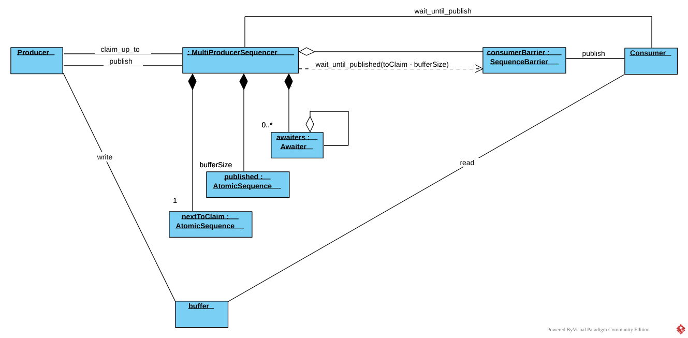
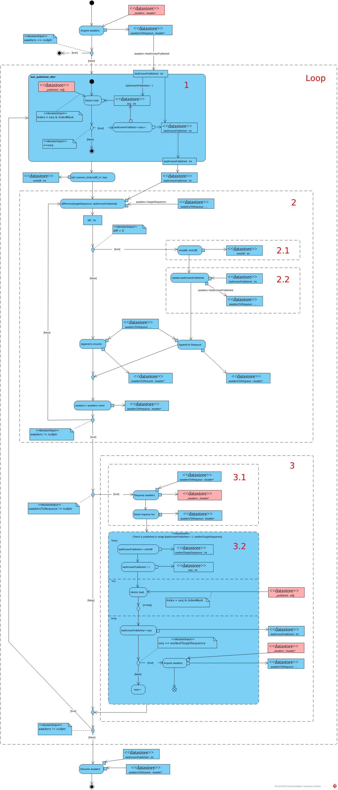
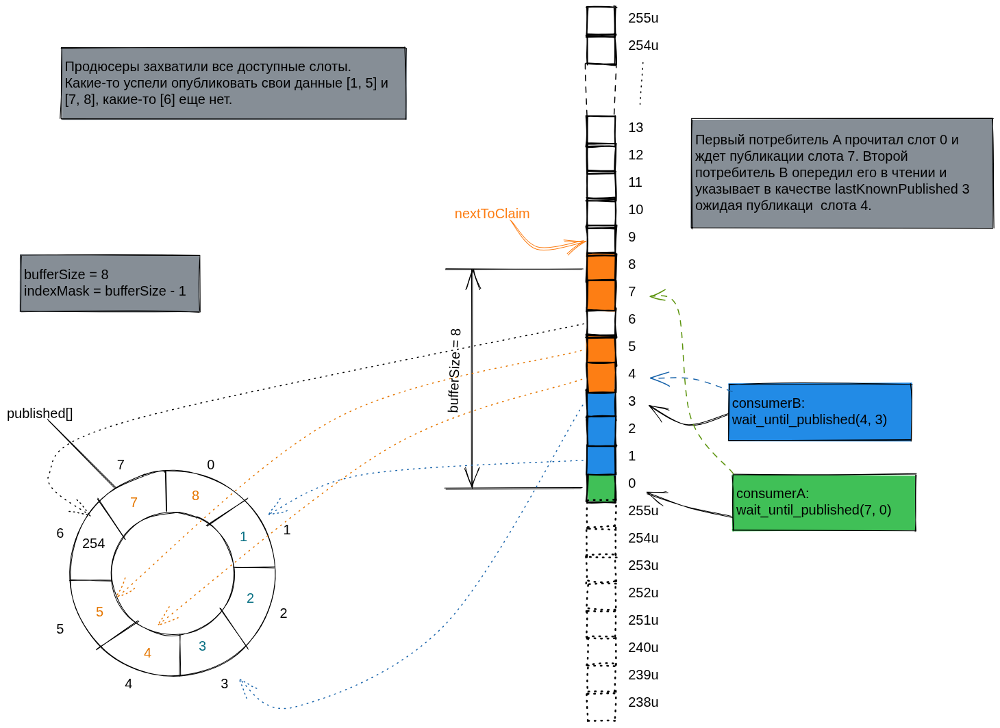
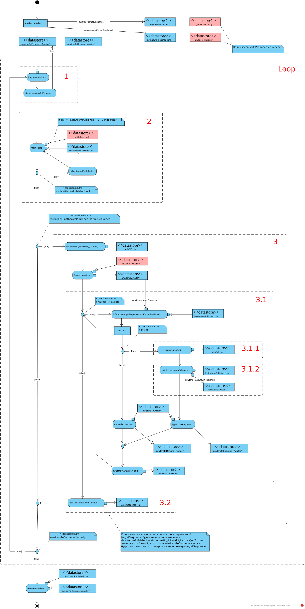

Следующий примитив синхронизации из [cppcoro](https://github.com/lewissbaker/cppcoro?ref=kysa.me#multi_producer_sequencer) - MultiProducerSequencer. Он предназначен для координации нескольких продюсеров и одного или нескольких (с использовании [группы барьеров](boost-asio-coroutines-sequencer-and-multiple-consumers.md)) потребителей. Продюсеры и потребители могут работать в разных тредах, основное назначение этого секвенсора - реализация _thread-safe_ очереди. Если продюсер только один, то стоит применять [SingleProducerSequencer](https://kysa.me/boost-asio-coroutines-singleproducersequencer/) для избежания излишнего оверхеда.

# Intro

Продюсеры сначала захватывают слоты в буфере, записывают в них данные и публикуют номера записанных слотов, аналогично тому как взаимодействует один продюсер с [SingleProducerSequencer](boost-asio-coroutines-singleproducersequencer.md). Т.к. захват слота, и публикация его номера после, раздельные операции, продюсеры могут публиковать номера записанных слотов в порядке отличным от порядка захвата, т.е. не в виде монотонно-возрастающей последовательности, дополнительной координации продюсеров не требуется и друг-друга они не блокируют. Если продюсер захватывает несколько смежных слотов, то ему необходимо публиковать **все** номера записанных им слотов (в отличии от секвенсора с одним продюсером), например используя перегрузку метода `MultiProducerSequencer::publish` для диапазона `SequenceRange`, передавая в него диапазон полученный из метода `MultiProducerSequencer::claim_up_to`.

Потребители в свою очередь получают номера записанных слотов в виде неубывающий последовательности. Потребитель никогда не получит слот N - 1, после слота N. Он может получить либо следующий слот N + 1, либо непрерывную группу смежных слотов (N + 1, N + 2, N + 3), т.е. потребители получают номера слотов в порядке захвата продюсерами. Для этого необходимо отслеживать последний номер слота прочитанного потребителем. Вариант брать в качестве последнего номера позицию барьера потребителя не подойдет, т.к. при нескольких потребителях в барьере-группе будет позиция самого отстающего и все остальные будут ждать его. Поэтому почетная обязанность отслеживать номер последнего прочитанного слота возложена на сам потребитель, этот номер он передает в метод `MultiProducerSequencer::wait_until_published` вместе с ожидаемым номером `targetSequence`. При использовании нескольких потребителей каждый отслеживает свою последнюю прочитанную позицию самостоятельно, координировать их не нужно. В отличии от продюсеров потребителям нет необходимости публиковать (в своем барьере) все номера прочитанных слотов, достаточно последнего номера, за счет этого у отстающего потребителя есть возможность догнать других при помощи минимального количества атомарных операций.

```cpp
struct Message
{
    int id;
    std::chrono::steady_clock::time_point timestamp;
    float data;
};

constexpr std::size_t bufferSize = 1024; // Must be power-of-two
Message buffer[bufferSize];

awaitable<void> producer(MultiProducerSequencer<std::size_t>& sequencer)
{
	const std::size_t indexMask = sequencer.buffer_size() - 1;
    
    for (int i = 0; i < 1'000'000; ++i)
    {
        // Wait until a slot is free in the buffer.
        auto sequence = co_await sequencer.claim_one();
        
        // Populate the message.
        Message& msg = buffer[sequence & indexMask];
        msg.id = i;
        msg.timestamp = std::chrono::steady_clock::now();
        msg.data = 123;
        
        // Publish message.
        sequencer.publish(sequence);
    }
    
    // Publish a sentinel.
    auto sequence = co_await sequencer.claim_one();
    
    Message& msg = buffer[sequence & indexMask];
    msg.id = -1;
    
    sequencer.publish(sequence);
    
    co_return;
}

awaitable<void> consumer(const MultiProducerSequencer<std::size_t>& sequencer,
                         SequenceBarrier<std::size_t>& consumerBarrier,
                         unsigned producerCount)
{
    const std::size_t indexMask = sequencer.buffer_size() - 1;
    
    unsigned endCount = 0;
    std::size_t nextToRead = 0;
    do
    {
        // Wait until next message is available.
        // There may be more than one available.
        const std::size_t available = 
            co_await sequencer.wait_until_publish(nextToRead, nextToRead - 1);
        do
        {
            Message& msg = buffer[nextToRead & indexMask];
            
            if (msg.id == -1) {
                // Sentry message.
                endCount++;
            } else {
                processMessage(msg);
            }
        } while (nextToRead++ != available);
        // Notify that we've finished processing up to 'available'.
        consumerBarrier.publish(available);
    } while (endConunt < producerCount);
    
    co_return;
}

SequenceBarrier<std::size_t> consumerBarrier;
MultiProducerSequencer<std::size_t> sequencer{consumerBarrier, bufferSize};

thread_pool tp{3};
co_spawn(tp, producer(sequencer), detached);
co_spawn(tp, producer(sequencer), detached);
co_spawn(tp, consumer(sequencer, consumerBarrier, 2), detached);
tp.join();
```

# Implementation

Структура проектируемого секвенсора заметно отличается от [SingleProducerSequencer](boost-asio-coroutines-singleproducersequencer.md). В качестве барьера чтения также как в SingleProducerSequncer используется ссылка [SequenceBarrier](boost-asio-coroutines-sequencebarrier.md) (или [SequenceBarrierGroup](boost-asio-coroutines-sequencer-and-multiple-consumers.md)). Но вместо барьера записи используется отдельный набор полей вместо приватного барьера:

- `nextToClaim` - атомарный счетчик, указывает какой слот будет захвачен следующим
- массив атомиков `published` - в него записываются номера слотов опубликованных продюсерами, размер массива равен размеру буфера, каждой ячейке соответствует слот в кольце.
- `awaiters` - односвязный список авайтеров, аналогичный списку авайтеров в [SequenceBarrier](boost-asio-coroutines-sequencebarrier.md), каждому вызову `MultiProducerSequencer::wait_until_published` со стороны потребителей соответствует свой авайтер.



При захвате продюсером слота для записи в первую очередь увеличивается атомарный счетчик `nextToClaim`, дальше в барьере чтения запрашивается позиция равная предыдущему значению счетчика минус размер буфера аналогично [SingleProducerSequencer](boost-asio-coroutines-singleproducersequencer.md).

```cpp
template<std::unsigned_integral TSequence, typename Traits, IsSequenceBarrier<TSequence> ConsumerBarrier, typename Awaiter>
awaitable<TSequence> MultiProducerSequencer<TSequence, Traits, ConsumerBarrier, Awaiter>::claim_one()
{
    const TSequence claimedSequence = _nextToClaim.fetch_add(1, std::memory_order_relaxed);
    co_await _consumerBarrier.wait_until_published(claimedSequence - buffer_size());
    co_return claimedSequence;
}
```

При захвате нескольких слотов счетчик увеличивается на число захватываемых слотов. В отличии от [SingleProducerSequencer](boost-asio-coroutines-singleproducersequencer.md) в барьере чтения запрашивается последняя позиция в которую продюсер хочет записать минус размер буфера. Т.е. продюсер будет ждать пока в кольцевом буфере не будут свободны все запрошенные слоты, в отличии от `SingleProducerSequencer::claim_up_to`, который возвращает диапазон всех доступных слотов, а не запрошенных. Это еще одна причина для одного продюсера использовать более простой секвенсор.

```cpp
template<std::unsigned_integral TSequence, typename Traits, IsSequenceBarrier<TSequence> ConsumerBarrier, typename Awaiter>
awaitable<SequenceRange<TSequence, Traits>> MultiProducerSequencer<TSequence, Traits, ConsumerBarrier, Awaiter>::claim_up_to(std::size_t count)
{
    count = std::min(count, buffer_size());
    const TSequence first = _nextToClaim.fetch_add(count, std::memory_order_relaxed);
    auto claimedRange = SequenceRange<TSequence, Traits>{first, first + count};
    co_await _consumerBarrier.wait_until_published(claimedRange.back() - buffer_size());
    co_return claimedRange;
}
```

В обоих методах инкремент счетчика `nextToClaim` выполняется с максимально ослабленным упорядочиванием `std::memory_order_relaxed`. Операция [fetch_add](https://en.cppreference.com/w/cpp/atomic/atomic/fetch_add?ref=kysa.me) является _read-modify-write_ операцией, запись нового значения ею аналогична сохранению с семантикой _release_, а актуальное значение она загружает по определению. Обращения к общим переменным, которые нужно синхронизировать отсутствуют, поэтому достаточно семантики _relaxed_.

При публикации продюсером номера записанного слота этот номер атомарно записывается в соответствующую ячейку массива `published`. После этого запускается пробуждение авайтеров.

```cpp
template<std::unsigned_integral TSequence, typename Traits, IsSequenceBarrier<TSequence> ConsumerBarrier, typename Awaiter>
void MultiProducerSequencer<TSequence, Traits, ConsumerBarrier, Awaiter>::publish(TSequence sequence)
{
    _published[sequence & _indexMask].store(sequence, std::memory_order_seq_cst);
    resume_ready_awaiters();
}
```

При публикация продюсером диапазона в соответствующие ячейки массива `published` записываются **все** номера диапазона, после этого также запускается пробуждение авайтеров.

```cpp
template<std::unsigned_integral TSequence, typename Traits, IsSequenceBarrier<TSequence> ConsumerBarrier, typename Awaiter>
void MultiProducerSequencer<TSequence, Traits, ConsumerBarrier, Awaiter>::publish(const SequenceRange<TSequence, Traits>& range)
{
    assert(!range.empty());

    // Publish all but the first sequence number using relaxed atomics.
    // No consumer should be reading those subsequent sequence numbers until they've seen
    // that the first sequence number in the range is published.
    for (TSequence seq : range.skip(1))
    {
        _published[seq & _indexMask].store(seq, std::memory_order_relaxed);
    }
    // Now publish the first sequence number with seq_cst semantics.
    _published[range.front() & _indexMask].store(range.front(), std::memory_order_seq_cst);

    resume_ready_awaiters();
}
```

Т.к. потребители получают опубликованные продюсерами номера последовательно в этом методе применена оптимизация. Сначала в массив `published` записываются все номера диапазона кроме первого с максимально ослабленным упорядочиванием, а затем первый номер диапазона (уже с семантикой `seq_cst`). Авайтеры не будут пробуждены пока не будет записан первый номер диапазона (диапазон публикует только один продюсер). К моменту когда первый номер диапазона будет записан и прочтен (с семантикой `acquire` или `seq_cst`) механизмом пробуждения, все последующие номера диапазона будут уже доступны для пробуждения соответствующих авайтеров.

Ожидание потребителями публикации продюсерами новых номеров аналогично [SequenceBarrier](boost-asio-coroutines-sequencebarrier.md), за исключением дополнительного поля `lastKnownPublished` в авайтере. Авайтер также инстанционируется во фрейме короутины, его адрес передается в метод `add_awaiter`, ожидается пробуждение авайтера и возврат опубликованного номера.

```cpp
template<std::unsigned_integral TSequence, typename Traits, IsSequenceBarrier<TSequence> ConsumerBarrier, typename Awaiter>
awaitable<TSequence> MultiProducerSequencer<TSequence, Traits, ConsumerBarrier, Awaiter>::wait_until_published(TSequence targetSequence,
                                                                                                               TSequence lastKnownPublished) const
{
    auto awaiter = Awaiter{targetSequence, lastKnownPublished};
    add_awaiter(&awaiter);
    TSequence available = co_await awaiter.wait(co_await this_coro::executor);
    co_return available;
}
```

С интерфейсной частью разобрались, теперь переходим к основной lock-free магии скрытой в методах `resume_ready_awaiters` и `add_awaiter`.

# resume_ready_awaiters



В первую очередь выполняется атомарный захват списка авайтеров `MultiProducerSequencer::_awaiters`. Если список захватить не получилось, метод просто завершается, если же список захвачен, то запускается основной цикл (**Loop**) метода.

И так, начальные условия цикла:

1. В массиве `MultiProducerSequencer::_published` записан один или более опубликованных продюсерами номеров слотов. В качестве индексов массива взяты сами же номера с примененной маской, аналогично тому как продюсеры пишут в буфер сообщения.
2. Захвачен список авайтеров в локальную переменную `awaiters`

Теперь нужно разбудить подходящие авайтеры. Авайтеры должны пробуждаться в порядке захвата слотов продюсерами, при пробуждении авайтеру нужно передать максимальный номер слота доступного для чтения (чтобы потребитель смог прочитать все доступные слоты). Т.е. нужно вычислить последний опубликованный продюсером номер, для которого все предшествующие номера тоже опубликованы.

Этим занимается метод `MultiProducerSequencer::last_published_after` (**1**). Мы знаем что максимальный опубликованный номер не может опережать номер слота прочитанного самым отстающим потребителем больше чем размер буфера (перед этим продюсер упрется в барьер чтения).



Задача метода сводится к поиску максимального N следующего за опубликованным номером для которого выполняется `published[N & indexMask] == N`. Если такового нет, то возвращается последний опубликованный номер. Для картинки приведенной выше `last_published_after` вернет значение 5. В качестве начальной точки можно выбрать поле `lastKnownPublished` любого из авайтеров (все номера между двумя версиями `lastKnownPublished` уже опубликованы продюсерами), от этого зависит только число итераций цикла сравнения.

```cpp
template<std::unsigned_integral TSequence, typename Traits, IsSequenceBarrier<TSequence> ConsumerBarrier, typename Awaiter>
TSequence MultiProducerSequencer<TSequence, Traits, ConsumerBarrier, Awaiter>::last_published_after(TSequence lastKnownPublished) const
{
    TSequence seq = lastKnownPublished + 1;
    while (_published[seq & _indexMask].load(std::memory_order_acquire) == seq) {
        lastKnownPublished = seq++;
    }
    return lastKnownPublished;
}
```

После вычисления `lastKnownPublished`, с которым будем будить авайтеры, разбиваем список авайтеров (захваченный в локальную переменную `awaiters`): авайтеры у которых поле `targetSequence` опережает вычисленное ранее `lastKnownPublished` помещаются в список для обратной вставки `awaitersToRequeue`, авайтеры у которых `targetSequence` предшествует либо равно вычисленному `lastKnownPublished` помещаются в список для пробуждения `awaitersToResume` (**2**). Параллельно с этим вычисляется дистанция между ближайшем `targetSequence` и ранее полученном `lastKnownPublished` (**2.1**). Также поле `lastKnownPublished` авайтеров, которых пока будить рано, обновляется на последнее актуальное значение (**2.2**), в будущем это уменьшит число атомарных чтений в методе `last_known_published`.

```cpp
// Loop
do
{
    // 1
    lastKnownPublished = last_published_after(awaiters->lastKnownPublished);

    // 2
    // First scan the list of awaiters and split them into 'requeue' and 'resume' lists.
    auto minDiff = std::numeric_limits<typename Traits::difference_type>::max();
        do
        {
            auto diff = Traits::difference(awaiters->targetSequence, lastKnownPublished);
            if (diff > 0)
            {
                // Not ready yet.
                minDiff = std::min(diff, minDiff);                 // 2.1
                awaiters->lastKnownPublished = lastKnownPublished; // 2.2
                *awaitersToRequeueTail = awaiters;
                awaitersToRequeueTail = &(awaiters->next);
            }
            else
            {
                *awaitersToResumeTail = awaiters;
                awaitersToResumeTail = &(awaiters->next);
            }
            awaiters = awaiters->next;
        } while (awaiters != nullptr);
        
    // 3
    if (awaitersToRequeue != nullptr)
    {
        // Requeue awaiters
        // Check publsihed
    }
} while (awaiters != nullptr);
```

Теперь у нас есть два списка авайтеров `awaitersToRequeue` и `awaitersToResume`, а также дистанция до ближайшего `targetSequence`. Если список для вставки `awaitersToRequeue` не пуст (**3**), то его атомарно вставляем в поле `MultiProsucerSequencer::_waiters` секвенсора (**3.1**) и очищаем. С этого момента начинается основное отличие от подобного алгоритма в методе `publish` класса [SequenceBarrier](boost-asio-coroutines-sequencebarrier.md). Проектируемый секвенсер предназначен для работы с несколькими продюсерами, поэтому другой продюсер мог выполнить конкурентную публикацию одного и более номеров. В этот момент могут сложится условия для пробуждения ближайшего авайтера: будут опубликованы слоты с номерами в диапазоне [`lastKnowPublished + 1`, `lastKnownPublished + minDiff`]. Но список авайтеров был захвачен первым продюсером, поэтому конкурирующие публикации не увидели и не пробудили ближайший авайтер. Конкурирующие публикации могли создать условия для пробуждения и других авайтеров, но важно не потерять именно это событие как начальное, иначе если это было последнее сообщение в очереди, то потребитель его никогда не получит (потому что больше никто ничего не опубликует). Поэтому аналогично методу `last_published_after` проверяем были ли опубликованы все номера в диапазоне [`lastKnowPublished + 1`, `lastKnownPublished + minDiff`] и если да, то атомарно захватываем записанный чуть ранее список авайтеров `MultiProducerSequencer::_awaiters` в локальную переменную `awaiters`(**3.2**).

```cpp
// Loop
do
{
    // 1
    lastKnownPublished = last_published_after(awaiters->lastKnownPublished);
    
    // 2
    // First scan the list of awaiters and split them into 'requeue' and 'resume' lists.
    
    // 3
    if (awaitersToRequeue != nullptr)
    {
        // 3.1
        // Requeue the waiters that are not ready yet.
        Awaiter* oldHead = nullptr;
        while (!_awaiters.compare_exchange_weak(oldHead,
                                                    awaitersToRequeue,
                                                    std::memory_order_seq_cst,
                                                    std::memory_order_relaxed))
        {
            *awaitersToRequeueTail = oldHead;
        }

        // Reset the awaitersToRequeue list
        awaitersToRequeueTail = &awaitersToRequeue
           
        // 3.2
        // Check published
        const TSequence earliestTargetSequence = lastKnownPublished + minDiff;
        TSequence seq = lastKnownPublished + 1;
        while (_published[seq & _indexMask].load(std::memory_order_seq_cst) == seq)
        {
            lastKnownPublished = seq;
            if (seq == earliestTargetSequence)
            {
                // At least one of the awaiters we just published is now satisfied.
                // Reacquire the list of awaiters and continue around the outer loop.
                awaiters = _awaiters.exchange(nullptr, std::memory_order_acquire);
                break;
            }
            ++seq;
        }
    }
} while (awaiters != nullptr);
```

Захват списка выполняется с семантикой _acquire_ чтобы текущему потоку были все манипуляции с ним в других потоках. Если список авайтеров захвачен, то запускаем следующую итерацию цикла метода (**Loop**). Если другой продюсер опередил (`awaiters == nullptr`), то он сам займется пробуждением ближайшего авайтера (и последующих). Первый продюсер в это время пробуждает авайтеры накопленные в списке `awaitersToResume` и на этом исполнение метода завершается. Заметьте, список `awaitersToResume` мог быть накоплен за несколько итераций цикла **Loop**, в отличии от `awaitersToRequeue` он не очищается. Все они будут пробуждены самым новым опубликованным номером, найденном при проверке (**3.2**).

# add_awaiter



После инициализации переменных `targetSequence`,  `lastKnownPublished` и `awaitersToEnqueue` запускается основной цикл метода (**Loop**). Первым шагом выполняется вставка **CAS**-ом нового авайтера или списка авайтеров полученного в предыдущей итерации (**1**) в список `MultiProducerSequencer::_awaiters` и очистка списка `awaitersToEnqueue`. Второй шаг - поиск максимального опубликованного номера, пригодного для пробуждения авайтеров (**2**), осуществляется аналогично методу `lats_published_after` в массиве `MultiProducerSequencer::_published`.  В качестве начального номера для поиска в первой итерации цикла метода используется соответствующее поле вставляемого авайтера, в последующих итерациях используются вычисленное в предыдущей итерации значение `lastKnownPublished`.

```cpp
// Loop
do
{
    // 1
    // Enqueue awaiters
    
    // 2
    while (_published[(lastKnownPublished + 1) & _indexMask]
           .load(std::memory_order_seq_cst) == (lastKnownPublished + 1))
    {
        ++lastKnownPublished;
    }
    
    if (!Traits::precedes(lastKnownPublished, targetSequence))
    {
        // 3
        Awaiter* awaiters = _awaiters.exchange(nullptr, std::memory_order_acquire);
         
        // Split list of awaiters
    }   
} while (awaitersToEnqueue != nullptr);
```

Если подходящий номер был опубликован выполняется захват списка авайтеров из поля `MultiProducerSequencer::_awaiters` в локальную переменную `awaiters` и его последующая обработка (**3**). В противном случаи работа метода на этом завершается, пробуждать нечего. Захват выполняется с семантикой _acquire_ чтобы все изменения в этой структуре были видны в треде осуществившем захват.

Захваченный список предсказуемо разбивается в цикле на два списка `awaitersToResume` и `awaitersToEnqueue` (**3.1**), подсчитывается дистанция до ближайшего авайтера (**3.1.1**), и у ожидающих авайтеров обновляется поле `lastKnownPublished` (**3.1.2**). После завершения обработки списка авайтеров вычисляется `targetSequence` ближайшего авайтера (**3.2**).

```cpp
// Loop
do
{
    // 1
    // Enqueue awaiters
    
    // 2
    // Calc lastKnownPublished
    
    if (!Traits::precedes(lastKnownPublished, targetSequence))
    {
        // 3
        Awaiter* awaiters = _awaiters.exchange(nullptr, std::memory_order_acquire);

        // 3.1
        auto minDiff = std::numeric_limits<typename Traits::difference_type>::max();
        while (awaiters != nullptr)
        {
            auto diff = Traits::difference(awaiters->targetSequence, lastKnownPublished);
            if (diff > 0)
            {
                // Not yet ready.
                minDiff = std::min(diff, minDiff); // 3.1.1
                awaiters->lastKnownPublished = lastKnownPublished; // 3.1.2
                *awaitersToEnqueueTail = awaiters;
                awaitersToEnqueueTail = &(awaiters->next);
            }
            else
            {
                // Now ready.
                *awaitersToResumeTail = awaiters;
                awaitersToResumeTail = &(awaiters->next);
            }
            awaiters = awaiters->next;
        }

        // 3.2
        // Calculate earliest target
        targetSequence = static_cast<TSequence>(lastKnownPublished + minDiff);    
    }   
} while (awaitersToEnqueue != nullptr);
```

После завершения основного цикла пробуждаются авайтеры, накопленные в списке `awaitersToResume` и выполнение метода завершается. В целом похоже на аналогичный метод из [SequenceBarrier](boost-asio-coroutines-sequencebarrier.md) за исключением того что поиск последнего опубликованного номера для пробуждения авайтеров производится в массиве `MultiProducerSequencer::_published`.

# ThreadSanitizer

По правильному для поиска несинхронизированного доступа к памяти при помощи TSAN нужно передать при сборке тестов компилятору и компоновщику параметр `-fsanitize=thread` и запустить тесты. Но на текущий момент TSAN не дружит с короутинами фреймы которых размещаются в **heap**, в точках инстанционирования/удаления этих фреймов TSAN генерирует _false-positive_. С этой проблемой я еще столкнулся во время тестирования [SequenceBarrier](boost-asio-coroutines-sequencebarrier.md). Так что применим аналогичный подход.

Попытка просто подставлять авайтеры в метод `add_awaiter` провалилась. Для этого секвенсора важно чтобы поле `lastPublished` авайтеров содержало реальное значение (опубликованное продюсером), также важно чтобы поле `targetSequence` авайтеров не отставало больше чем на размер буфера от последнего опубликованного  продюсером номера. Поэтому логику методов `resume_ready_awaiters`/ `add_awaiter` мучить будем в конфигурации приближенной к эксплуатируемой, но без короутин. В качестве механизма блокировки/ожидания применен спинлок `spin_wait_strategy::wait_until_publihsed` из библиотеки [disruptorplus](https://github.com/lewissbaker/disruptorplus?ref=kysa.me). Из этой же библиотеки взяты барьер и группа барьеров в качестве барьера чтения. Также заново реализованы функции `claim_on`/`claim_up_to`, использующие барьер из **disruptorplus** в качестве барьера чтения.

Код TSAN теста

```cpp
#include "multi_producer_sequencer.h"

#include <boost/asio/thread_pool.hpp>
#include <boost/test/unit_test.hpp>

#include <disruptorplus/spin_wait_strategy.hpp>
#include <disruptorplus/sequence_barrier.hpp>
#include <disruptorplus/sequence_barrier_group.hpp>

namespace boost::asio::awaitable_ext::test {

namespace {
using TSequence = disruptorplus::sequence_t;
using Traits = SequenceTraits<TSequence>;

struct MockAwaiter
{
    const TSequence targetSequence;
    TSequence lastKnownPublished;
    MockAwaiter* next;

    MockAwaiter(TSequence targetSequence, TSequence lastKnownPublished)
        :
        targetSequence{targetSequence}, lastKnownPublished{lastKnownPublished},
        next{nullptr}, _published{lastKnownPublished}
    {
        assert(Traits::precedes(lastKnownPublished, targetSequence));
    }

    void resume(disruptorplus::sequence_t published) {
        assert(!Traits::precedes(published, targetSequence));
        lastKnownPublished = published;
        _published.store(published, std::memory_order_release);
        _waitStrategy.signal_all_when_blocking();
    }

    TSequence wait() const {
        const std::atomic<disruptorplus::sequence_t>* const sequences[] = { &_published };
        return _waitStrategy.wait_until_published(targetSequence, 1, sequences);
    }

private:
    std::atomic<TSequence> _published;
    mutable disruptorplus::spin_wait_strategy _waitStrategy;
};

using DummyBarrier = SequenceBarrier<TSequence>;
using BaseSequencer = MultiProducerSequencer<TSequence, Traits, DummyBarrier, MockAwaiter>;
struct Sequencer : BaseSequencer
{
    using BaseSequencer::BaseSequencer;
    using BaseSequencer::add_awaiter;
};
} // Anonymous namespace

BOOST_AUTO_TEST_CASE(_MultiProducerSequencer)
{
    constexpr std::size_t bufferSize = 1024;
    constexpr std::size_t indexMask = bufferSize - 1;
    std::uint64_t buffer[bufferSize];

    DummyBarrier dummyBarrier;
    Sequencer sequencer{dummyBarrier, bufferSize};

    using WaitStrategy = disruptorplus::spin_wait_strategy;
    WaitStrategy waitStrategy;
    disruptorplus::sequence_barrier_group<WaitStrategy> readBarrierGroup{waitStrategy};

    std::atomic<TSequence> nextToClaim = 0;

    auto claim_one = [&]() -> TSequence
    {
        const TSequence claimedSequence = nextToClaim.fetch_add(1, std::memory_order_relaxed);
        readBarrierGroup.wait_until_published(claimedSequence - bufferSize);
        return claimedSequence;
    };

    auto one_at_time_producer = [&](std::uint64_t iterationCount)
    {
        std::uint64_t i = 0;
        while (i < iterationCount)
        {
            auto seq = claim_one();
            buffer[seq & indexMask] = ++i;
            sequencer.publish(seq);
        }

        auto finalSeq = claim_one();
        buffer[finalSeq & indexMask] = 0;
        sequencer.publish(finalSeq);
    };

    auto claim_up_to = [&](std::size_t count) -> SequenceRange<TSequence, Traits>
    {
        count = std::min(count, bufferSize);
        const TSequence first = nextToClaim.fetch_add(count, std::memory_order_relaxed);
        auto claimedRange = SequenceRange<TSequence, Traits>{first, first + count};
        readBarrierGroup.wait_until_published(claimedRange.back() - bufferSize);
        return claimedRange;
    };

    auto batch_producer = [&](std::uint64_t iterationCount, std::size_t maxBatchSize)
    {
        std::uint64_t i = 0;
        while (i < iterationCount)
        {
            const std::size_t batchSize = static_cast<std::size_t>(
                std::min<std::uint64_t>(maxBatchSize, iterationCount - i));
            auto sequences = claim_up_to(batchSize);
            for (auto seq : sequences)
            {
                buffer[seq & indexMask] = ++i;
            }
            sequencer.publish(sequences);
        }

        auto finalSeq = claim_one();
        buffer[finalSeq & indexMask] = 0;
        sequencer.publish(finalSeq);
    };

    using ReadBarrier = disruptorplus::sequence_barrier<WaitStrategy>;
    auto consumer = [&](unsigned producerCount, ReadBarrier& readBarrier, std::uint64_t& sum)
    {
        TSequence nextToRead = 0;
        unsigned endCount = 0;
        do
        {
            auto awaiter = MockAwaiter{nextToRead, nextToRead - 1};
            sequencer.add_awaiter(&awaiter);
            const TSequence available = awaiter.wait();
            do
            {
                const auto& value = buffer[nextToRead & indexMask];
                sum += value;
                const bool isEndOfStream = value == 0;
                endCount += isEndOfStream ? 1 : 0;
            } while (nextToRead++ != available);

            readBarrier.publish(available);
        } while (endCount < producerCount);
    };

    constexpr std::uint64_t iterationCount = 1'000'000;
    constexpr unsigned producerCount = 2;

    ReadBarrier readBarrier1{waitStrategy}, readBarrier2{waitStrategy};
    readBarrierGroup.add(readBarrier1); readBarrierGroup.add(readBarrier2);
    std::uint64_t result1 = 0, result2 = 0;

    thread_pool tp{4};
    any_io_executor executorA = tp.get_executor();
    any_io_executor executorB = tp.get_executor();
    any_io_executor executorC = tp.get_executor();
    any_io_executor executorD = tp.get_executor();
    post(executorA, [&](){ consumer(producerCount, readBarrier1, result1); });
    post(executorB, [&](){ consumer(producerCount, readBarrier2, result2); });
    post(executorC, [&](){ one_at_time_producer(iterationCount); });
    post(executorD, [&](){ batch_producer(iterationCount, 17); });
    tp.join();

    constexpr std::uint64_t expectedResult =
        producerCount * static_cast<std::uint64_t>(iterationCount) * static_cast<std::uint64_t>(1 + iterationCount) / 2;
    BOOST_TEST(result1 == expectedResult);
    BOOST_TEST(result2 == expectedResult);
}

} // namespace boost::asio::awaitable_ext::test
```

В светлом будущем TSAN допилят для нормальной работы с короутинами и таких костылей строить не придется.

# Synchronization

Синхронизация аналогична [SequenceBarrier](boost-asio-coroutines-sequencebarrier.md) плюс в нашем случаи два и более продюсера могут конкурентно публиковать номера записанных слотов. Эту ситуацию и рассмотрим подробней. В треде первого продюсера выполняется вставка ожидающих авайтеров в поле `MultiProducerSequencer::_awaiters` (**A**) и последующая проверка наличие опубликованных номеров в массиве `MultiProducerSequencer::_published`(**B**) чтобы не упустить событие пробуждения из-за того, что продюсеру опубликовавшему номер для пробуждения ближайшего авайтера этот авайтер был не доступен (потому что  захвачен в треде первого продюсера).

```cpp
// Thread producer 1

// A
// Requeue the waiters that are not ready yet.
Awaiter* oldHead = nullptr;
while (!_awaiters.compare_exchange_weak(oldHead,
                                        awaitersToRequeue,
                                        std::memory_order_seq_cst,
                                        std::memory_order_relaxed))
{
    *awaitersToRequeueTail = oldHead;
}

// B
// Check published
const TSequence earliestTargetSequence = lastKnownPublished + minDiff;
TSequence seq = lastKnownPublished + 1;
while (_published[seq & _indexMask].load(std::memory_order_seq_cst) == seq)
{
    lastKnownPublished = seq;
    if (seq == earliestTargetSequence)
    {
        awaiters = _awaiters.exchange(nullptr, std::memory_order_acquire);
        break;
    }
    ++seq;
}


// Thread producer 2

// С
// publish, write sequence
_published[sequence & _indexMask].store(sequence, std::memory_order_seq_cst);

// В
// resume_ready_awaiters, acquire awaiters
Awaiter* awaiters = _awaiters.exchange(nullptr, std::memory_order_seq_cst);
```

Для корректной работы алгоритмов в методах `resume_ready_awaiters`/`add_awaiter` необходимо чтобы продюсер в первом треде (**1**) увидел последнюю запись в массив `MultiProducerSequencer::_published` (**C**), либо продюсер во втором треде (**2**) увидел вставленный первым продюсером список авайтеров в поле `MultiProducerSequencer::_awaiters`(**A**). Так же возможен вариант в котором оба этих условия выполняются одновременно, в этом случаи продюсеры будут соревноваться за захват списка авайтеров из поля `MultiProducerSequencer::_awaiters` и победитель выполнит работу за конкурентов, что нас вполне устраивает. Для выполнения этого требования у всех четырех этих операций должен быть единый порядок модификации (семантика `std::memory_order_seq_cst`) Довольно похоже на синхронизацию продюсера-потребителя (см. [SequenceBarrier](boost-asio-coroutines-sequencebarrier.md), раздел 'Облегчаем синхронизацию').

---

Так же как и [SequenceBarrier](boost-asio-coroutines-sequencebarrier.md) разработанный код функционален но требует доработок перед продуктовым применением. Требуемые доработки все те же:

- Решить ABA-проблему при вставке CAS-ом нового авайтера в список `MultiProducerSequencer::_awaiters`
- Выровнять поля класса `MultiProducerSequencer` по кэш-линиям процессора (предварительно написав нагрузочные тесты).

Тем не менее теперь есть возможность строить очереди с одним ([SingleProducerSequencer](boost-asio-coroutines-singleproducersequencer.md)) или несколькими (приведенный в этой заметке `MultiProducerSequencer`) продюсерами, и одним и более (при применении [группы барьеров](boost-asio-coroutines-sequencer-and-multiple-consumers.md)) потребителями для передачи сообщений между короутинами, работающими в разных тредах.  Код [тут](https://github.com/dvetutnev/boost_asio_awaitable_ext?ref=kysa.me).
