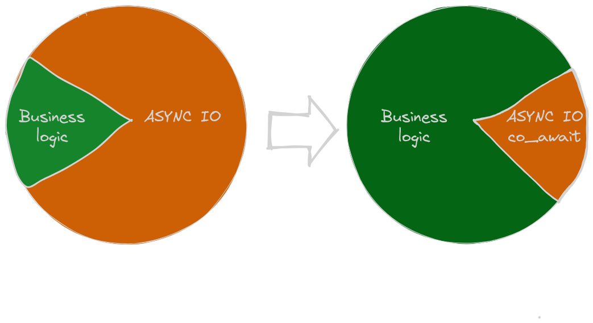

Теперь я добрался до практического применения разработанных ранее барьеров/секвенсоров ([SequenceBarrier](boost-asio-coroutines-sequencebarrier.md), [SingleProducerSequencer](boost-asio-coroutines-singleproducersequencer.md), [MultiProducerSequencer](boost-asio-coroutines-multiproducersequencer.md)) для короутин. В этот раз будет реализован клиент для [NATS](https://nats.io/?ref=kysa.me). Концептуально эта система очередей довольно проста: клиенты могут отправлять события в очередь (топик), клиенты могут подписываться на получение событий из очереди (топика). Ключевая фишка - отсутствие необходимости заранее [конфигурировать](https://docs.nats.io/nats-concepts/what-is-nats?ref=kysa.me#connecting-nats-client-applications-to-the-nats-servers) очереди.

Сначала определимся что хотим получить

```cpp
awaitable<void> handler(Subscription sub)
{
	auto* client = sub.get_client();
	for co_await (Message request : sub)
	{
		Message reply = processMessage(request);
		client->publish(std::move(reply));
	}
}

Subscription sub = co_await client.subscribe("a.b.c");
co_spawn(executor, handler(std::move(sub)), detached);
```

# Interface

## NATS Protocol

Особенностью протокола является то, что он асинхронный и не является request/reply протоколом, в нем нет отправляемых сервером ответов на сообщения, переданные клиентом. В нем предусмотрены сообщения об ошибках, отправляемых сервером, в случаи если клиент отправил какую-то фигню, но подтверждений, что запрос от клиента принят и обработан сервер не высылает. При получении клиентом сообщении об ошибке предполагается разрыв соединения и переинициализация клиента. За счет этого и достигается простота протокола.

Конечно у сервера NATS есть [verbose-режим](https://docs.nats.io/reference/reference-protocols/nats-protocol?ref=kysa.me#+ok-err) для отладки взаимодействия с клиентом в котором сервер будет отправлять сообщения-подтверждения `+OK`, но это создает дополнительную нагрузку. Поэтому ориентироваться на это в эксплуатационном режиме не будем.

## Thread safety

Клиент проектируется изначально с возможностью многопоточной работы. Методы отправки сообщений, получения подписки, получения сообщения из подписки и отключение клиента от NATS должны иметь гарантию безопасного вызова из короутин, работающих в тредах отличных от основного. Соответственно IO нужно организовывать через очереди.

## Publish

Для публикация нужен механизм подтормаживания источника при заполнении очереди на отправку. Блокировать тред мы не можем, т.к. у нас асинхронность (вся история с короутинами была начата как раз поэтому). Соответственно публикация сообщений должна осуществляться короутиной. Хотя подтверждений от NATS у нас нет, но в тоже время нужно как-то сообщать вызывающей стороне что сообщения никто не слушает и больше их слать не нужно (клиент отвалился от сервера). Отправка сообщения начинается с захвата буфера, а эта операция может выкинуть исключение (`boost::system::system_error` с `errc`  `boost::asio::error::operation_aborted`). Для начала оставим это поведение как есть.

```cpp
try {
	co_await client->publish(msg);
catch(const boost::system::system_error& ex) {
	assert(ex.code() == boost::asio::error::operation_aborted);
}
```

Если же нужно просто опубликовать сообщение и не ждать IO, то всегда это можно сделать запуском параллельной короутины (при этом отдавая себе отчет, что выстрел в ногу приближается, т.к. короутины потенциально могут запускаться быстрей, чем клиент будет обрабатывать публикацию из них):

```cpp
auto publishMsg = [client](Message&& msg) -> awaitable<void>
{
	co_await client->publish(std::move(message));
};
co_spawn(executor, publishMsg(std::move(msg)), detached);
```

Изначально подписку я хотел смоделировать как range-based цикл:

```cpp
for co_await (Message msg : subscribe)
{
	process(msg);
}
```

но выражение `for co_await` [запретили в C++23](https://www.open-std.org/jtc1/sc22/wg21/docs/papers/2019/p0664r8.html?ref=kysa.me#35) чтобы не создавать ограничений для будущего [std::generator](https://en.cppreference.com/w/cpp/coroutine/generator?ref=kysa.me). Пришлось искать другое решение.

Раз эта разработка экспериментальная, то можно взять [experimental::coro](https://www.boost.org/doc/libs/1_82_0/doc/html/boost_asio/overview/composition/coro.html?ref=kysa.me#boost_asio.overview.composition.coro.yield) для передачи сообщений в пользовательский (по отношению к проектируемому клиенту) код. К тому же операция _yield_ концептуально близка нашей задаче: выдача сообщений по мере их поступления.

Еще нам нужен функционал _отписки_, т.е. ее завершения приема сообщений. Отнаследоваться от [experimental::coro](https://www.boost.org/doc/libs/1_82_0/doc/html/boost_asio/reference/experimental__coro.html?ref=kysa.me) чтобы добавить нужный функционал не получится потому что инстанционирование этого типа происходит в недрах ASIO. Да и само по себе наследование от классов, явно на то не предназначенных не очень. Раз невозможно наследование, то всегда можно сделать композицию: вместе с экземпляром короутины будем возвращать объект реализующий функционал отписки. Для упрощения жизни будующим пользователям этого клиента запроектируем для объекта обязаность завершать подписку при разрушении если она не была завершена явно ранее.

```cpp
struct Unsub
{
	awaitable<void> operator();
	~Unsub();
};

auto accept(IClient* client, std::string_view subject) -> awairable<void>
{
	auto [sub, unsub] = co_await client->subscribe(co_await this_coro::executor,
	                               	               subject);
	
	while (auto msg = co_await sub.async_resume(use_awaitable))
	{
		// process message
	}

	co_await unsub();
}

co_spawn(executor, accept(client, "4.2"), exceptionHandler);
```

Из минусов: потребовалось добавить в сигнатуру метода получения подписки экзекьютер, он требуется для инстанционирования экземпляра короутины. В теории он может быть любым, но в если [он не будет совпадать с экзекютором](https://www.boost.org/doc/libs/1_82_0/doc/html/boost_asio/overview/composition/coro.html?ref=kysa.me#boost_asio.overview.composition.coro.executor) на котором происходит вызов `co_await sub.async_resume` то пробуждение короутины будет происходить с его излишнем использованием (сначала функтор пробуждения отправляется в экзекьютор короутины-подписки, потом в экзекьютор короутины использующей эту подписку).

## Error handling

Методы `publish` и `subscribe` могут сообщать об ошибках, но производить обработку ошибок в месте применения этих методов не разумно т.к. при большинстве ошибок клиент будет отключен сервером. В них стоит передавать событие сигнализирующий об общей ошибке (нет подключения), а непосредственную обработку производить в другом месте (и принимать решение о переподключении). Для этого введем еще один метод-короутину `run`, не обязательно что в нем будет запускаться какая-то работа, основное его назначение вернуть код конкретной ошибки (что серверу не понравилось или с сетью случилось) для последующей обработки. На текущий момент ошибка будет передаваться выбросом исключения.

## Shutdown

Сразу стоит предусмотреть механизм плавной остановки. После перевода клиента в это состояние он перестает отправлять сообщения (`publish` возвращает ошибку), выталкивает в сеть буфер передачи и перестает принимать сообщения, в существующие подписки отправляется сигнал завершения.

В тоже время для цивилизованной остановки стоит передать серверу сообщения `UNSUB` для существующих подписок. Поэтому допустим отправку этих сообщений после вызова `shutdown`. Короутины обрабатывающие подписки когда-нибудь завершатся и объекты `Unsub` в них разрушаться, отправляя сообщение `UNSUB` на сервер (если ранее не было вызова `co_await unsub()`). Метод `run` будет завершаться после отправки `UNSUB` для всех подписок (если соединение раньше не разорвется).

Точный момент окончания приема входящих сообщений я пока определять не буду, чтобы не вводить излишних ограничений. Все равно в философии NATS потеря части сообщений чем-то страшным не считается, раз в протоколе нет подтверждений.

## Connect

К серверу как-то нужно подключаться. Тут применем одну из лучших фишек C++ - идиому RAII. Функция подключения возвращает нам полностью проинициализированный и уже подключенный клиент. После отключения от сервера (не важно по какой причине) его можно безопасно удалить, но повторное использование допускать не будем (для упрощения инварианта). Т.к. подключение может быть связано с IO сделаем эту функцию короутиной.

## Interface declaration

Итого интерфейс получился таким:

```cpp
class MQClient
{
public:
    awaitable<void> run();

    awaitable<void> publish(std::string_view subject,
                            std::string_view payload);

    using Subscribe = std::tuple<coro<Message>, Unsub>;
    awaitable<Subscribe> subscribe(any_io_executor executor,
                                   std::string_view subject);

    awaitable<void> shutdown();
};

awaitable<std::shared_ptr<MQClient>> createClient(std::string_view url);
```

# Implementation

Основная деятельность клиента это прием входящих сообщений (с последующим помещением в очереди подписок) и отправка исходящих сообщений (из соответствующей очереди). Обе эти функциональности смоделированы как короутины (`rx` и `tx`). Т.к. они одновременно взаимодействуют с сокетом они должны быть запущены в одном треде/экзекуторе. Запомним этот момент.


```plantuml
class Client {
  +publish(subject : string, payload : string)
  +subscribe(executor, subject : string)
  +shutdown()
  +run()
}
class rx {
  +rx()
}
class Map {
  +find()
  +erase()
  +emplace()
}
class SubQueueTail {
  +push(item : T)
}
class tx {
  +tx(queue : TXQueueHead)
}
class TXQueueHead {
  +get() : SequenceRange
  +operator[](seq : int) : T&
  +consume(range : SequenceRange)
  close()
}
class TXQueueTail {
  push(item : T)
}

Client --* rx
Client --* Map
Map --* "0..*" SubQueueTail
Client --* tx
tx --* "1" TXQueueHead
Client --* "1" TXQueueTail
```

Разумеется внутри клиента есть очереди: одна `TXQueueHead`/`TXQueueTail` для исходящих сообщений и ассоциативный массив (`Map`) с очередьми `SubQueueTail` активных подписок. Очереди пожалуй самая важная часть клиента. Оба типа очередей являются специализацией одного шаблона.

```plantuml
class QueueState<T, Sequencer> {
  -buffer : T[]
  -readBarrier : SequenceBarrier
  -sequencer : Sequencer
  -nextToRead : int
  +QueueState(bufferSize : int)
  +claim_one() : int
  +operator[](seq : int) : T&
  +get() : SequenceRange
  +consume(range : SequenceRange)
  +close()
}
class QueueTail<T, Sequencer> {
  -state : QueueState*
  +push(item : T)
}
class TXQueueTail
class TXQueueHead
class TXMessage {
  +content : string
  +before_send()
  +after_send()
}
class QueueHead<T, Sequencer> {
  -state : QueueState
  +get() : SequenceRange
  +operator[](seq : int) : T&
  +consume(range : SequenceRange)
  +close()
}
class Message {

  -data : string
  +head() : ControlLineView
  +payload() : string
}

together {
  class TXQueueTail
  class TXQueueHead
}

together {
  class SubQueueTail
  class SubQueueHead
}

together {
  class QueueTail
  class QueueHead
}

together {
  class TXMessage
  class Message
}

QueueState --o QueueTail
QueueState --o QueueHead

TXQueueTail -up..> QueueTail : T->TXMessage\nSequencer->MultiProducerSequencer
TXQueueHead -up..> QueueHead : T->TXMessage\nSequencer->MultiProducerSequencer
TXQueueTail -down..> TXMessage
TXQueueHead -down..> TXMessage

SubQueueTail -up..> QueueTail : T->TXMessage\nSequencer->SingleProducerSequencer
SubQueueHead -up..> QueueHead : T->TXMessage\nSequencer->SingleProducerSequencer
SubQueueTail -down..> Message
SubQueueHead -down..> Message
```

Шаблон параметризируется типом секвенсора и типом передаваемого сообщения. Для исходящей очереди используется [MultiProducerSequencer](boost-asio-coroutines-multiproducersequencer.md) (в нее могут помещаться сообщения из нескольких потоков одновременно), для очереди подписки используется более простой секвенсор [SingleProducerSequencer](boost-asio-coroutines-singleproducersequencer.md) (в эту очередь сообщения помещает только одна короутина-приемник).

Базовая очередь-шаблон смоделирована тремя объектами: хвост очереди `QueueTail` к которому добавляются сообщения, голова `QueueHead` из которой сообщения извлекаются и разделяемое состояние `QueueState` непосредственно реализующее функционал. В голове и хвосте содержится `shared_ptr` на разделяемый стейт. По сути классы головы и хвоста это просто фасады и эта конструкция немного напоминает реализацию пары `std::future`/`std::promise`. Такое деление я выбрал чтобы разрушением объекта-головы можно было уведомлять отправителей о том, что эту очередь больше никто не обрабатывает. Хвост очереди и стейт не объединены в один класс для возможности подписке обработать оставшиеся в очереди данные при ее отмене (удаляется голова-фасад, буфер и примитивы синхронизации остаются валидными в разделяемом стейте). Когда у нас есть очереди, все остальное реализуется довольно просто.

При проектировании интерфейса подписка (со стороны клиентского кода) была представлена двумя классами - короутиной-генератором и классом `Unsub` для завершения подписки. Изнутри она выглядит так:

```plantuml
class boost::asio::experimental::coro<Yield> {
  +async_resume
}
class Subscription {
  +Subscription(queue : SubQueueHead)
}
class SubQueueHead {
  +get() : SequenceRange
  +operator[](seq : int) : T&
  +consume(range : SequenceRange)
  +close()
}
class Message {
  -data : string
  +head() : ControlLineView
  +payload : string
}
class ControlLineView {
  -data : string
  +op_name() : string
  +subscribe_id() : string
  +subject() : string
  +reply_to() : string
  +payload_size() : int
}
class Unsub {
  +operator()()
  +~Unsub()
}
class TXMessage {
  +content : string
  +before_send
  +after_send
}

Subscription ..> boost::asio::experimental::coro : Yield->Message
Subscription --* SubQueueHead
Subscription ..> Message
Message *-- ControlLineView
Unsub --* TXMessage
```

В короутине-генераторе `Subsription` находится голова очереди, второй конец очереди лежит ассоциативном массиве, который является одним из полей клиента. В токене отписки `Unsub` лежит функтор, генерирующий структуру-сообщение отписки и помещающий его в исходящую очередь при явном вызове `co_await unsub` либо при вызове деструктора.  В этой структуре находится поле `content` c сообщением `UNSUB subIdxxx\r\n` отправляемое серверу NATS и функтор `after_send`, удаляющий хвост очереди подписки из контейнера. Он вызывается короутиной-передатчиком `rx` после отправки контента. Получение подписки производиться аналогичным способом: в очередь исходящих сообщений помещается сообщение с контентом `SUB subject.a.b.c subIdxxx` и функтором добавляющим хвост очереди подписки в контейнер. За счет того, что обе короутины `tx` и `rx` работают на одном экзекьюторе не нужна синхронизация добавления/удаления хвоста очереди подписки в/из контейнера, при этом клиентский код может запускать метод-короутину `subscribe` из любого треда.

В итоге подписка на топик сводится к инстанционированию необходимых объектов и отправке экземпляра `TXMessage` в исходящую очередь.

```cpp
using Subscribe = std::tuple<coro<Message>, Unsub>;
awaitable<Subscribe> Client::subscribe(any_io_executor executor,
                                       std::string_view subject)
{
    if (_isShutdown.load(std::memory_order_acquire)) {
        throw boost::system::system_error{error::operation_aborted};
    }
    std::string subId = generate_subscribe_id();
    auto [queueHead, queueTail] = make_queue_sp<Message>(64);

    coro<Message> sub = subscription(executor,
                                     std::move(queueHead));
    Unsub unsub = make_unsub(subId);

    TXMessage subMsg = make_sub_tx_message(subject,
                                           std::move(subId),
                                           std::move(queueTail));
    co_await _txQueueTail->push(std::move(subMsg));

    co_return std::make_tuple(std::move(sub), std::move(unsub));
}
```

Сама подписка, вернее корутина ее довольно проста:

```cpp
coro<Message> subcription(any_io_executor executor, SubQueueHead queue)
{
    bool end = false;
    do {
        auto range = co_await co_spawn(executor, queue.get(), deferred);
        for (auto seq : range) {
            Message& msg = queue[seq];
            if (msg == IClient::eof) {
                end = true;
                break;
            }
            co_yield std::move(msg);
        }
        queue.consume(range);
    } while (!end);
}
```

В классе `Unsub` я планировал разместить функтор помещающие экземпляр `TXMessage` в очередь исходящих и экзекьтор `boost::asio::any_io_executor` чтобы выполнять это из деструктора. Но почему-то короутина `boost::asio::awaitable` не может вернуть кортеж из двух move-only типов. Один перемещаемый тип вернуть может, кортеж из перемещаемого и копируемого типов тоже может, а вот кортеж из двух перемещаемых типов уже нет. Какая-то фигня с ASIO либо с компилятором, я не стал долго голову ломать не стал и реализовал `Unsub` как фасад для pimpl.

```cpp
struct Unsub::Impl
{
    auto push() -> awaitable<void>
    {
        auto doUnsub = std::exchange(_doUnsub, nullptr);
        if (doUnsub) {
            co_await doUnsub();
        }
    }

    ~Impl()
    {
        if (!_doUnsub) {
            return;
        }
        try {
            auto push = [](std::move_only_function<awaitable<void>()> doUnsub) -> awaitable<void>
            {
                co_await doUnsub();
            };
            co_spawn(_executor,
                     push(std::move(_doUnsub)),
                     detached);
        }
        catch (...) {}
    }

    std::move_only_function<awaitable<void>()> _doUnsub;
    any_io_executor _executor;
};
```

Публикация сообщений в топик тривиальна, это форматирование сообщения для NATS и помещение его в очередь отправки:

```cpp
awaitable<void> Client::publish(std::string_view subject,
                                std::string_view payload)
{
    if (_isShutdown.load(std::memory_order_acquire)) {
        throw boost::system::system_error{error::operation_aborted};
    }
    std::string content = std::format("PUB {} {}\r\n{}\r\n",
                                      subject,
                                      payload.size(),
                                      payload);
    co_await _txQueueTail->push(TXMessage{std::move(content)});
}
```

Теперь рассмотрим запуск, обработку ошибок и остановку клиента. Как я писал ранее функциональность реализована короутинами `rx` и `tx`, чуть забегая в перед добавлю что короутна `tx` продолжает свою работу пока существуют активные подписки. И так, метод `run`:

```cpp
awaitable<void> Client::run()
{
    if (!_socket.is_open()) {
        throw boost::system::system_error{error::operation_aborted};
    }

    auto cs = co_await this_coro::cancellation_state;
    if (auto slot = cs.slot(); slot.is_connected()) {
        slot.assign([self = shared_from_this()](cancellation_type)
        {
            auto executor = self->get_executor();
            auto doShutdown = [](std::shared_ptr<IClient> self) -> awaitable<void> {
                co_await self->shutdown();
            };
            co_spawn(executor,
                     doShutdown(std::move(self)),
                     detached);
        });
    }

    auto rxWrap = [this]() -> awaitable<void>
    {
        auto executor = co_await this_coro::executor;
        auto [order, rxEx, shutdownEc] = co_await make_parallel_group(
            co_spawn(executor, rx(), deferred),
            _shutdownEvent.wait(deferred))
            .async_wait(wait_for_one(),
                        deferred);

        if (order[0] == 0) {
            assert(!!rxEx); // rx() first only with net error
            std::rethrow_exception(rxEx);
        }
    };

    auto executor = _socket.get_executor();
    auto [order, rxEx, txEx] = co_await make_parallel_group(
        co_spawn(executor, rxWrap(), deferred),
        co_spawn(executor, tx(std::move(*_txQueueHead)), deferred))
        .async_wait(wait_for_one_error(),
                    bind_cancellation_slot(
                        cancellation_slot(),
                        use_awaitable));
    {
        boost::system::error_code dummy;
        _socket.shutdown(ip::tcp::socket::shutdown_both, dummy);
        _socket.close();
    }

    for (auto& [_, queue] : _subscribes)
    {
        try {
            co_await queue.push(Message{}); // push EOF
        } catch (const boost::system::system_error& ex) {
            // queue back maybe destroyed
            assert(ex.code() == error::operation_aborted);
        }
    }

    if (order[0] == 0 && rxEx) {
        std::rethrow_exception(rxEx);
    }
    if (order[0] == 1 && txEx) {
        std::rethrow_exception(txEx);
    }
}
```

В нем запускаются короутины `tx` и `rx` (через враппер) параллельной группой. Эта группа запускается со стратегией `wait_for_one_error`, т.е. при любой ошибке (разрыв соединения) в одной из короутин автоматически завершается вторая. После завершении группы оставшимся подпискам отправляется сообщение-терминатор и выбрасывется исключение из первой завершившейся короутины (если остановка происходит из-за ошибки). Короутина `rx` обернута во враппер для ее прерывания при плавной остановке клиента, в нем также запускается группа короутин (сама `rx` и ожидание эвента остановки), но в этот раз используется стратегия `wait_for_one` (кто первый). В норме короутина `rx` сама не завершается, поэтому для ее остановки используется врапер.

Остановка клиента производится отправкой эвента для завершения короутины приема входящих сообщений (`rx`) и помещением в исходящую очередь экземпляра `TXMessage` с пустым контентом и функтором отправляющим во **все** подписки сообщение-терминатор. Отсутствие контента является сигналом для короутины `tx`, что клиент находится в процессе остановки, это используется чтобы различать ситуацию в которой нет ни одной подписки и остановку.

```cpp
TXMessage Client::make_shutdown_tx_message()
{
    return {._after_send = [this]() -> awaitable<void>
    {
        for (auto& [_, queue] : _subscribes)
        {
            try {
                co_await queue.push(Message{}); // push EOF
            } catch (const boost::system::system_error& ex) {
                // queue back maybe destroyed
                assert(ex.code() == error::operation_aborted);
            }
        }
    }
    };
}

awaitable<void> Client::shutdown()
{
    bool isAlready = _isShutdown.exchange(true, std::memory_order_acquire);
    if (isAlready) {
        co_return;
    }
    _shutdownEvent.set();
    co_await _txQueueTail->push(make_shutdown_tx_message());
}
```

Осталось рассмотреть реализацию короутин `rx` и `tx`.

```cpp
awaitable<void> Client::rx()
{
    using namespace std::string_view_literals;
    streambuf buffer;

    for (;;) {
        std::size_t readed = co_await async_read_until(_socket,
                                                       buffer,
                                                       "\r\n"sv,
                                                       use_awaitable);
        // A single contiguous character array
        BOOST_ASIO_CONST_BUFFER sb = buffer.data();
        auto controlLine = std::string_view(static_cast<const char*>(sb.data()),
                                            readed);

        if (controlLine.starts_with("MSG"sv))
        {
            ControlLineView head = parse_msg(controlLine);
            std::size_t payloadOffset = controlLine.size();
            std::size_t totalMsgSize = payloadOffset +
                                       head.payload_size() +
                                       "\r\n"sv.size();

            readed = co_await async_read_until(_socket,
                                               buffer,
                                               received(totalMsgSize),
                                               use_awaitable);
            assert(readed == totalMsgSize);

            auto begin = buffers_begin(buffer.data());
            auto data = std::string(begin,
                                    begin + totalMsgSize);
            assert(data.ends_with("\r\n"));
            auto payload = std::make_pair(payloadOffset,
                                          head.payload_size());
            auto msg = Message(std::move(data), head, payload);

            // From msg because head storage maybe not valid
            auto subId = msg.head().subscribe_id();
            // Add comporator for lookup by string_view
            // https://stackoverflow.com/questions/69678864/safe-way-to-use-string-view-as-key-in-unordered-map
            if (auto it = _subscribes.find(std::string{subId});
                it != std::end(_subscribes))
            {
                auto& queue = it->second;
                co_await queue.push(std::move(msg));
            }
        }
        else if (controlLine.starts_with("PING"sv))
        {
            co_await pong();
        }
        else if (controlLine.starts_with("-ERR")) {
            throw boost::system::system_error{error::eof, std::string(controlLine)};
        }

        buffer.consume(readed);
    }
}
```

В короутине `rx` в цикле выполняется чтение из сокета до получения последовательности `\r\n` и последующий анализ полученной строки. Если это сообщение для подписки (начинается с `MSG`) то, парсится заголовок, вычисляется полная длина сообщения и запускается следующее чтение оставшейся части сообщения (с использованием кастомного match condition). И после приема всего сообщения оно помещается в соответствующую очередь подписки. Если NATS нам прислал `PING\r\n`, то отправляем в ответ `PONG\r\n`, если от сервера пришло `-ERR`, то сигнализируем об ошибке выбросом исключения.

```cpp
awaitable<void> Client::tx(TXQueueHead txQueueBack)
{
    bool isStopping = false;
    do {
        auto range = co_await txQueueBack.get();
        for (std::size_t seq : range)
        {
            TXMessage& msg = txQueueBack[seq];
            msg.before_send();
            if (msg.content.empty()) {
                isStopping = true;
            } else {
                co_await async_write(_socket,
                                     buffer(msg.content),
                                     use_awaitable);
            }
            co_await msg.after_send();
        }
        txQueueBack.consume(range);
    } while (!isStopping ||
             !_subscribes.empty());
}
```

Короутина `tx` это просто цикл, обрабатывающий сообщения из исходящей очереди. Контент сообщения отправляется в сокет,  методы `before_send`/`after_send` добавляют/удаляют голову хвост очереди подписки в контейнер подписок (для сообщений `SUB`/`UNSUB`). Сигналом для завершения, как было указаено выше, служит сообщений с пустым контентом и отсутствие активных подписок. Передача пустого сообщения и флажок `isStoping` нужны чтобы различать начальное состояние (в котором нет активных подписок) и состояние когда все подписки удалены при завершении работы.

Внимательные читатели заметили, что в коде есть два места в которых во все подписки отправляется сигнал завершения. На первый взгляд от этого можно избавиться если отправлять в очереди подписок сигнал завершения из врапера `rxWrap` после завершения короутины `rx`. Но такой вариант не прокатывает, в это время короутина `tx`  (при приостаноке `rx` на каком-нибудь `co_await`) может работать и удалять очереди подписок из контейнера. Это инвалидирует итераторы контейнера и простым обходом  `for (auto [_, queue] : _subscribes)` обойтись не получиться. При выполнении подобного цикла из короутины `tx` такой проблемы, т.к. никто больше контейнер подписок не меняет.

И последний штрих - инстационирование клиента и подключение NATS-серверу. Реализовано это отдельной короутиной. В ней выполняется непосредственно подключение к серверу и рукопожатие с ним, а дальше сокет установленного соединения передается в конструктор клиента.

```cpp
auto connect_to_nats(std::string_view host,
                     std::string_view port,
                     std::string_view token) -> awaitable<ip::tcp::socket>
{
    auto executor = co_await this_coro::executor;
    auto resolver = ip::tcp::resolver(executor);
    auto endpoints = co_await resolver.async_resolve(host,
                                                     port,
                                                     use_awaitable);
    auto socket = ip::tcp::socket(executor);
    co_await async_connect(socket,
                           endpoints,
                           use_awaitable);

    std::string buf;
    co_await async_read_until(socket,
                              dynamic_buffer(buf),
                              "\r\n",
                              use_awaitable);
    auto data = std::string_view(buf);

    auto head = std::string_view("INFO ");
    data.remove_prefix(head.size());
    json::value srvInfo = json::parse(data);

    std::string reply = std::format("CONNECT {}\r\n",
                                    json::serialize(build_handshake(srvInfo,
                                                                    token)));
    co_await async_write(socket,
                         buffer(reply),
                         use_awaitable);

    co_return socket;
}
```

# Usage

В качестве демонстрации нужно слепить простенький сервис. Он будет подписываться на топик, полученую строчку скармливать в MySQL как запрос и результат отправлять в топик, указаный в поле `reply_to` запроса. Удобней будет  
рассмотреть в поряде его запуска.

```cpp
using MqClient = std::shared_ptr<nats_coro::IClient>;
using DbClient = std::shared_ptr<boost::mysql::tcp_ssl_connection>;

using Handler = std::function<
					boost::asio::awaitable<void>(nats_coro::Message,
                                                 MqClient,
                                                 DbClient)>;

auto accept(std::string_view subject,
            Handler handler,
            MqClient mqClient,
            DbClient dbClient) -> boost::asio::awaitable<void>;

auto async_main(std::string_view subject,
                boost::asio::ssl::context& sslContext) -> boost::asio::awaitable<void>
{
    auto mqClient = co_await nats_coro::createClient(natsUrl);
    auto dbClient = co_await connect2mysql(sslContext);
    auto executor = co_await boost::asio::this_coro::executor;

    co_spawn(executor,
             accept(subject,
                    process,
                    mqClient,
                    dbClient),
             [](std::exception_ptr ex)
             {
                 try { if (ex) std::rethrow_exception(ex); }
                 catch (const std::exception& ex) { std::cerr << "Exception accept: " << ex.what() << std::endl; }
             });

    auto signal = boost::asio::signal_set(executor, SIGINT, SIGTERM);

    auto [order, ex, _, __] = co_await boost::asio::experimental::make_parallel_group(
        co_spawn(executor, mqClient->run(), boost::asio::deferred),
        signal.async_wait(boost::asio::deferred))
        .async_wait(boost::asio::experimental::wait_for_one(),
                    boost::asio::use_awaitable);

    if (order[0] == 0 && ex) {
        std::rethrow_exception(ex);
    }

    std::cout << "service stopped" << std::endl;
}

int main(int argc, char** argv)
{
    if (argc < 2) {
        std::cerr << "Usage: " << argv[0] << " <subject>" << std::endl;
        return EXIT_FAILURE;
    }
    auto ioContext = boost::asio::io_context();
    auto sslContext = boost::asio::ssl::context(boost::asio::ssl::context::tls_client);
    boost::asio::co_spawn(ioContext, async_main(argv[1], sslContext),
                          [](std::exception_ptr ex){ if (ex) std::rethrow_exception(ex); });
    ioContext.run();
    return EXIT_SUCCESS;
}
```

В `main` инстанционируются минимально необходимые объекты и запускается короутина `async_main`.  Вся остальная инициализация и запуск с остановкой выполняются в ней. Первым делом создаюся клиенты NATS (`mqClient`) и MySQL (`dbClient`). Дальше, как параллельная цепочка, запускается короутина приема запросов `accept`, в нее аргументом передается непосредственный обработчик сообщений в котором расположена бизнес-логика сервиса. И последний шаг - запуска клиента и ожидания сигнала (`SIGTREM`/`SIGINT`) внутри одной группы. Группа запускается со стратегией `wait_for_one`, первая завершившаяся (неважно как, нормально или выбросом исключения) операция в группе отменяет другую. В короутине `Client::run()` для этого в слот отмены устанавливается обработчик запускающий короутину-метод `Client::shutdown`. Таким образом осуществляется корректное завершение работы по сигналу с отправкой исходящей очереди в сеть.

```cpp
auto wrapper(nats_coro::Message msg,
             Handler handler,
             MqClient mqClient,
             DbClient dbClient) -> boost::asio::awaitable<void>;

auto accept(std::string_view subject,
            Handler handler,
            MqClient mqClient,
            DbClient dbClient) -> boost::asio::awaitable<void>
{
    auto executor = co_await boost::asio::this_coro::executor;
    auto [sub, unsub] = co_await mqClient->subscribe(executor, subject);
    while (auto msg = co_await sub.async_resume(boost::asio::use_awaitable))
    {
        co_spawn(executor,
                 wrapper(std::move(*msg),
                         handler,
                         mqClient,
                         dbClient),
                 [](std::exception_ptr ex)
                 {
                     try { if (ex) std::rethrow_exception(ex); }
                     catch (const std::exception& ex) { std::cerr << "Exception wrapper/process: " << ex.what() << std::endl; }
                 });
    }
    co_await unsub();
    std::cout << "accept stopped" << std::endl;
};
```

Короутина `accept` подписывается на топик и запускает цикл приема сообщений. Для каждого принятого сообщения запускается отдельная цепочка (мы же хотим обрабатывать запросы параллельно) для его обработки. Запуск непосредственного обработчика (`process`) осуществляется через врапер для перехвата исключений из него.

```cpp
auto wrapper(nats_coro::Message msg,
             Handler handler,
             MqClient mqClient,
             DbClient dbClient) -> boost::asio::awaitable<void>
{
    auto executor = co_await boost::asio::this_coro::executor;
    auto replyTo = std::string(msg.head().reply_to());

    try {
        co_await handler(std::move(msg), mqClient, dbClient);
    }
    catch (const std::exception& ex) {
        co_spawn(executor,
            [&](std::string replyTo,
                std::string err,
                MqClient mqClient) -> boost::asio::awaitable<void>
            {
                co_await mqClient->publish(replyTo, err);
            } (std::move(replyTo), ex.what(), mqClient),
            [](std::exception_ptr ex)
            {
                if (ex) std::rethrow_exception(ex);
            });
    }
};
```

С врапером конкретно этот код получается немного развесистым, но он (врапер) нужен для демонстрации того, что большая часть кода с обработкой ошибок может быть переиспользована, не беспокоясь об исключениях из бизнес-логики.

```cpp
auto process(nats_coro::Message msg,
             MqClient mqClient,
             DbClient dbClient) -> boost::asio::awaitable<void>
{
    auto query = msg.payload();
    auto replyTo = msg.head().reply_to();

    boost::system::error_code ec;
    boost::mysql::diagnostics diag;
    boost::mysql::results result;

    std::tie(ec) = co_await dbClient->async_query(query,
                                                  result,
                                                  diag,
                                                  use_awaitable_nothrow);
    boost::mysql::throw_on_error(ec, diag);
    co_await mqClient->publish(replyTo, result.rows()[0].at(0).as_string());
};
```

В нашем примере бизнес-логика сервиса собрана в короутине `process` и она передельно проста: скармливаем запрос в БД и полученый ответ отправляем в NATS. Если что-то пошло не так, то просто выбрасывается исключение и вызывающая сторона (врапер) сама решает что с этим делать.

По-подробней нужно рассмотреть время жизни клиентов. При разрыве связи короутина `Client::run` может завершиться раньше, чем какая-нибудь пользовательская короутина (если точнее, то запущенная через `co_spawn`, в нашем случаи `process` вместе с врапером), а вместе с ней и короутина `async_main`, во фрейме которой расположены указатели на клиенты (перенести их в другое место не получиться т.к. они создаются асинхронными функциями). В этом случаи необходимо гарантировать, что клиенты NATS и СУБД останутся живы пока они нужны. Для этого shared_ptr на них передаются в короутины как аргумент по значению, чтобы в каждой из них явно были копии. Конкретно этот пример можно оптимизировать и передавать в `process`  голые указатели (или ссылки) т.к. коррутина-враппер дожидается завершения `process` и тем самым гарантируется валидность клиентов NATS и MySQL. Но проводить такую оптимизацию можно, только если гарантировать, что из бизнес-логики через `co_spawn` ничего не запускается, что может работать дольше, чем родительская короутина. В качестве альтернативы можно подсчитывать запущенные короутины и перед завершением `async_main` ожидать завершения всех короутин, обращающихся к клиентам.

Теперь запустим сервис в первой консоли:

```bash
$ build/test/example_service2 c.v
```

и проверим как он работает приставая к нему из второй:

```bash
$ nix-shell natscli

[nix-shell:~]$ nats -s token@localhost req c.v "SELECT VERSION()"
01:38:08 Sending request on "c.v"
01:38:08 Received with rtt 1.202953ms
8.0.25

[nix-shell:~]$ nats -s token@localhost req c.v "SELECT VER_SION()"
01:38:05 Sending request on "c.v"
01:38:05 Received with rtt 1.006734ms
er_no_db_error [mysql.common-server:1046]
```

Отправляя нормальный запрос получаем на него ответ (версию MySQL сервера). При отправке ошибочного запроса получаем сообщение из выброшего исключения. При разрыве соединения с NATS сервис завершается с предсказуемой ошибкой:

```bash
$ docker restart local-nats
```

```bash
$ build/test/example_service2 c.v
terminate called after throwing an instance of 'boost::system::system_error'
  what():  End of file [asio.misc:2 at include/boost/asio/detail/reactive_socket_recv_op.hpp:134:5 in function 'static void boost::asio::detail::reactive_socket_recv_op<MutableBufferSequence, Handler, IoExecutor>::do_complete(void*, boost::asio::detail::operation*, const boost::system::error_code&, std::size_t)']
Aborted (core dumped)
```

 конечно работает корректная остановка (по нажатию  Ctrl-C):

```bash
$ build/test/example_service2 c.v
^Caccept stopped
service stopped

$ echo $?
0
```

#### Про Boost.MYSQL

На самом деле пример сервиса не совсем корректный, в Boost.MYSQL нет буферизации запросов и при достаточном числе обращений сервис упадет. Для одного коннекта Boost.MYSQL допускается выполнение только одной операции (запроса) за раз. Что как-то странно, хотелось бы иметь возможность отправлять множество асинхронных запросов в БД за раз для независимой обработки обращений к сервису. Также решить эту проблему можно менеджером коннектов к БД, который будет предоставлять на время (обработки запроса) монопольный доступ к одному из подключений. Если свободных коннектов нет, обработчик запроса приостанавливается до освобождения одного из них. Но лучше прикрутить буферизацию к клиенту БД, заодно поупражнявшись в [композитных операциях](https://www.boost.org/doc/libs/1_82_0/doc/html/boost_asio/overview/composition/compose.html?ref=kysa.me)

Итого мы получили сервис, бизнес-логика которого пишется в привычном линейном виде, аналогично синхронному коду, но при этом весь сетевой IO работает асинхронно. Из коробки поддерживается плавная/цивилизованная остановка. Сервис может быть многопоточным, для этого достаточно `boost::asio::io_context` в `main` заменить на `boost::asio::thread_pool`.

# Retro

Теперь итоги разработки, информация за это время накопилась.

## Про клиент

Хочется менее _рыхлый_ интерфейс подписки. Весь функционал (получение сообщений и завершение подписки) пусть будет собран в один класс-фасад, сообщения из него желательно получать простым выражением `std::optional<Message> msg = co_await sub`. Еще меня напрягает необходимость указывать экзекьютор при получении подписки, если же он ей так нужен, то пусть подписка его получает из текущей короутины при первом запросе сообщения.

```cpp
struct Subscription
{
    Awaitable operator co_await(); // pick message
    Awaitable unsub();
    std::shared_ptr<IClient> get_client() { return _client; }
    ~Subscription();

private:
    std::shared_ptr<IClient> _client;
};

auto process(std::shared_ptr<IClient>, Message) -> awaitable<void>;

auto accept(Subscription sub, Handler handler) -> awaitable<void>
{
    while (auto msg = co_await sub)
	{
        co_spawn(thread_pool,
                 process(sub.get_client(), *msg),
                 error_handler);
	}
    co_await sub.unsub();
}

Subscription sub = co_await client->subscribe(subject);
co_spawn(thread_pool,
		 accept(std::move(sub), process),
		 error_handler);
```

Очереди клиента базируются на паттерне disruptor ([SequenceBarrier](boost-asio-coroutines-sequencebarrier.md), [SingleProducerSequencer](boost-asio-coroutines-singleproducersequencer.md), [MultiProducerSequecner](boost-asio-coroutines-multiproducersequencer.md)). При реализации этого паттерна в качестве основы я взял его вариацию из [cppcoro](https://github.com/lewissbaker/cppcoro?ref=kysa.me#sequence_barrier) применив короутины `boost::asio::awaitable<>` вместо кастомных авайтеров. Асинхронная часть его интерфейса получила такой вид:

```cpp
auto wait_until_published(TSequence)
    -> awaitable<TSequence>;
```

Но практика применения показала что такой интерфейс неудобен. Его стоит привести к форме аналогичной бустовским асинхронным операциям для возможности вставлять различные токены-обработчики завершения (как это уже сделано в [Event](https://github.com/dvetutnev/boost_asio_awaitable_ext/blob/main/include/event.h?ref=kysa.me#L22)):

```cpp
template<
    completion_token_for<void(error_code, TSequence)>
        CompletionToken>
auto wait_until_published(TSequence, CompletionToken);
```

Это позволит избавится от мозолящих глаза перехватов исключений (используя адаптер [as_tuple](https://www.boost.org/doc/libs/1_82_0/doc/html/boost_asio/overview/composition/token_adapters.html?ref=kysa.me#boost_asio.overview.composition.token_adapters.as_tuple)) и запускать асинхронные операции с пустым слотом отмены (не порождая отдельную цепочку короутин через `co_spawn`).

## Подводные камни

Вместе с новыми инструментами появились и новые способы отстрелить себе ногу.

Короутинам работающим на одном экзекьюторе нет необходимости синхронизировать доступ к разделяемым объектам. Но нужно аккуратно использовать итераторы, если короутина, выполняющая итерацию (в том числе банальный `for (auto item : cont)`) засыпает между ее шагами, то нужно обеспечить валидность итераторов на время всей итерации. Например в `map` нельзя вставлять/удалять из другой короутины.

Если в короутину нужно передать владение объектом, то передавать его нужно по значению, и не в коем случаи как **rvalue** ссылку. При инстанционировании короутины сначала выполняется копирование аргументов в ее фрейм и только потом запускается ее выполнение. Если передать rvalue ссылку, то правильно, во фрейм скопируется ссылка, а сам объект может быть разрушен.

Вместо захвата shared_ptr на разделяемый объект в лямбду, нужно передать его как параметр. Мы привыкли писать приблизительно так:

```cpp
async_op([self = shared_from_this()](error_code ec, size_t length) {
    self->call(...);
});
```

Инстанц лямбы `coro` будет разрушен вместе в месте shared_ptr в нем при завершении метода, а короутина может исполняться когда-нибудь потом. Вместо этого нужно передать shared_ptr как параметр по значению:

```cpp
auto coro = [](std::shared_ptr<Client> self) -> awaitable<void>
{
    co_await self->call(...);
};
co_spawn(executor, coro(shared_from_this()), exception_handler);
```

## Про асинхронность и короутины в общем

А сейчас небольшой исторический экскурс про написание асинхронного сетевого кода. С появлением в стандартной библиотеке shared_ptr типичная реализация сессии взаимодействия с клиентом на стороне сервера выглядела подобным образом:

```cpp
class Session : public std:enable_shared_from_this<Session>
{
    tcp::ip::socket _socket;
    std::string _request;
    std::string _reply;

void do_read()
{
    _socket.async_read(
        buffer(_request),
        [self = shared_from_this()](error_code ec, std::size_t length)
        {
            self->on_read(ec, length);
        }
    );
}
	
void on_read(error_code ec, std::size_t length)
{
    if (ec) {
        process_error(ec);
        return;
    } else {
        _reply = process_request(_reply);
        do_write();
	}
}

void do_write()
{
    _socket.async_write(
        buffer(_reply),
        [self = shared_from_this()](error_code ec, std::size_t length)
        {
            self->on_write(ec, length);
        }
    );
}

void on_write(error_code ec, std::size_t lenght)
{
    if (ec) {
        process_error(ec);
        return;
    } else {
        do_read();
    }
}
} // Session
```

Сессия отнаследована от `std::enable_shared_from_this`, в каждую асинхронную операцию передается функтор с shared_ptr на нее. Пока выполняется какая-нибудь асинхронная операция существует копия shared_ptr на сессию и она остается в живых, после завершения всех асинхронных операций сессия автоматически удаляется. Из плюсов этой конструкции - она работает) И позволяет в одном треде обслуживать множество соединений. Подобную сессию приходилось каждый раз сочинять заново. Основной минус - чтобы понять что оно делает нужно прочитать весь код, как оно переходит между состояниями наглядно не видно. Нет поддержки исключений (кто их будет ловить?).

Можно сделать сессию с выделенной машиной состояний. Подобный вариант я реализовывал [тут](https://github.com/dvetutnev/tomsksoft?ref=kysa.me)

```cpp
struct DefFSM
{
  explicit DefFSM(Session& s) : session{s} {}

  struct InitEvent {};
  struct ByteEvent { char byte; };
  struct HaltEvent {};

  auto operator()() const {

    auto init = [this] () { session.init(); };
    auto pushToHeaderBuffer = [this] (const ByteEvent& e) { session.pushToHeaderBuffer(e.byte); };
    auto isHeaderComplete = [this] () -> bool { return session.isHeaderComplete(); };
    auto processHeader = [this] () { session.processHeader(); };
    auto pushToDataBuffer = [this] (const ByteEvent& e) { session.pushToDataBuffer(e.byte); };
    auto isDataComplete = [this] () -> bool { return session.isDataComplete(); };
    auto processResult = [this] { session.processResult(); };
    auto restart = [this] { session.restart(); };
    auto halt = [this] { session.halt(); };

    using namespace boost::sml;

    return make_transition_table(
      *"Wait init"_s + event<InitEvent> / init = "Receive header"_s,
       "Receive header"_s + event<ByteEvent> / pushToHeaderBuffer = "Is header complete"_s,
       "Is header complete"_s [ !isHeaderComplete ] = "Receive header"_s,
       "Is header complete"_s [ isHeaderComplete  ] = "Process header"_s,
       "Process header"_s / processHeader = "Receive data"_s,
       "Receive data"_s + event<ByteEvent> / pushToDataBuffer = "Is data complete"_s,
       "Is data complete"_s [ !isDataComplete ] = "Receive data"_s,
       "Is data complete"_s [ isDataComplete  ] = "Process result"_s,
       "Process result"_s / (processResult, restart) = "Receive header"_s,

      *"In work"_s + event<HaltEvent> / halt = X
    );
  } // operator()()

  Session& session;
}; // DefFSM
```

Еще один вариант асинхронной обработки запросов с которым я работал это  
[future continuations](https://www.boost.org/doc/libs/1_82_0/doc/html/thread/synchronization.html?ref=kysa.me#thread.synchronization.futures.then) аналогичные бустовским. С ними код выглядел приблизительно так:

```cpp
Future<Reponse> process(Request& req)
{
	auto sql = make_query(req);
	auto f = dbClient->query(sql);
	return f.then([](Future<db::Response> f)
	{
		auto dbResponse = f.get();
		...
		return mqClient->call(params);
	}).then([](Future<mq::Response> f)
	{
		auto mqResponse = f.get();
		...
		return dbClient->query(sql);
	}).then([](Future<db::Response> f)
	{
		auto dbResponse = f.get();
		...
		return make_ready_future(std::move(response));
	});
}
```

Здесь уже есть поддержка исключений (этим занимает метод `then`) и обработка запроса представлена в виде последовательности шагов. Но есть серьезный недостаток: все локальные переменные в теле каждой лямбды остаются в ней же и доступа из следующей лямбды к ним нет. В двух предыдущих вариантах, с выделенным классом-сессией, переменные связанные с конкретным запросом реализуются как поля этого класса (каждому запросу соответствует свой экземпляр). С future continuations такое уже невозможно. Можно перед обработкой запроса создавать какой-нибудь объект для хранения того, что вычисляется в процессе обработки и захватывать sharer_ptr на него во все лямбды. Но выглядит это уж очень костыльно.

Короутины решают все описаные выше проблемы. Есть поддержка исключений, локальные переменные доступны во все время работы короутины, код выглядит аналогично синхронному и легко читается. Совместно с очередями на короутинах можно строить сложные системы, которые в императивной форме достаточно точно реализуют конечные автоматы спроектированные на [UML](https://www.uml-diagrams.org/state-machine-diagrams.html?ref=kysa.me) Еще короутины напоминают [модель акторов](https://ru.wikipedia.org/wiki/%D0%9C%D0%BE%D0%B4%D0%B5%D0%BB%D1%8C_%D0%B0%D0%BA%D1%82%D0%BE%D1%80%D0%BE%D0%B2?ref=kysa.me): короутина принявшая запрос может обработать его сама, либо запустить (параллельно) другую короутину и делегировать обработку ей. Если раньше асинхронное программирование было развесистым и бизнес-логика размазана настолько тонким слоем по коду что ее не было видно:



то с короутинами вся эта асинхронная машинерия сворачивается в маленький `co_await`. С чем я нас и поздравляю. Код [тут](https://github.com/dvetutnev/boost_asio_awaitable_ext/?ref=kysa.me).
