В этот раз буду реализовывать **sequence barrier**, аналогичный реализации в [cppcoro](https://github.com/lewissbaker/cppcoro?ref=kysa.me#sequence_barrier).  Этот примитив синхронизации координирует работу одного издателя (**producer**) и одного или нескольких подписчиков (**consumers**) относительно монотонно-возрастающей (неубывающей) последовательности. В дальнейшем он будет применен в качестве курсора в кольцевого буфера.

# Intro

Издатель периодически публикует новое значения последовательности, а подписчики ждут пока не будет опубликован элемент последовательности (_номер_) равный или больший ожидаемого подписчиком.

```cpp
SequenceBarrier barrier;

auto consumer = [&]() -> awaitable<void> {
    std::size_t lastPublished;
    lastPublished = co_await barrier.wait_until_published(7);
    assert(lastPublished == 7);
    lastPublished = co_await barrier.wait_until_published(11);
    assert(lastPublished == 20);
    co_return;
};

auto = producer = [&]() -> awaitable<void> {
    barrier.publish(7);
    co_await schedule(co_await this_coro::executor);
    barrier.publish(20);
    co_return;
};

auto main = [&]() -> awaitable<void> {
    co_await(
      producer() &&
      consumer()
    );
    co_return;
};

io_context ioContext;
co_spawn(ioContext, main(), detached);
ioContext.run();
```

Подписчики и издатель могут работать в разных тредах.

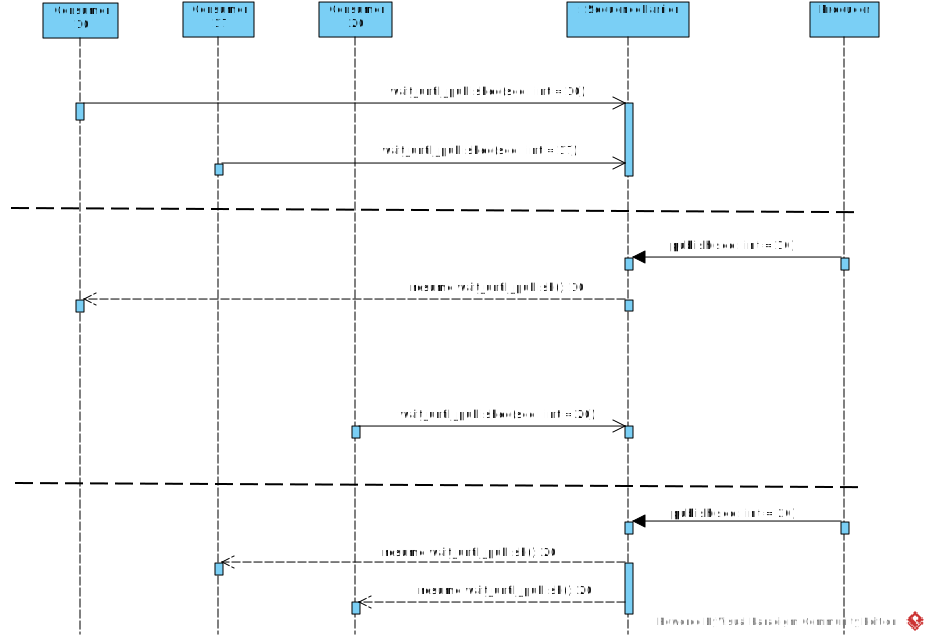

# Overflow cursor

Для того, чтобы курсор можно было использовать многократно переполняя по кругу накладываются два условия:

- Элементы последовательности должны быть представлены беззнаковым целочисленным типом ([переполнения знакового типа](https://riptutorial.com/cplusplus/example/7412/signed-integer-overflow?ref=kysa.me) - UB)
- Ожидаемый подписчиком элемент последовательности, не должен отстоять более чем на половину диапазона последовательности (`std::numeric_limits<TSequence>::max() / 2 + 1`).  Элементы отстоящие дальше половины диапазона считается _предшествующими_ и метод-короутина `SequenceBarrier::wait_until_publish` без приостановки возвращает последний опубликованный элемент последовательности.

Пример для последовательности `std::uint8_t`

```cpp
using Traits = SequenceTraits<std::uint8_t>;

BOOST_TEST(Traits::precedes(0u, 127u));
BOOST_TEST(Traits::precedes(0u, 128u));
BOOST_TEST(!Traits::precedes(0u, 129u));

BOOST_TEST(Traits::precedes(128u, 255u));
BOOST_TEST(Traits::precedes(128u, 0u));
BOOST_TEST(!Traits::precedes(128u, 1u));
```


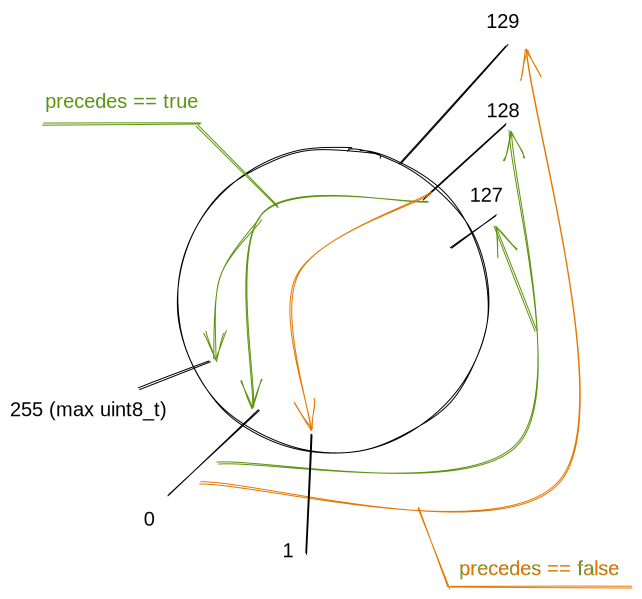

и тоже самое относительно дефолтной инициализации `SequenceBarrier` (_предшествующей_ нулю):


```cpp
    BOOST_TEST(Traits::initial_sequence == 255u);

    BOOST_TEST(Traits::precedes(255u, 126u));
    BOOST_TEST(Traits::precedes(255u, 127u));
    BOOST_TEST(!Traits::precedes(255u, 128u));

    BOOST_TEST(Traits::precedes(127u, 254u));
    BOOST_TEST(Traits::precedes(127u, 255u));
    BOOST_TEST(!Traits::precedes(127u, 0u));
```


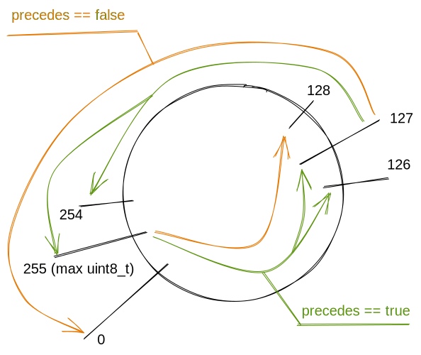

Свойство завершения `SequenceBarrier::wait_until_publish` без приостановки при запросе _предшествующего_ элемента последовательности в дальнейшем будет применено при начальном захвате издателем слотов в кольцевом буфере.

# Implementation

Структурно представляет собой однонаправленный список экземпляров `Awaiter` (авайтеров).  Каждому авайтеру соответствует свой _приостановленный_ вызов подписчиком короутины-метода `SequenceBarrier::wait_until_publish`.


Свойство завершения `SequenceBarrier::wait_until_publish` без приостановки при запросе _предшествующего_ элемента последовательности в дальнейшем будет применено при начальном захвате издателем слотов в кольцевом буфере.

# Implementation

Структурно представляет собой однонаправленный список экземпляров `Awaiter` (авайтеров).  Каждому авайтеру соответствует свой _приостановленный_ вызов подписчиком короутины-метода `SequenceBarrier::wait_until_publish`.

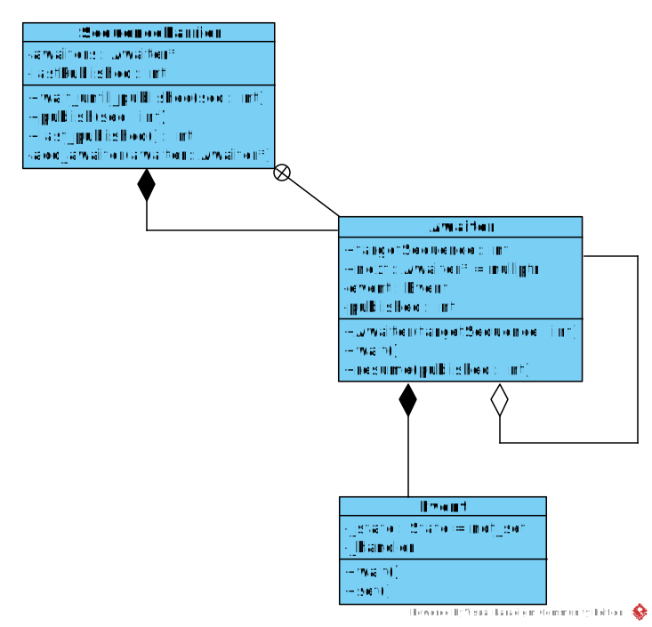

Логика управления списком авайтеров не занимается выделением памяти, т.к. авайтеры размещаются во фреймах короутин `SequenceBarrier::wait_until_publish` и автоматически удаляются вместе с ними при их завершении.

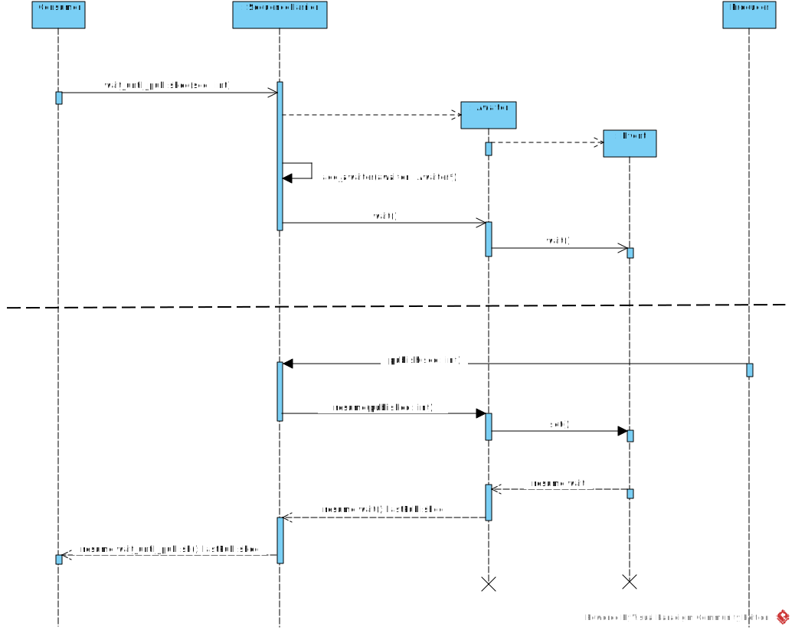

Для непосредственной приостановки/пробуждения короутины используется ранее описанный класс [Event](https://kysa.me/boost-asio-coroutines-event/).

# Thread safety

Логика/синхронизация будет аналогична [ccpcoro](https://github.com/lewissbaker/cppcoro/blob/master/include/cppcoro/sequence_barrier.hpp?ref=kysa.me#L308). Но сперва подготовим инструментарий для тестирования при помощи ThreadSanitizer. TSan (по крайней мере для текущей версии v2) отслеживает доступ не к объектам, а непосредственно к памяти по адресам. Т.е. при разрушении (удалении) объекта и последующим созданием нового в том же куске памяти TSan может сгенерировать _false-positive_, а аллокаторы как раз стараются переиспользовать один и тот же кусок памяти (короутины будут размещаться в _heap_, если компилятору не известно их число). Поэтому мучить наш проектируемый `SequenceBarrier` будем не через публичный интерфейс, а непосредственно через метод `add_awaiter` подставляя в него mock-авайтеры, лежащими явно по разным адресам памяти. Для этого класс `SequenceBarrier` параметризуется типом авайтера для подстановки mock-класса вместо обычного, метод `add_awaiter` объявляется `protected` чтобы добраться до него через отнаследованный класс. Конечно тестировать опираясь на внутренние методы не совсем корректно, в данном случаи это компромисс для проверки логики/синхронизации в методах `add_awaiter`/`publish` изолированно от остального кода.

Определения `SequenceBarrier` и рабочего авайтера:

```cpp
namespace detail {
template<std::unsigned_integral TSequence, typename Traits>
struct Awaiter
{
    const TSequence targetSequence;
    Awaiter* next;

    explicit Awaiter(TSequence s) : targetSequence{s}, next{nullptr} {}

    awaitable<TSequence> wait(any_io_executor executor) {
        co_await _event.wait(executor);
        co_return _published;
    }

    void resume(TSequence published) {
        assert(!Traits::precedes(published, targetSequence));
        _published = published;
        _event.set();
    }

private:
    Event _event;
    TSequence _published;
};
} // namespace detail

template<std::unsigned_integral TSequence = std::size_t,
         typename Traits = SequenceTraits<TSequence>,
         typename Awaiter = detail::Awaiter<TSequence, Traits>>
class SequenceBarrier
{
public:
    SequenceBarrier(TSequence initialSequence = Traits::initial_sequence);
    ~SequenceBarrier();

    TSequence last_published() const;
    awaitable<TSequence> wait_until_published(TSequence);
    awaitable<TSequence> wait_until_published(TSequence, any_io_executor);
    void publish(TSequence);

protected:
    void add_awaiter(Awaiter*);

private:
    std::atomic<TSequence> _lastPublished;
    std::atomic<Awaiter*> _awaiters;
};
```

Mock авайтера:

```cpp
template<std::unsigned_integral TSequence>
struct MockAwaiter
{
    const TSequence targetSequence;
    MockAwaiter* next;

    explicit MockAwaiter(TSequence s) : targetSequence{s}, next{nullptr}, busy{false} {}
    void resume(TSequence) {
        next = nullptr;
        busy.store(false, std::memory_order_release); // Not use single total order
    }

private:
    template<std::unsigned_integral, typename, typename>
    friend struct MockAwaitersStorage;
    std::atomic_bool busy;
};
```

Контейнер для mock-авайтеров:

```cpp
template<std::unsigned_integral TSequence,
         typename Traits = SequenceTraits<TSequence>,
         typename Awaiter = MockAwaiter<TSequence>>
struct MockAwaitersStorage
{
    MockAwaitersStorage() {
        constexpr std::size_t countAwaiters = std::numeric_limits<TSequence>::max() + 1;
        std::generate_n(std::back_inserter(_storage), countAwaiters,
                        [s = TSequence{}] mutable { return std::make_unique<Awaiter>(s++); });
    }

    // Return nullptr if no free awaiter
    Awaiter* get_upper(TSequence target) {
        TSequence current = target;
        do {
            Awaiter* awaiter = _storage[current].get();
            bool captured = !(awaiter->busy.exchange(true, std::memory_order_acquire)); // Not use single total order
            if (captured) {
                return awaiter;
            }
        } while (Traits::precedes(target, ++current));

        return nullptr;
    }

    Awaiter* get_lower(TSequence target) {
        TSequence current = target;
        do {
            Awaiter* awaiter = _storage[current].get();
            bool captured = !(awaiter->busy.exchange(true, std::memory_order_acquire)); // Not use single total order
            if (captured) {
                return awaiter;
            }
        } while (Traits::precedes(--current, target));

        return nullptr;
    }

private:
    // Atomic MockAwaiter::busy can`t moved/copied, unique_ptr is wrapper
    std::vector<std::unique_ptr<Awaiter>> _storage;
};
```

Сначала я затолкал набор mock-авайтеров с возрастающим `targetSequence` в вектор и выбирал из него в цикле пару, отстоящих вперед и назад на некоторое число от `SequenceBarrier::last_published()`. Но в этом алгоритме один и тот же mock-авайтер мог использоваться одновременно повторно, списки (`awaitersToRequeue`, `awaitersToResume`) закольцовывались и логика методов `add_awaiter`/`publish` попадала в бесконечный цикл. Поэтому в mock-авайтер был добавлен флажок занятости и сделано хранилище, которое отдает ближайший свободный mock-авайтер предварительно помечая его как занятый. При вызове метода `MockAwaiter::resume()` mock-авайтер помечается свободным и может использоваться повторно.

Теперь сам тест для TSan, какой-то особой магии в нет. Продюсер в цикле публикует номера, подписчик ожидает публикации следующего номера и вставляет два авайтера (будущий и предшествующий для проверки всех ветвей).

```cpp
using SequenceTypesTSan = boost::mpl::list<std::uint8_t,
                                           std::uint16_t>;

BOOST_TEST_DECORATOR(* unit_test::disabled())
BOOST_AUTO_TEST_CASE_TEMPLATE(tsan, T, SequenceTypesTSan)
{
    using BaseBarrier = SequenceBarrier<T, SequenceTraits<T>, MockAwaiter<T>>;
    struct Barrier : BaseBarrier
    {
        using BaseBarrier::add_awaiter;
    };
    Barrier barrier;

    constexpr std::size_t countAwaiters = std::numeric_limits<T>::max() + 1;
    constexpr T quater = std::numeric_limits<T>::max() / 4;

    MockAwaitersStorage<T> awaiters;

    auto consumer = [&, previos = T{}] mutable
    {
        for (;;)
        {
            const T lastPublished = barrier.last_published();
            if (lastPublished == 0) {
                break;
            }
            if (lastPublished == previos) {
                continue;
            }
            previos = lastPublished;

            if (auto* awaiter = awaiters.get_upper(lastPublished + quater); awaiter != nullptr) {
                barrier.add_awaiter(awaiter);
            }
            if (auto* awaiter = awaiters.get_lower(lastPublished - quater); awaiter != nullptr) {
                barrier.add_awaiter(awaiter);
            }
        }
    };

    auto producer = [&]()
    {
        for (T i = 1; ; i++) {
            barrier.publish(i);
            if (i == 0) {
                break;
            }
        }

        // Resume remaining awaiters
        for (std::size_t i = 0; i < countAwaiters; i++) {
            barrier.publish(i);
        }
    };

    thread_pool tp{2};
    any_io_executor executorA = tp.get_executor();
    any_io_executor executorB = tp.get_executor();
    post(executorA, consumer);
    post(executorB, producer);
    tp.join();
}
```

Возможность протестировать синхронизацию при помощи TSan теперь есть, переходим к реализации основной логики `SequenceBarrier`. Начнем с метода`SequenceBarrier::publish` как более простого (и для запоминания точек синхронизации).

```cpp
template<std::unsigned_integral TSequence, typename Traits, typename Awaiter>
void SequenceBarrier<TSequence, Traits, Awaiter>::publish(TSequence sequence)
{
    _lastPublished.store(sequence);

    Awaiter* awaiters = _awaiters.exchange(nullptr);
    if (!awaiters) {
        return;
    }

    Awaiter* awaitersToRequeue;
    Awaiter** awaitersToRequeueTail = &awaitersToRequeue;

    Awaiter* awaitersToResume;
    Awaiter** awaitersToResumeTail = &awaitersToResume;

    do
    {
        if (Traits::precedes(sequence, awaiters->targetSequence))
        {
            // Target sequence not reached. Append to 'requeue' list.
            *awaitersToRequeueTail = awaiters;
            awaitersToRequeueTail = &(awaiters->next);
        }
        else
        {
            // Target sequence reached. Append to 'resume' list.
            *awaitersToResumeTail = awaiters;
            awaitersToResumeTail = &(awaiters->next);
        }
        awaiters = awaiters->next;
    } while (awaiters);

    // null-terminate the two lists.
    *awaitersToRequeueTail = nullptr;
    *awaitersToResumeTail = nullptr;

    if (awaitersToRequeue)
    {
        Awaiter* oldHead = nullptr;
        while (!_awaiters.compare_exchange_weak(
            oldHead,
            awaitersToRequeue))
        {
            *awaitersToRequeueTail = oldHead;
        }
    }

    while (awaitersToResume)
    {
        Awaiter* next = awaitersToResume->next;
        awaitersToResume->resume(sequence);
        awaitersToResume = next;
    }
}
```

В первую очередь записываем новый номер последовательсности (строка 4), потом атомарно захватываем (строка 6) список авайтеров (буквально - заменяя `_awaiters` на `nullptr`). Дальше захваченный список разбирается на два: для сохранения и дальнейшего ожидания, второй для пробуждения. Список ожидающих обратно вставляется **CAS**-ом (строка 41) в список `Sequecnce::_awaiters`, для списка авайтеров на пробуждение в цикле вызывается (строка 49) метод `resume`.

Дальше метод `SequenceBarrier::add_awaiter`:

```cpp
template<std::unsigned_integral TSequence, typename Traits, typename Awaiter>
void SequenceBarrier<TSequence, Traits, Awaiter>::add_awaiter(Awaiter* awaiter)
{
    TSequence targetSequence = awaiter->targetSequence;
    Awaiter* awaitersToRequeue = awaiter;
    Awaiter** awaitersToRequeueTail = &(awaiter->next);

    TSequence lastKnownPublished;
    Awaiter* awaitersToResume;
    Awaiter** awaitersToResumeTail = &awaitersToResume;

    do
    {
        // Enqueue the awaiter(s)
        {
            auto* oldHead = _awaiters.load();
            do
            {
                *awaitersToRequeueTail = oldHead;
            } while (!_awaiters.compare_exchange_weak(
                oldHead,
                awaitersToRequeue));
        }

        lastKnownPublished = _lastPublished.load();
        if (Traits::precedes(lastKnownPublished, targetSequence))
        {
            // None of the the awaiters we enqueued have been satisfied yet.
            break;
        }

        // Reset the requeue list to empty
        awaitersToRequeueTail = &awaitersToRequeue;

        // At least one of the awaiters we just enqueued is now satisfied by a concurrently
        // published sequence number. The producer thread may not have seen our write to m_awaiters
        // so we need to try to re-acquire the list of awaiters to ensure that the waiters that
        // are now satisfied are woken up.
        auto* awaiters = _awaiters.exchange(nullptr);

        auto minDiff =
        	std::numeric_limits<typename Traits::difference_type>::max();

        while (awaiters)
        {
            const auto diff = 
            	Traits::difference(awaiters->targetSequence, lastKnownPublished);
            if (diff > 0)
            {
                *awaitersToRequeueTail = awaiters;
                awaitersToRequeueTail = &(awaiters->next);
                minDiff = std::min(diff, minDiff);
            }
            else
            {
                *awaitersToResumeTail = awaiters;
                awaitersToResumeTail = &(awaiters->next);
            }

            awaiters = awaiters->next;
        }

        // Null-terminate the list of awaiters to requeue.
        *awaitersToRequeueTail = nullptr;

        // Calculate the earliest target sequence required by any of the awaiters to requeue.
        targetSequence =
        	static_cast<TSequence>(lastKnownPublished + minDiff);

    } while (awaitersToRequeue);

    // Null-terminate the list of awaiters to resume
    *awaitersToResumeTail = nullptr;

    // Resume the awaiters that are ready
    while (awaitersToResume != nullptr)
    {
        auto* next = awaitersToResume->next;
        awaitersToResume->resume(lastKnownPublished);
        awaitersToResume = next;
    }
}
```

В первую очередь вставляем CAS-ом в цикле новый авайтер в список `SequenceBarrier::_awaiters` (строки 16-20). Дальше загружаем последний опубликованный номер последовательности (строка 25). Если он предшествует (строка 26) ближайшему номеру последовательности на пробуждение (на первой итерации это `targetSequence` добавляемого авайтера, строка 4), то завершаем цикл. Если же нет, то захватываем список авайтеров и аналогично методу `SequenceBarrier::publish` разбираем его на два (для обратной вставки и для пробуждения), плюс вычисляем ближайший неопубликованный `targetSequence` (строки 46, 52 и 67). Если список `awaitersToRequeue` не пуст, то выполняем следующую итерацию цикла между строк 12 и 70 для вставки списка `awaitersToRequeue` в список `SequenceBarrier::_awaiters`. В случаи когда список `awaitersToRequeue` для обратной вставки в окажется пустым (строка 70), либо последний опубликованный номер будет предшествовать ближайшему номеру на пробуждение (строка 26), завершаем цикл и будим авайтеры из списка `awaitersToResume` (если он не пуст).

Добавление авайтера может конкурировать с публикацией нового номера последовательности. Возможна ситуация в которой вставка авайтера выполняется после захвата списка `SequenceBarrier::_awaiters` во время публикации номера большего либо равного `targetSequence` вставляемого авайтера. В этом случаи если бы список авайтеров не захватывался (в методе `add_awaiter`) и не выполнялась его обработка аналогичная методу `SequenceBarrier::publish`, то вновь добавленный авайтер не пробудился бы до публикации следующего номера последовательности. Авайтер остался бы в ожидании не смотря на то, что номер последовательности для его пробуждения уже опубликован. Т.е. это была бы потеря события и нарушение спецификации разрабатываемого `SequenceBarrier`. Дополнительный захват и обработка списка авайтеров после добавления нового устраняет эту проблемы. Это типичный пример взаимопомощи потоков в lock-free структурах.

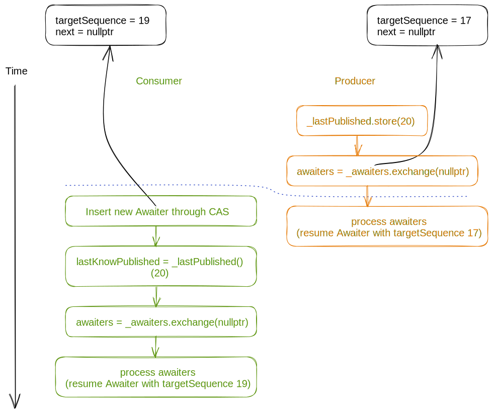

Теперь рассмотрим межпоточную синхронизацию при конкуретных вызовах `publish` и `add_awaiter`. Подробно не буду рассматривать синхронизацию вставка-вставка **CAS**-ом авайтера (списка авайтеров), от этого зависит только порядок авайтеров в списке `SequenceBarrier::_awaiters`, который для логики не важен, важно предшествует или нет `targetSequence` конкретного авайтера значению загруженному из поля `SequenceBarrier::_lastPublished`.

Первый случай самый простой. Продюсер публикует номер предшествующий `targetSequence` вставляемого авайтера. Продюсер (в методе `publish`) захватет список `SequenceBarrier::_awaiters` раньше вставки авайтера (метод `add_awaiter`). Авайтер вставляется в пустой список `SequenceBarrier::_awaiters` и на этом метод `add_awaiter` завершается, т.к. публикуемый номер меньше `targetSequence`.

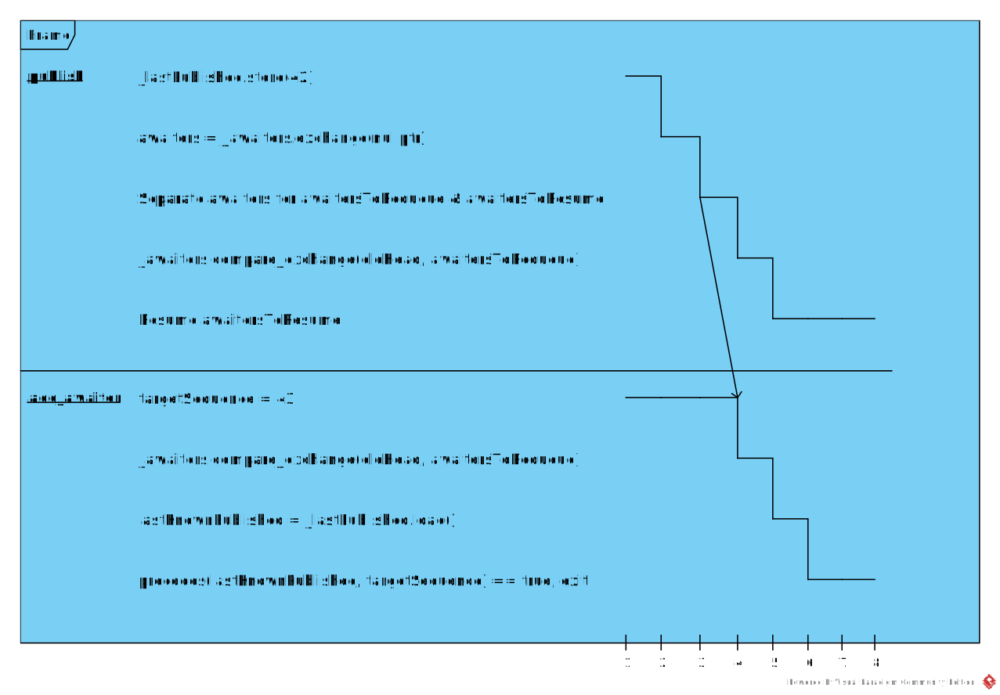

Случай второй, в нем продюсер также публикует предшествующий номер, но в этот раз вставка авайтера происходит раньше захвата списка `SequenceBarrier::_awaiters` в методе `publish`. Метод `add_awaiter` завершается, метод `publish` разбирает захваченный список, вставляет обратно в список `SequenceBarrier::_awaiters` вновь добавляемый авайтер (и другие ожидающие), будит авайтеры (если они есть) для которых публикуемый номер **не** предшествует `targetSequence`.

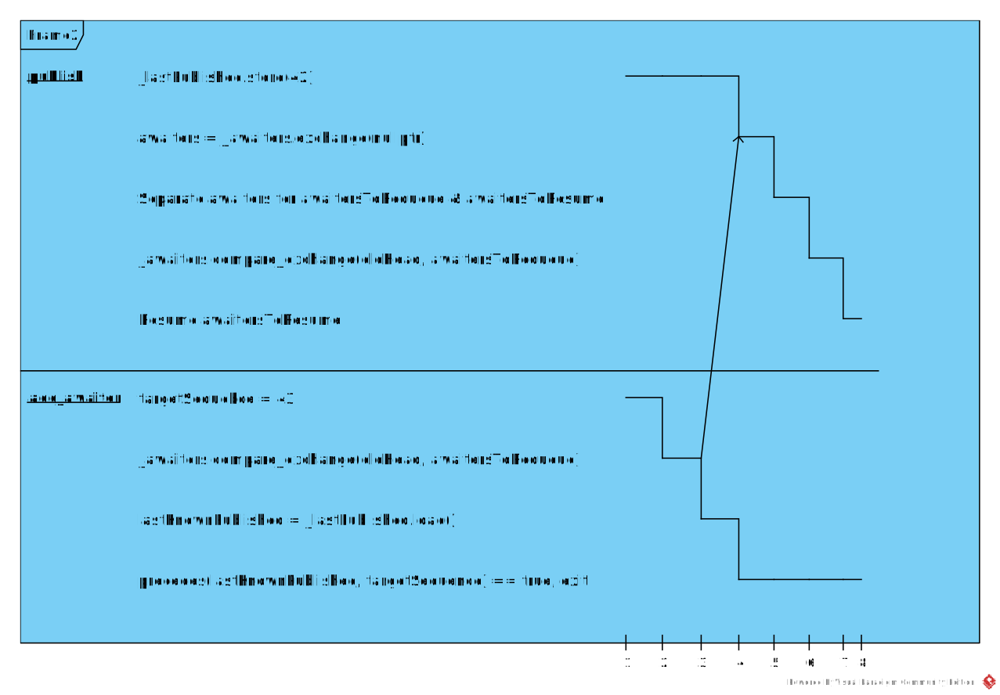

Случай третий, теперь продюсер публикует номер равный `targetSequence` вставляемого авайтера. Продюсер (в методе `publish`) захватывает список `SequenceBarrier::_awaiters` после вставки **CAS**-ом нового авайтера. Продюсер также разбирает захваченный список на `awaitersToRequeue` и `awaitersToResume`, первый список вставляет обратно в `SequenceBarrier::_awaiters`, второй пробуждает. В целом похоже на предыдущий случай, но метод `add_awaiter` работает дольше, т.к. публикуемый номер равен (либо предшествует) `targetSequence` вставляемого авайтера.

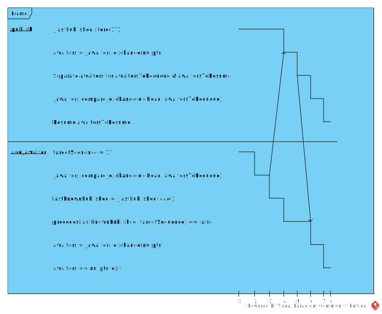

Случай четвертый, также как и предыдущем варианте продюсер публикует номер равный `targetSequence` вставляемого авайтера. Но теперь список `SequenceBarrier::_awaiters` захватывается подписчиком в методе `add_awaiter`. На этом метод `publish` завершается, в методе `add_awaiter` выполняется разбор захваченного списка, вставка ожидающих авайтеров в `SequenceBarrier::_awaiters` и пробуждение авайтеров у которых `targetSequence` меньше либо равен вновь опубликованному номеру последовательности.

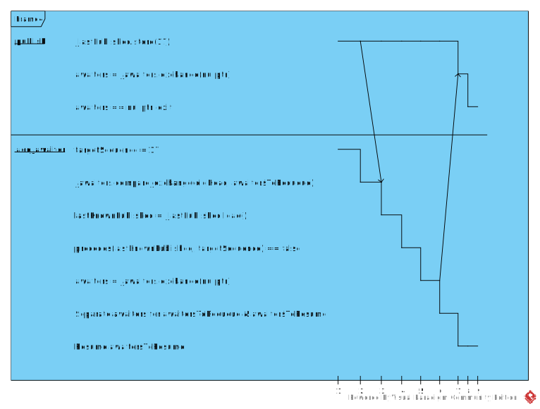

И последний вариант, в нем рассмотрим синхронизацию конкурирующих вставок двух авайтеров с публикацией нового номера последовательности. Продюсер публикует новый номер последовательности, в это же время два (или более) подписчика работающие в разных тредах выполняют вставку новых авайтеров. Первый поток (A) вставляет авайтер с `targetSequence` равным публикуемому номеру последовательности, второй поток (B) вставляет авайтер с `targetSequence` большим чем публикуемый номер. В захвате списка `SequenceBarrier::_awaiters` побеждает второй поток (B), вызовы метода `publish` продюсером и метода `add_awaiter` первым (A) потоком на этом завершается. Второй поток (B) в методе `add_awaiter` разбирает захваченный список авайтеров, вставляет обратно в `SequenceBarrier::_awaiters` авайтер с `targetSequence` большим публикуемого номера (вставленный этим же потоком B) и будит авайтер с `targetSequence` равным публикуемому номеру (вставленный первым потоком A завершившим к этому моменту исполнение метода `add_awaiter`).

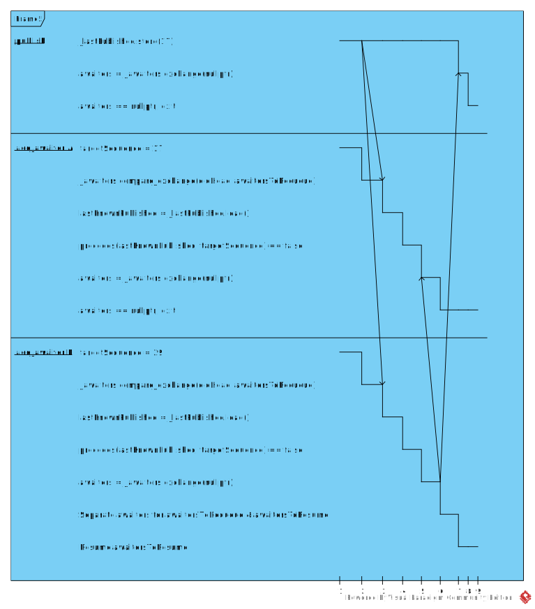

# Облегчаем синхронизацию

Начнем с синхронизации вставки авайтера и публикации нового номера последовательности.

```cpp
// Thread consumer
{
    auto* oldHead = _awaiters.load();
    do
    {
        *awaitersToRequeueTail = oldHead;
    } while (!_awaiters.compare_exchange_weak(
                oldHead,
                awaitersToRequeue));        // A
}
lastKnownPublished = _lastPublished.load(); // B
if (Traits::precedes(lastKnownPublished, targetSequence))
{
    // None of the the awaiters we enqueued have been satisfied yet.
    break;
}
        
// Thread producer
_lastPublished.store(sequence);                  // C
Awaiter* awaiters = _awaiters.exchange(nullptr); // D
if (!awaiters)
{
    return;
}
```

Как уже было сказано выше, продюсер может опубликовать новый номер последовательности конкурируя с вставкой авайтера подписчиком. Чтобы в списке `_awaiters` не остался необработанный авайтер (с `targetSequence` предшествующим либо равным опубликованному номеру последовательности) подписчик должен увидеть последний опубликованный номер, либо продюсер в должен увидеть последний вставленный авайтер. Или же оба этих события должны произойти одновременно, в этом случаи продюсер и подписчик будут бороться за захват списка `_awaiters` и победитель обработает его (что нас вполне устраивает). Главное чтобы соблюдался относительный порядок операций: вставка подписчиком нового авайтера (A) раньше чтения `_lastPublished` (B) и запись `_lastPublished` (C) происходит раньше захвата продюсером списка авайтеров (D). Соответственно если чтение `_lastPublished` (B) происходит раньше чем запись в него нового номера продюсером (С), то вставка авайтера подписчиком (A) происходит раньше захвата продюсером списка `_awaiters` (D) и продюсер видит последний вставленный авайтер. Для этого у этих четырех операций должен быть единый порядок для всех тредов, поэтому для них выбираем `std::memory_order_seq_cst`. Если же использовать ослабленный **memory order**, то для продюсера операции могут быть видны в порядке B-C-D-A (т.к. `_awaiters` и `_lastPublished` независимые переменные) и произойдет потеря события.

Следующая точка синхронизации - захват списка `SequenceBarrier::_awaiters` подписчиком. Для нее важно синхронизировать загрузку с другими операциями изменяющими это поле и синхронизировать замену загруженного значения на `nullptr` с другими операциями читающие это поле. Для выполнения первой части требования нужна семантика **acquire**, для второй **release**. Т.к. `std::atomic<T>::exchange` это _read-modify-write_ операция, то запись нового значения будет выполнятся как **release-sequence** и другие операция чтения будут синхронизироваться с ней, в общие переменные подписчик до нее не пишет, поэтому явно указывать семантику **release** не требуется. Осталось только явно задать семантику захвата, итого выбираем `std::memory_order_acquire`.

И последняя точка синхронизации - вставка продюсером обратно в `SequenceBarrier::_awaiters` списка ожидающих авайтеров. На первый взгляд кажется можно обойтись `std::memory_order_relaxed`, **CAS** по свой природе всегда сравнивает с последним актуальным значением, это read-modify-write операция, других общих изменяемых переменных вроде нет. Но это не так)

```cpp
// null-terminate the two lists.
*awaitersToRequeueTail = nullptr;
*awaitersToResumeTail = nullptr;

if (awaitersToRequeue)
{
    Awaiter* oldHead = nullptr;
    while (!_awaiters.compare_exchange_weak(
            oldHead,
            awaitersToRequeue))
    {
        *awaitersToRequeueTail = oldHead;
    }
}

while (awaitersToResume)
{
    Awaiter* next = awaitersToResume->next;
    awaitersToResume->resume(sequence);
    awaitersToResume = next;
}
 
```

Перед вставкой продюсером списка `awaitersToRequeue` в `SequenceBarrier::_awaiters` выполняется обнуления поля `next` последнего авайтера во вставляемом списке. И этом месте происходит data race с чтением этого поля подписчиком (при обработке списка авайтеров), о чем мне услужливо сообщил TSan. Поэтому выбираем семантику `std::memory_order_release` чтобы операция обнуления хвоста списка не могла быть перепланирована ниже **CAS**-а.

Итого получаем такие изменения:

```diff
diff --git a/include/sequence_barrier.h b/include/sequence_barrier.h
index 5a1daf8..d9345b8 100644
--- a/include/sequence_barrier.h
+++ b/include/sequence_barrier.h
@@ -98,7 +98,7 @@ awaitable<TSequence> SequenceBarrier<TSequence, Traits, Awaiter>::wait_until_pub
 template<std::unsigned_integral TSequence, typename Traits, typename Awaiter>
 void SequenceBarrier<TSequence, Traits, Awaiter>::publish(TSequence sequence)
 {
-    _lastPublished.store(sequence);
+    _lastPublished.store(sequence, std::memory_order_seq_cst);
 
     // Cheaper check to see if there are any awaiting coroutines.
 //    Awaiter* awaiters = _awaiters.load();
@@ -108,7 +108,7 @@ void SequenceBarrier<TSequence, Traits, Awaiter>::publish(TSequence sequence)
 
     Awaiter* awaiters;
 
-    awaiters = _awaiters.exchange(nullptr);
+    awaiters = _awaiters.exchange(nullptr, std::memory_order_seq_cst);
     if (!awaiters) {
         return;
     }
@@ -148,7 +148,9 @@ void SequenceBarrier<TSequence, Traits, Awaiter>::publish(TSequence sequence)
         Awaiter* oldHead = nullptr;
         while (!_awaiters.compare_exchange_weak(
             oldHead,
-            awaitersToRequeue))
+            awaitersToRequeue,
+            std::memory_order_release,
+            std::memory_order_relaxed))
         {
             *awaitersToRequeueTail = oldHead;
         }
@@ -177,13 +179,15 @@ void SequenceBarrier<TSequence, Traits, Awaiter>::add_awaiter(Awaiter* awaiter)
     {
         // Enqueue the awaiter(s)
         {
-            auto* oldHead = _awaiters.load();
+            auto* oldHead = _awaiters.load(std::memory_order_relaxed);
             do
             {
                 *awaitersToRequeueTail = oldHead;
             } while (!_awaiters.compare_exchange_weak(
                 oldHead,
-                awaitersToRequeue));
+                awaitersToRequeue,
+                std::memory_order_seq_cst,
+                std::memory_order_relaxed));
         }
 
         // Check that the sequence we were waiting for wasn't published while
@@ -192,7 +196,7 @@ void SequenceBarrier<TSequence, Traits, Awaiter>::add_awaiter(Awaiter* awaiter)
         // publishes a new sequence number concurrently with this call that we either see
         // their write to m_lastPublished after enqueueing our awaiter, or they see our
         // write to m_awaiters after their write to m_lastPublished.
-        lastKnownPublished = _lastPublished.load();
+        lastKnownPublished = _lastPublished.load(std::memory_order_seq_cst);
         if (Traits::precedes(lastKnownPublished, targetSequence))
         {
             // None of the the awaiters we enqueued have been satisfied yet.
@@ -206,7 +210,7 @@ void SequenceBarrier<TSequence, Traits, Awaiter>::add_awaiter(Awaiter* awaiter)
         // published sequence number. The producer thread may not have seen our write to m_awaiters
         // so we need to try to re-acquire the list of awaiters to ensure that the waiters that
         // are now satisfied are woken up.
-        auto* awaiters = _awaiters.exchange(nullptr);
+        auto* awaiters = _awaiters.exchange(nullptr, std::memory_order_acquire);
 
         auto minDiff = std::numeric_limits<typename Traits::difference_type>::max();
```

---

Спроектированный выше код полностью функционален, но простор для доработок все еще широк:

- [ABA-проблема](https://en.wikipedia.org/wiki/ABA_problem?ref=kysa.me) - при вставке **CAS**-ом очередного авайтера в список `SequenceBarrier::_awaiters` потенциально возможна ситуация когда указатель на текущую вершину равен ожидаемому, но указывает он уже на другой авайтер (например между загрузкой вершины и **CAS,** операционка вытеснила поток исполняющий этот кусок кода). Победить ее можно применением теггированных (например из [Boost.Lockfree](https://www.boost.org/doc/libs/1_81_0/doc/html/lockfree/rationale.html?ref=kysa.me#lockfree.rationale.aba_prevention)) указателей (простое решение), либо при помощи [hazard-указателей](https://en.wikipedia.org/wiki/Hazard_pointer?ref=kysa.me) (сложнее и правильней).
- Выравнивание полей `SequenceBarrier::_awaiters` и `SequenceBarrier::_lastPublished` под кеш-линии. К этим полям происходит частый конкурентный доступ. Для того чтобы лишний раз неинвалидировалось закешированное значение одного из полей при записи другого поля, оба этих поля нужно выровнять по длине кеш-линии процессора. Но сперва к этому нужно написать нагрузочные тесты.

Код [тут](https://github.com/dvetutnev/boost_asio_awaitable_ext?ref=kysa.me).