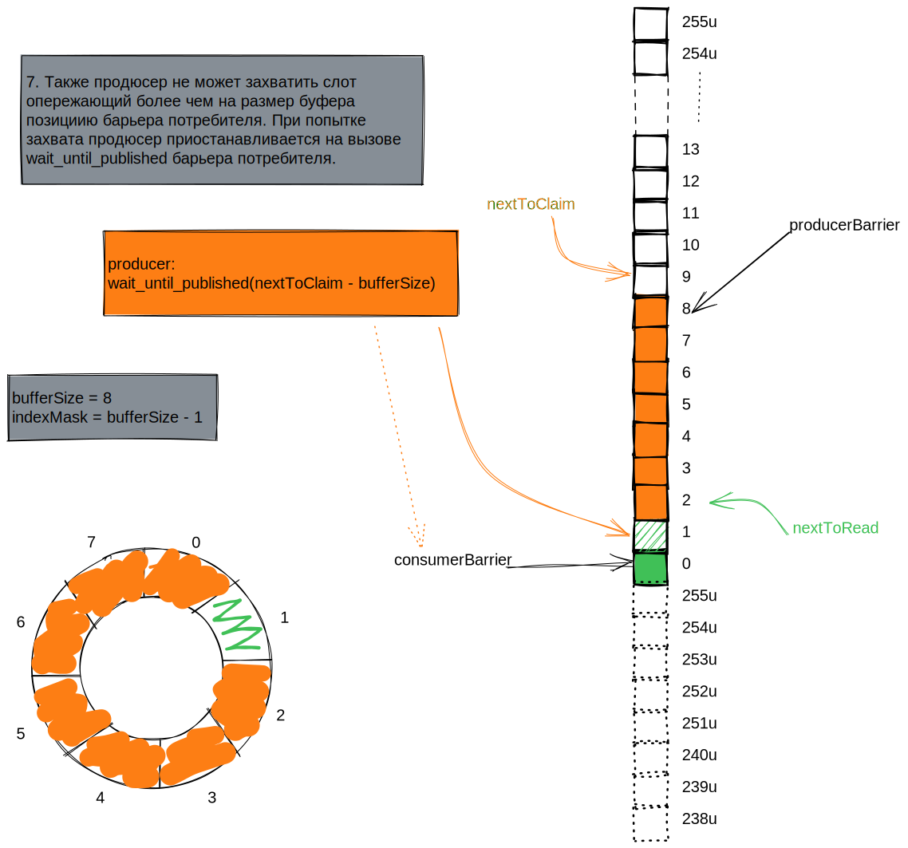

Основное назначение этой заметки не столько реализация работы [секвенсера](boost-asio-coroutines-singleproducersequencer.md) с несколькими потребителями (это не самый частый вариант использования), сколько более подробное рассмотрение взаимодействия продюсера и потребителей. Она является небольшим прологом к секвенсеру (тут будет ссылка на MultiProducerSequencer) со множеством продюсеров.

Начнем с кейса с одним продюсером и одним потребителем. Размер буфера задан 8, чтобы поменьше рисовать. Представлено в виде слайдов.





С одним потребителем разобрались: он сначала получает позицию для чтения, после прочтения помечает ее доступной для записи. Кольцевой буфер - он есть кольцевой буфер, не новый паттерн. Но все меняется когда потребителей больше одного. Возможны две стратегии работы с буфером нескольких потребителей: каждый из них читает/обрабатывает по одному уникальному сообщению (несколько потребителей поедают одну очередь одновременно), и каждый потребитель читает все сообщение наравне с другими (распараллеливание потока сообщений на несколько получателей). Т.к. потребители могут работать в разных потоках, а операции чтения и пометки слотов прочтенными независимы, возможна ситуация в которой второй потребитель публикует номер прочитанного им слота, _следующий_ за тем, который в это время еще не закончил читать первый потребитель.


Для обеих стратегий важно, чтобы продюсер не начал писать в слот который еще не помечен прочтенным самым отстающим потребителем. Нужен механизм для ожидания пока **все** потребители не опубликуют номер равный или больший заданному.


Все необходимое в Boost для реализации уже есть. Реализовано аналогично перегрузкам [операторов `||` и `&&`](https://www.boost.org/doc/libs/1_81_0/doc/html/boost_asio/overview/composition/cpp20_coroutines.html?ref=kysa.me#boost_asio.overview.composition.cpp20_coroutines.co_ordinating_parallel_coroutines) для типов `awaitable<>`, но применена range-версия `make_parallel_group`.

```cpp
template<std::unsigned_integral TSequence = std::size_t,
         typename Traits = SequenceTraits<TSequence>>
class SequenceBarrierGroup
{
public:
    using BarrierRef =
        std::reference_wrapper<SequenceBarrier<TSequence, Traits>> ;

    SequenceBarrierGroup(std::vector<BarrierRef> barriers)
        :
        _barriers{std::move(barriers)}
    {
        assert(_barriers.size() > 0);
    }

    SequenceBarrierGroup(const SequenceBarrierGroup&) = delete;
    SequenceBarrierGroup& operator=(const SequenceBarrierGroup&) = delete;

    [[nodiscard]] awaitable<TSequence> wait_until_published(TSequence targetSequence) const
    {
        using experimental::make_parallel_group;
        using experimental::wait_for_all;

        auto executor = co_await this_coro::executor;

        auto makeOperation = [executor, targetSequence](BarrierRef barrier)
        {
            // As args, not capture
            auto coro = [](BarrierRef barrier, TSequence targetSequence) -> awaitable<TSequence>
            {
                co_return co_await barrier.get().wait_until_published(targetSequence);
            };

            return co_spawn(executor, coro(barrier, targetSequence), deferred);
        };

        using Operation = decltype(makeOperation(_barriers.front()));
        std::vector<Operation> operations;

        operations.reserve(_barriers.size());
        for (BarrierRef barrier : _barriers) {
            operations.push_back(makeOperation(barrier));
        }

        auto [order, exceptions, published] =
            co_await make_parallel_group(std::move(operations))
                .async_wait(wait_for_all(), use_awaitable);

        (void)order;
        auto isThrow = [](const std::exception_ptr& ex) -> bool { return !!ex; };
        if (auto firstEx = std::find_if(std::begin(exceptions), std::end(exceptions), isThrow);
            firstEx != std::end(exceptions))
        {
            if (std::any_of(firstEx, std::end(exceptions), isThrow)) {
                throw multiple_exceptions(*firstEx);
            } else {
                std::rethrow_exception(*firstEx);
            }
        }

        auto it = std::min_element(std::begin(published), std::end(published),
                                   [](TSequence a, TSequence b) {
                                       return Traits::precedes(a, b); 
                                   });
        co_return *it;
    }

private:
    const std::vector _barriers;
};
```

Для каждого барьера запускается короутина ожидающая публикации заданного номера, короутины помещаются в контейнер (40). Для всех запускается операция ожидания (45). После завершения **всех** короутин из возвращенных ими номеров выбирается самый ранний (61).

С реализацией разобрались, теперь нужно научить [секвенсер](boost-asio-coroutines-singleproducersequencer.md) работать с группой барьеров. Эта конструкция с претензией на производительность поэтому динамическому полиморфизму предпочтем статический - параметризуем секвенсер типом барьера потребителя. Его определение будет таким:

```cpp
template<typename Barrier, typename TSequence>
concept IsSequenceBarrier = requires(Barrier b, TSequence s) {
    { b.wait_until_published(s) } -> std::same_as<awaitable<TSequence>>;
};

template<std::unsigned_integral TSequence = std::size_t,
         typename Traits = SequenceTraits<TSequence>,
         IsSequenceBarrier<TSequence> ConsumerBarrier = SequenceBarrier<TSequence, Traits>>
class SingleProducerSequencer
{
public:
    SingleProducerSequencer(const ConsumerBarrier& consumerBarrier,
                            std::size_t bufferSize,
                            TSequence initialSequence = Traits::initial_sequence);

    SingleProducerSequencer(const SingleProducerSequencer&) = delete;
    SingleProducerSequencer& operator=(const SingleProducerSequencer&) = delete;

    [[nodiscard]] awaitable<TSequence> claim_one();
    [[nodiscard]] awaitable<SequenceRange<TSequence, Traits>> claim_up_to(std::size_t);
    void publish(TSequence);
    void publish(const SequenceRange<TSequence, Traits>&);

    TSequence last_published() const;
    [[nodiscard]] awaitable<TSequence> wait_until_published(TSequence) const;

private:
    const ConsumerBarrier& _consumerBarrier;
    const std::size_t _bufferSize;

    TSequence _nextToClaim;

    SequenceBarrier<TSequence, Traits> _producerBarrier;
};
```

Теперь о том, как использовать несколько потребителей. Выше было сказано, что есть две стратегии: обработка каждым потребителем уникальных сообщений и обработка всех сообщений каждым потребителем. Вторая стратегия это распараллеливание потока сообщений, ничего особенного в реализации нет, просто каждый потребитель публикует номера прочитанных слотов в своем барьере, а секвенсер работает с группой из барьеров потребителей. С первой стратегией немного хитрей. Чтобы потребители читали уникальные сообщения у них должен быть общий счетчик слотов, перед получение/чтением слота каждый потребитель его атомарно инкрементирует и использует для ожидания/чтения предшествующий (инкременту) номер, также этот номер потребитель публикует помечая слот как свободный. И еще продюсеру нужно отправлять завершающее сообщение для каждого потребителя, каждый же свое уникально получает и без него не завершиться.

```cpp
BOOST_AUTO_TEST_CASE(unique)
{
    constexpr std::size_t bufferSize = 256;
    constexpr std::size_t indexMask = bufferSize - 1;
    std::uint64_t buffer[bufferSize];

    constexpr std::size_t iterationCount = 1'000'000;

    using Sequencer = SingleProducerSequencer<
        std::size_t,
        SequenceTraits<std::size_t>,
        SequenceBarrierGroup<std::size_t>>;

    auto producer = [&](Sequencer& sequencer, unsigned consumerCount) -> awaitable<void>
    {
        constexpr std::size_t maxBatchSize = 10;

        std::size_t i = 0;
        while (i < iterationCount)
        {
            std::size_t batchSize = std::min(maxBatchSize, iterationCount - i);
            auto range = co_await sequencer.claim_up_to(batchSize);
            for (auto seq : range) {
                buffer[seq & indexMask] = ++i;
            }
            sequencer.publish(range);
        }

        while (consumerCount--)
        {
            auto finalSeq = co_await sequencer.claim_one();
            buffer[finalSeq & indexMask] = 0;
            sequencer.publish(finalSeq);
        };

        co_return;
    };

    auto consumer = [&](const Sequencer& sequencer,
                        SequenceBarrier<std::size_t>& readBarrier,
                        std::atomic_size_t& nextToRead,
                        std::size_t& result) -> awaitable<void>
    {
        bool reachedEnd = false;
        std::size_t lastKnownPublished = readBarrier.last_published();
        do {
            std::size_t toRead = nextToRead.fetch_add(1);
            if (Traits::difference(toRead, lastKnownPublished) >= bufferSize)
            {
                // Move consumer barrier if retarded
                readBarrier.publish(toRead - 1);
            }
            
            co_await sequencer.wait_until_published(toRead);
            result += buffer[toRead & indexMask];

            // Zero value is sentinel that indicates the end of the stream.
            reachedEnd = buffer[toRead & indexMask] == 0;

            // Notify that we've finished processing up to 'available'.
            readBarrier.publish(toRead);
            lastKnownPublished = toRead;

        } while (!reachedEnd);

        co_return;
    };

    SequenceBarrier<std::size_t> barrier1, barrier2;
    SequenceBarrierGroup<std::size_t> barrierGroup{{barrier1, barrier2}};
    Sequencer sequencer{barrierGroup, bufferSize};

    std::atomic_size_t nextToRead{0};

    std::size_t result1 = 0;
    std::size_t result2 = 0;

    thread_pool tp{3};
    any_io_executor executorA = tp.get_executor();
    any_io_executor executorB = tp.get_executor();
    any_io_executor executorC = tp.get_executor();
    co_spawn(executorA, consumer(sequencer, barrier1, nextToRead, result1), detached);
    co_spawn(executorB, consumer(sequencer, barrier2, nextToRead, result2), detached);
    co_spawn(executorC, producer(sequencer, 2), detached);
    tp.join();

    constexpr std::uint64_t expectedResult =
        static_cast<std::uint64_t>(iterationCount) * static_cast<std::uint64_t>(1 + iterationCount) / 2;
    BOOST_TEST(result1 + result2 == expectedResult);
}
```

При разборе несколькими потребителями одной очереди возможна проблема: один из потребителей может отстать на размер (и более) буфера. В этом случаи получаем деадлок, потребители ждут от секвенсора новых номеров слотов, продюсер ждет упершись в барьер самого отстающего потребителя и друг-друга они никогда не дождутся. Можно увеличить размер буфера, но это решение ненадежное, т.к. ОС может вытеснить поток на сколь угодно длительное время (падать в деадлок из-за перегрузки сервера такое себе). Можно сдвигать барьер потребителя не прочитанную им позицию, а на последнюю позицию опубликованную продюсером (полученную из вызова `co_await sequencer.wait_until_published(toRead)`, это решение также ненадежное, ОС может вытеснить в поток в любой точке, в том числе после публикации потребителем прочитанного номера. Правильным решением этой проблемы будет отслеживание потребителем отставания и сдвиг своего барьера перед запросом у секвенсора следующего номера. Т.к. барьер сдвигает только сам потребитель, то последнюю прочитанную позицию можно получать не вызовом `readBarrier.last_published()`, а из отдельной переменной, тем самым избавляясь от избыточной атомарной операции (см. реализацию барьера). Эта ситуация пожалуй наглядная демонстрация, что в асинхронных системах могут быть не очевидные состояния, и если их специально не обрабатывать, то возможны проблемы.
