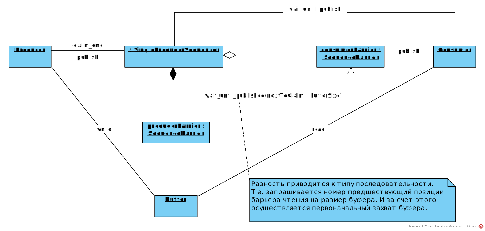
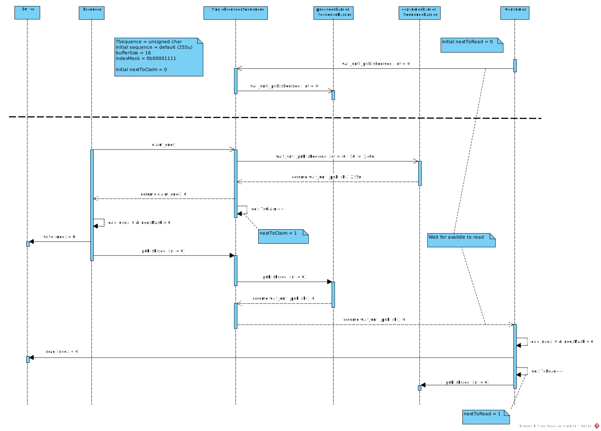
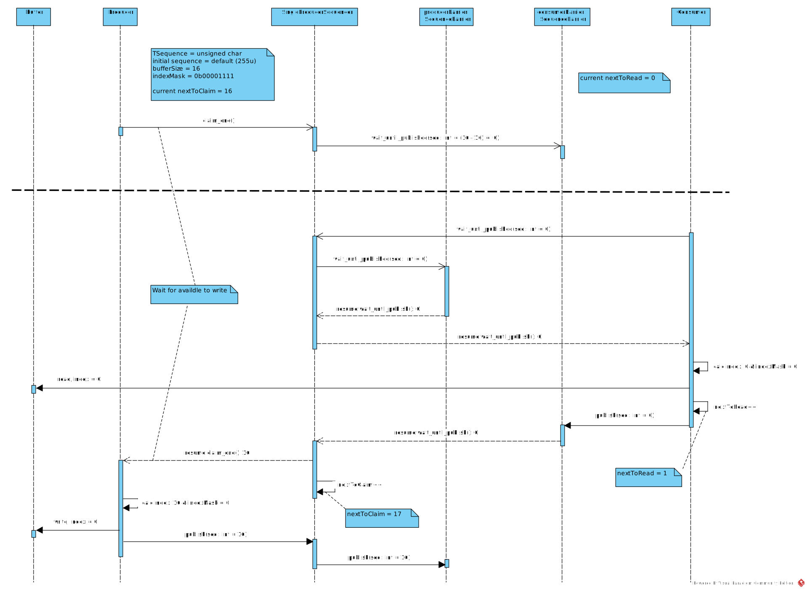

Следующий примитив синхронизации из [cppcoro](https://github.com/lewissbaker/cppcoro?ref=kysa.me#single_producer_sequencer). Он предназначен для координации  доступа к кольцевому буферу одного продюсера и одного подписчика. Продюсер и подписчик могут работать в разных тредах (собственно это основное назначение этого класса - реализация _thread-safe_ очереди). Это часть паттерна [Disruptor](https://lmax-exchange.github.io/disruptor/?ref=kysa.me) из Java-мира.

Продюсер захватывает один или более слотов в буфере, выполняет запись в эти слоты и в конце публикует номер последнего записанного слота. Продюсер никогда не захватывает слоты отстоящие дальше чем на размер буфера (в элементах, не байтах) от номера обработанного подписчиком.

Подписчик ожидает пока продюсер не опубликует номер слота следующий за текущей позицией (подписчика), обрабатывает данные из слотов и уведомляет продюсер где он закончил обработку публикуя номер последнего обработанного слота в барьере чтения.

Индекс для доступа вычисляется применением маски к номеру слота, маска - размер буфера минус один. Из этого же вытекает требование, что размер буфера должен быть степенью двойки.

```cpp
struct Message
{
    int id;
    std::chrono::steady_clock::time_point timestamp;
    float data;
};

constexpr std::size_t bufferSize = 256; // Must be power-of-two
constexpr std::size_t indexMask = bufferSize - 1;
Message buffer[bufferSize];

awaitable<void> producer(SingleProducerSequencer<std::size_t>& sequencer)
{
    for (int i = 0; i < 1'000'000; ++i)
    {
        // Wait until a slot is free in the buffer.
        auto sequence = co_await sequencer.claim_one();

	// Populate the message.
        Message& msg = buffer[sequence & indexMask];
        msg.id = i;
        msg.timestamp = std::chrono::steady_clock::now();
        msg.data = 123;

        // Publish message.
        sequencer.publish(sequence);
    }

    // Publish a sentinel.
    auto sequence = co_await sequencer.claim_one();

    Message& msg = buffer[sequence & indexMask];
    msg.id = -1;

    sequencer.publish(sequence);

    co_return;
}

awaitable<void> consumer(const SingleProducerSequencer<std::size_t>& sequencer,
                         SequenceBarrier<std::size_t>& consumerBarrier)
{
    std::size_t nextToRead = 0;
    for (;;)
    {
        // Wait until next message is available.
        // There may be more than one available.
        const std::size_t available =
            co_await sequencer.wait_until_publish(nextToRead);
        do {
            Message& msg = buffer[nextToRead & indexMask];

            if (msg.id == -1) {
                // Last message.
                consumerBarrier.publish(nextToRead);
                co_return;
            }

            processMessage(msg);
        } while (nextToRead++ != available);

        // Notify the producer that we`ve finished processing
        // up to 'nextToRead - 1'
        consumerBarrier.publish(available);
    }
}

SequenceBarrier<std::size_t> consumerBarrier;
SingleProducerSequencer<std::size_t> sequencer{consumerBarrier, bufferSize};

thread_pool tp{2};
co_spawn(tp, producer(sequencer), detached);
co_spawn(tp, consumer(sequencer, consumerBarrier), detached);
tp.join();
```



Вместо диаграммы классов приведена диаграмма объектов для более наглядного отображения двух барьеров.

Потребитель начинает чтение из буфера после того, как продюсер опубликует соответствующий номер слота. Продюсер же публикует номер слота только после окончания записи в буфер.



Если текущая позиция продюсера `nextToClaim` опережает позицию потребителя на размер буфера, то свободных слотов для записи нет. В этом случаи продюсер ожидает когда потребитель прочтет хотя бы один слот и опубликует его номер в своем барьере.



Реализация довольно проста т.к. все заботы по ожиданию событий ложатся на плечи барьеров. Для нашего секвенсора остается только вычисление номеров последовательности событий.

```cpp
template<std::unsigned_integral TSequence = std::size_t,
         typename Traits = SequenceTraits<TSequence>>
class SingleProducerSequencer
{
public:
    SingleProducerSequencer(const SequenceBarrier<TSequence, Traits>& consumerBarrier,
                            std::size_t bufferSize,
                            TSequence initialSequence = Traits::initial_sequence);

    [[nodiscard]] awaitable<TSequence> claim_one();
    [[nodiscard]] awaitable<SequenceRange<TSequence, Traits>> claim_up_to(std::size_t);
    void publish(TSequence);
    void publish(const SequenceRange<TSequence, Traits>&);

    TSequence last_published() const;
    [[nodiscard]] awaitable<TSequence> wait_until_published(TSequence) const;

private:
    const SequenceBarrier<TSequence, Traits>& _consumerBarrier;
    const std::size_t _bufferSize;

    TSequence _nextToClaim;

    SequenceBarrier<TSequence, Traits> _producerBarrier;
};

template<std::unsigned_integral TSequence, typename Traits>
SingleProducerSequencer<TSequence, Traits>::SingleProducerSequencer(const SequenceBarrier<TSequence, Traits>& consumerBarrier,
                                                                    std::size_t bufferSize,
                                                                    TSequence initialSequence)
    :
    _consumerBarrier{consumerBarrier},
    _bufferSize{bufferSize},
    _nextToClaim{initialSequence + 1},
    _producerBarrier{initialSequence}
{}

template<std::unsigned_integral TSequence, typename Traits>
awaitable<TSequence> SingleProducerSequencer<TSequence, Traits>::claim_one()
{
    const auto nextToWrite = static_cast<TSequence>(_nextToClaim - _bufferSize);
    co_await _consumerBarrier.wait_until_published(nextToWrite);
    co_return _nextToClaim++;
}

template<std::unsigned_integral TSequence, typename Traits>
awaitable<SequenceRange<TSequence, Traits>> SingleProducerSequencer<TSequence, Traits>::claim_up_to(std::size_t count)
{
    const auto nextToWrite = static_cast<TSequence>(_nextToClaim - _bufferSize);
    const TSequence lastAvailableSequence =
        static_cast<TSequence>(co_await _consumerBarrier.wait_until_published(nextToWrite) + _bufferSize);

    const TSequence begin = _nextToClaim;
    const std::size_t availableCount = static_cast<std::size_t>(lastAvailableSequence - begin) + 1;
    const std::size_t countToClaim = std::min(count, availableCount);
    const TSequence end = static_cast<TSequence>(begin + countToClaim);

    _nextToClaim = end;
    co_return SequenceRange<TSequence, Traits>{begin, end};
}

template<std::unsigned_integral TSequence, typename Traits>
void SingleProducerSequencer<TSequence, Traits>::publish(TSequence sequence)
{
    _producerBarrier.publish(sequence);
}

template<std::unsigned_integral TSequence, typename Traits>
void SingleProducerSequencer<TSequence, Traits>::publish(const SequenceRange<TSequence, Traits>& range)
{
    publish(range.back());
}

template<std::unsigned_integral TSequence, typename Traits>
TSequence SingleProducerSequencer<TSequence, Traits>::last_published() const
{
    return _producerBarrier.last_published();
}

template<std::unsigned_integral TSequence, typename Traits>
awaitable<TSequence> SingleProducerSequencer<TSequence, Traits>::wait_until_published(TSequence sequence) const
{
    co_return co_await _producerBarrier.wait_until_published(sequence);
}
```

Такая конструкция может показаться обладающей слишком развесистым интерфейсом (почему бы не обойтись push/pop) но зато позволяет раздельно захватывать слоты и сообщать об окончании записи в них. В том числе захватить за раз все доступные слоты и опубликовать последний номер с минимумом атомарных операций.

Код [тут](https://github.com/dvetutnev/boost_asio_awaitable_ext?ref=kysa.me).