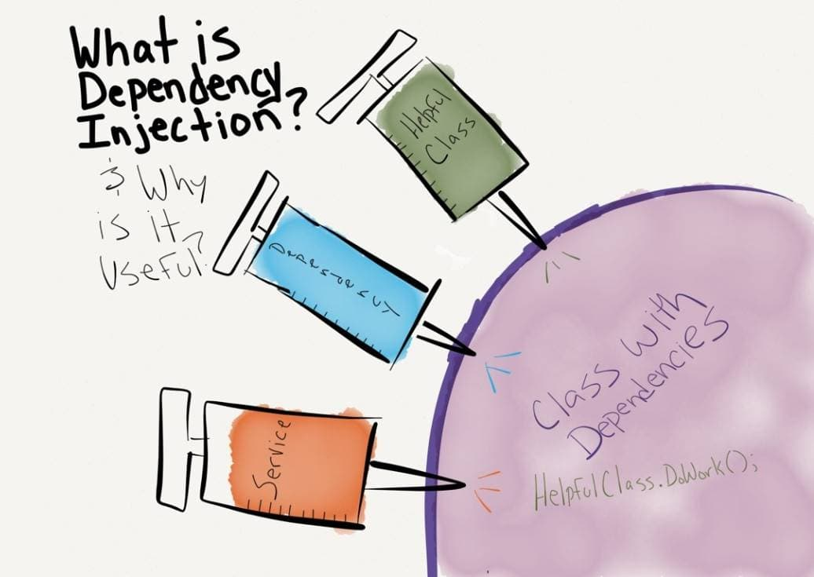
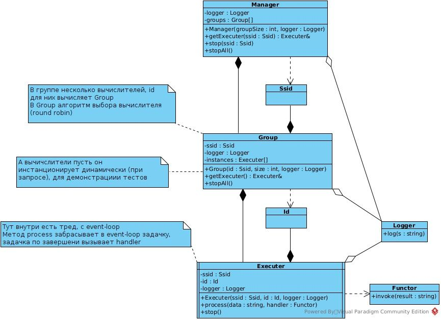
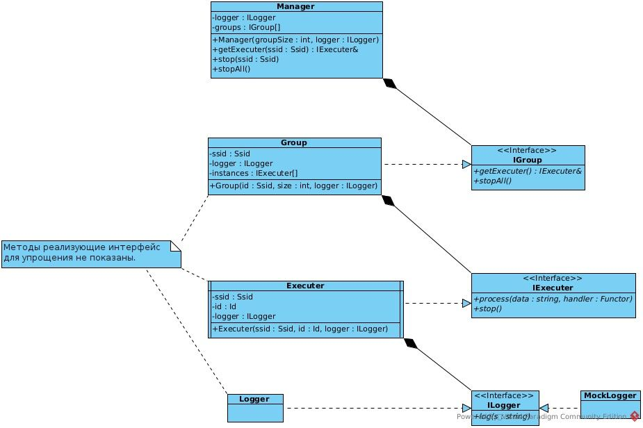
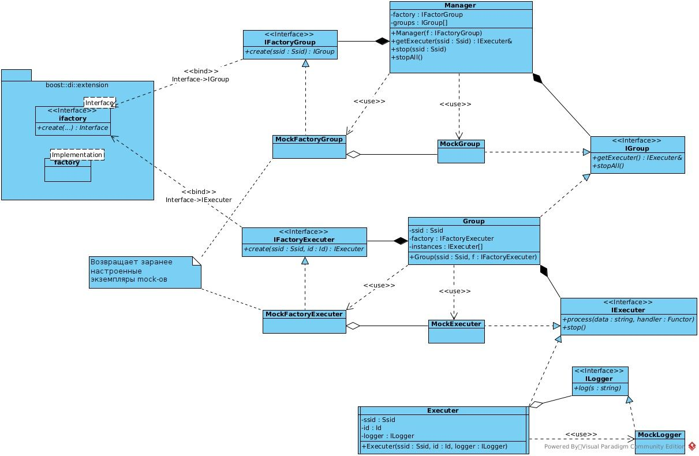
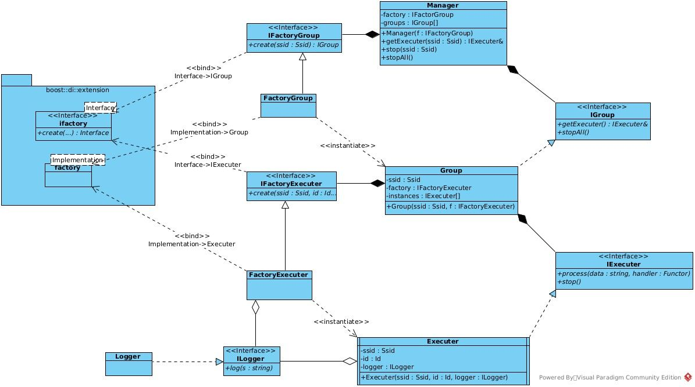
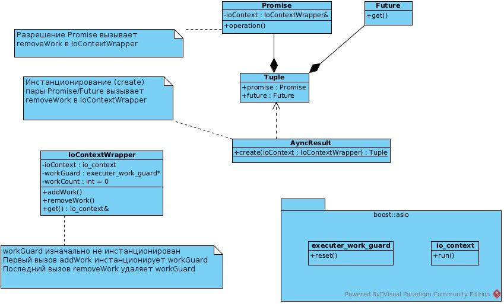

В книге Чистый код Роберт Мартин сравнивает модульное тестирование с серебряной пулей. Инъекция зависимостей это винтовка для этой пули, из которой почти любое legacy можно расстрелять и превратить в поддерживаемую  систему.

## Legacy

В качестве примера будет использована следующая система (исходники [тут](https://github.com/dvetutnev/boost-di-example/tree/main/legacy?ref=kysa.me)). Есть вычислитель (**Executer**), обсчитывающий входные данные в параллельном потоке и по завершению вызывающий handler (**Functor**). Также в вычислитель что-то пишет в логгер. Вычислители объединяются в группы (**Group**), группы объединяются менеджером (**Manager**). Нужное количество инстанцов вычислителей в группе создаются динамически, группа по своему алгоритму (в примере round-robin) выбирает вычислитель и возвращает ссылку на него (метод getExecuter). Менеджер динамически создает группы с указанным в методе getExecuter **Ssid**, сохраняет их в ассоциативный  контейнер (ключ **Ssid**), получает у группы ссылку на инстанц вычислителя и возвращает ее. При запросе вычислителя, с Ssid уже созданной группы, группа извлекается из контейнера.



Если посмотреть на тесты legacy, то видно, что их суть повторяется, но с каждым следующим вышестоящим уровнем иерархии они усложнятся. В этом примере какой-то сложной логики в классах **Manager** и **Group** нет, но в реальном проекте она будет и начнется комбинаторный взрыв, который приведет к невозможности тестирования. Число возможных комбинаций получится очень слишком большим, такое количество сложных тестов сложных больше проблем принесет чем пользы.

## Зависимость от интерфейсов (а не реализации)

При тестировании логики класса нужно проверять какие сообщения тестируемый класс передает в объектам и как реагирует на ответы. Использование реальных объектов для этого не подходит (входящие сообщения проверить можно только косвенно, получить детерминированный ответ тяжело). Решить эту проблему можно подставляя вместо реальных объектов [mock-объекты](https://en.wikipedia.org/wiki/Mock_object?ref=kysa.me) с заданным поведением (также они проверяют входящие сообщения). Для возможности подстановки mock-ов тестируем класс он должен зависеть от интерфейса используемого класса, не от конкретной реализации. В этом случаи тестируемому классу можно скормить mock реализующий этот интерфейс. Доработанная иерархия классов выглядит так:



Начнем с простого - тестирования взаимодействия **Executer** и **Logger**. На предыдущем шаге это не тестировалось, теперь такая возможность появилась:

```cpp
struct ILogger
{
    virtual void log(const std::string&) = 0;
    virtual ~ILogger() = default;
};

struct MockLogger : ILogger
{
    MOCK_METHOD(void, log, (const std::string&), (override));
};

TEST(Executer, log) {
    const Ssid ssid{"sSid"};
    const Id id{"157"};

    MockLogger logger;
    EXPECT_CALL(logger, log)
            .Times(1)
            ;

    Executer executer{ssid, id, logger};

    IoContextWrapper ioContext;
    auto [promise, future] = AsyncResult::create(ioContext);
    auto handler = [promise = promise] (const std::string& result) mutable {
        promise(result);
    };

    executer.process("AbCd", handler);
    ioContext.run();
    executer.stop();
}
```

## DI

### Тесты

Для подстановки mock-ов тестируемые классы не должны инстанционировать свои зависимости сами, их нужно передавать снаружи. Если классу все же требуется динамически инстанционировать зависимые объекты (заранее неизвестно нужное количество или часть данных вычисляется на лету) объекты, то он должен делать это через фабрику. Фабрику переданную снаружи и полиморфную, которая для тестирования возвращает заранее настроенные mock-и динамически создаваемых  зависимостей. Для рабочей конфигурации фабрика будет возвращать вместо mock-ов соответственно рабочие экземпляры объектов. Диаграмма классов с mock-объектами вместо рабочих выглядит так:



Выглядит сложно, но это позволяет полностью протестировать логику. Интерфейсы фабрик объявлены как специализации шаблона **ifactory** из Boost.DI:

```cpp
using IFactoryExecuter = boost::di::extension::ifactory<IExecuter, Ssid,  Id>;

using IFactoryGroup = boost::di::extension::ifactory<IGroup, Ssid>;
```

Теперь протестируем класс Manager с полной подменой его зависимостей. Для автоматической подстановки зависимостей все объекты должны создаваться через инъектор. В самом начале заполняем контейнер зависимостей: связываем запрашиваемые во время исполнения интерфейсы (типы) с используемыми реализациями (лямбда **config**).

```cpp
namespace di = boost::di;

struct MockFactoryGroup : IFactoryGroup
{
    MOCK_METHOD(std::unique_ptr<IGroup>, create, (Ssid&&), (const, override));
};

struct MockGroup : IGroup
{
    MOCK_METHOD(IExecuter&, getExecuter, (), (override));
    MOCK_METHOD(void, stopAll, (), (override));
};

auto config = []() {
    return di::make_injector(
        di::bind<IFactoryGroup>().to<MockFactoryGroup>().in(di::singleton),
        di::bind<IGroup>().to<MockGroup>().in(di::unique),
        di::bind<IExecuter>().to<MockExecuter>(),

        di::bind<Manager>().to<Manager>()
    );
};

TEST(Manager, getExecuter) {
    auto injector = di::make_injector(config());


    IExecuter& executer = injector.create<IExecuter&>();


    auto group1 = injector.create<std::unique_ptr<MockGroup>>();

    EXPECT_CALL(*group1, getExecuter())
            .WillOnce(ReturnRef(executer))
            .WillOnce(ReturnRef(executer))
            ;

    auto group2 = injector.create<std::unique_ptr<MockGroup>>();

    EXPECT_CALL(*group2, getExecuter())
            .WillOnce(ReturnRef(executer))
            ;


    auto& factory = injector.create<MockFactoryGroup&>();

    EXPECT_CALL(factory, create(Ssid{"Lepus"}))
            .WillOnce(Return(ByMove(std::move(group1))))
            ;
    EXPECT_CALL(factory, create(Ssid{"Cetus"}))
            .WillOnce(Return(ByMove(std::move(group2))))
            ;


    auto manager = injector.create<std::unique_ptr<Manager>>();

    IExecuter& _1 = manager->getExecuter(Ssid{"Lepus"});
    IExecuter& _2 = manager->getExecuter(Ssid{"Cetus"});
    IExecuter& _3 = manager->getExecuter(Ssid{"Lepus"});
}
```

В этом тесте проверяется инстанционирование групп (вызов фабрики только один раз для каждого **Ssid**) и получение объектов реализующих интерфейс **IExecuter** из группы (для первого **Ssid** два раза, для второго только один). Конкретно в этом случаи инстанционировать **MockGroup** и **MockExecuter** через инъектор не обязательно, т.к. их экземпляры возвращаются запрограммированными в тесте mock-ми (**MockFactoryGroup** возвращает реализацию **IGroup**, **MockGroup** соответственно реализацию **IExecuter**) и у них дефолтный (без параметров) конструктор, в инъектор они помещены для примера.

Т.к. все зависимости **Manager** теперь подменяются можно явно протестировать остановку групп (вызов метода **IGroup::stopAll**), что было недоступно в _legacy:_

```cpp
TEST(Manager, stopAll) {
    auto injector = di::make_injector(config());


    IExecuter& executer = injector.create<IExecuter&>();


    auto group1 = injector.create<std::unique_ptr<MockGroup>>();

    EXPECT_CALL(*group1, getExecuter)
            .WillRepeatedly(ReturnRef(executer))
            ;
    EXPECT_CALL(*group1, stopAll)
            .Times(1)
            ;

    auto group2 = injector.create<std::unique_ptr<MockGroup>>();

    EXPECT_CALL(*group2, getExecuter)
            .WillRepeatedly(ReturnRef(executer))
            ;
    EXPECT_CALL(*group2, stopAll)
            .Times(1)
            ;


    auto& factory = injector.create<MockFactoryGroup&>();

    EXPECT_CALL(factory, create(_))
            .WillOnce(Return(ByMove(std::move(group1))))
            .WillOnce(Return(ByMove(std::move(group2))))
            ;


    auto manager = injector.create<std::unique_ptr<Manager>>();

    IExecuter& _1 = manager->getExecuter(Ssid{"Lepus"});
    IExecuter& _2 = manager->getExecuter(Ssid{"Cetus"});

    manager->stopAll();
}
```

Тестирование **Group** выполняется аналогично.

Про шаблон **boost::di::extension::ifactory** нужно добавить важное уточнение: параметры метода **create** объявлены как _rvalue,_ соответственно при определении mock-классов параметры мокируемого метода так же должны быть объявлены как rvalue. Если этот момент упустить, то потом можно долго мучится с ошибками компиляции. В качестве альтернативного решения можно самому написать нужный интерфейс фабрики.

### Рабочая конфигурация



Для запуска рабочей конфигурации нужны определения фабрик (реализации интерфейсов **IFactoryExecuter** и **IFactoryGroup**). Фабрика для **Executer** разворачивается из уже сосуществующего шаблона:

```cpp
using FactoryExecuter = di::extension::factory<Executer>;
```

А вот фабрику для **Group** пришлось реализовать вручную, Boost.DI почему-то каскадировать фабрики не может:

```cpp
template <typename TInjector>
struct FactoryGroupImpl : IFactoryGroup
{
    FactoryGroupImpl(const TInjector& i) : injector{const_cast<TInjector&>(i)} {}

    std::unique_ptr<IGroup> create(Ssid&& ssid) const override {
        auto groupSize = injector.template create<GroupSize>();
        auto factory = injector.template create<std::shared_ptr<IFactoryExecuter>>();
        return std::make_unique<Group>(std::move(ssid), groupSize, std::move(factory));
    }

    TInjector& injector;
};

struct FactoryGroup {
  template <class TInjector, class TDependency>
  std::shared_ptr<FactoryGroupImpl<TInjector>> operator()(const TInjector& injector, const TDependency&) const {
    return std::make_shared<FactoryGroupImpl<TInjector>>(injector);
  }
};


auto config = []() {
    return di::make_injector(
        di::bind<ILogger>.to<Logger>().in(di::singleton),

        di::bind<IFactoryExecuter>.to<>(FactoryExecuter{}),
        di::bind<IFactoryGroup>().to<>(FactoryGroup{}),

        di::bind<GroupSize>().to(GroupSize{2})
    );
};
```

Заполняем инжектор:

```cpp
auto config = []() {
    return di::make_injector(
        di::bind<ILogger>.to<Logger>().in(di::singleton),

        di::bind<IFactoryExecuter>.to<>(FactoryExecuter{}),
        di::bind<IFactoryGroup>().to<>(FactoryGroup{}),

        di::bind<GroupSize>().to(GroupSize{2})
    );
};
```

Инстанционирование рабочей конфигурации осуществляется буквально двумя строчками (важно не забыть скобочки вызова лямбды генерирующей инжектор, иначе долго можно воевать с ошибками компиляции):

```cpp
auto injector = di::make_injector(config());
auto manager = injector.create<std::unique_ptr<Manager>>();
```

Функциональный тест:

```cpp
TEST(Product, _) {
    auto injector = di::make_injector(config());
    auto manager = injector.create<std::unique_ptr<Manager>>();

    IoContextWrapper ioContext;

    auto [promise1, future1] = AsyncResult::create(ioContext);
    auto handler1 = [p = promise1](const std::string& result) mutable {
        p(result);
    };
    manager->getExecuter(Ssid{"Cygnus"}).process("aSdFgH", handler1);

    auto [promise2, future2] = AsyncResult::create(ioContext);
    auto handler2 = [p = promise2](const std::string& result) mutable {
        p(result);
    };
    manager->getExecuter(Ssid{"Columba"}).process("AsDfGh", handler2);

    ioContext.run();
    manager->stopAll();

    std::string result1 = future1.get();
    std::string result2 = future2.get();

    EXPECT_TRUE(boost::algorithm::starts_with(result1, "AsDfGh"));
    EXPECT_TRUE(boost::algorithm::ends_with(result1, "[Cygnus-0]"));

    EXPECT_TRUE(boost::algorithm::starts_with(result2, "aSdFgH"));
    EXPECT_TRUE(boost::algorithm::ends_with(result2, "[Columba-0]"));
}
```

Итого для внедрения инъекции зависимостей пришлось написать свою реализацию фабрики и добавить интерфейсы (без которых динамический полиморфизм невозможен). Взамен получили возможность декларативно задавать из каких классов система собирается (заполнение инжектора) и протестировать ее насквозь, подставляя на время тестирование вместо зависимостей mock-и c заданным для каждого теста поведением. Исходники [тут](https://github.com/dvetutnev/boost-di-example?ref=kysa.me)

## Пара слов о доп.инструментах

В демонстрационном примере данные обрабатываются в нескольких потоках, после завершения задачки вычисляющие потоки вызывают переданные callback-и. Соответственно нужен механизм для ожидания вызова всех экземпляров handler-ов в главном потоке. В качестве **event-loop** я взял Boost.ASIO, для передачи данных в потоки-вычислители оно подошло хорошо. Но у него нет готового механизма для ожидания/получения сообщений из группы других потоков. Конечно всегда можно в io_context::post передать функтор (как сделано в **Executer**), но т.к. нет ожидающего хендла, то цикл событий завершается сразу. Для решения этой проблемы я сочинил обертку поверх **io_context**: внутри обертки при создании первого AsyncResult  инстанционируется [work guard](https://www.boost.org/doc/libs/1_76_0/doc/html/boost_asio/reference/executor_work_guard.html?ref=kysa.me), который не дает завершиться циклу событий. При разрешении последнего **Promise** work guard удаляется и цикл завершается.



Альтернативное решение применить [uv_async_t](http://docs.libuv.org/en/v1.x/async.html?ref=kysa.me) из **libuv** (с C++ оберткой [uvw](https://github.com/skypjack/uvw?ref=kysa.me)). С ним не пришлось бы сочинять свой AsyncResult поверх Boost.ASIO. [Но если уж начал делать глупость, нужно идти до конц](https://ru.wikipedia.org/wiki/%D0%98%D0%BC%D0%BF%D0%B5%D1%80%D0%B8%D1%8F_%D0%B0%D0%BD%D0%B3%D0%B5%D0%BB%D0%BE%D0%B2?ref=kysa.me)а.

---

Заглавная картинка взята [отсюда](https://www.kobzarev.com/programming/di/?ref=kysa.me).