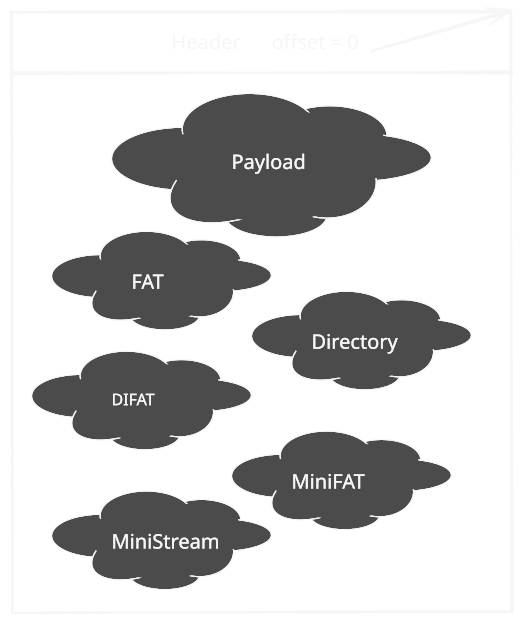
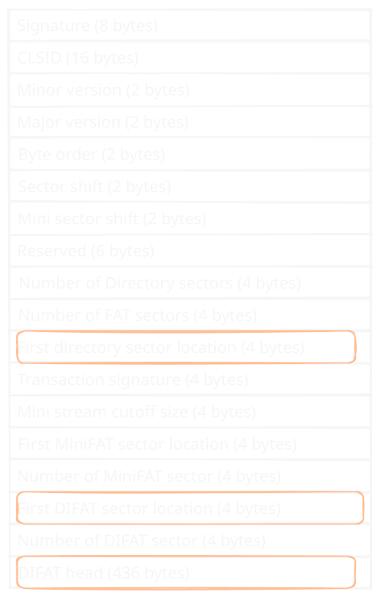
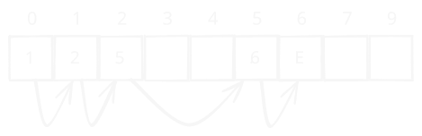
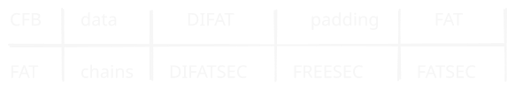
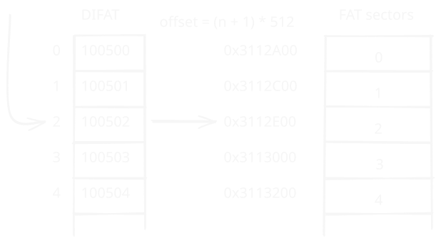
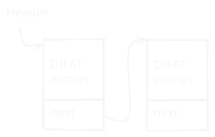
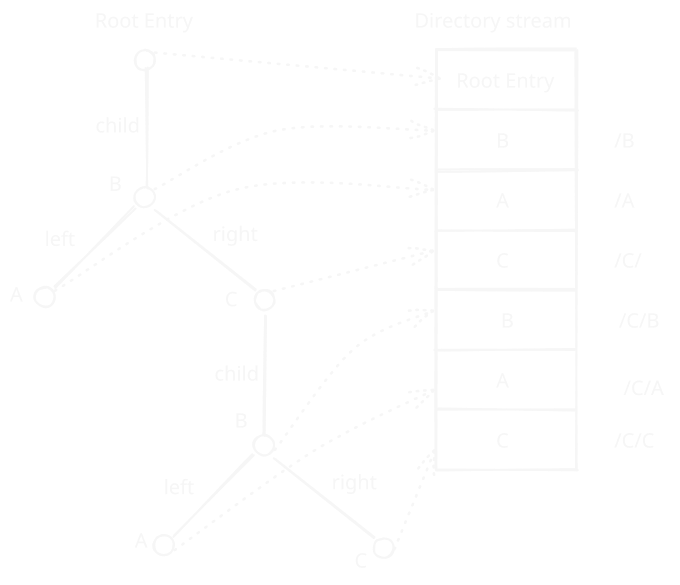
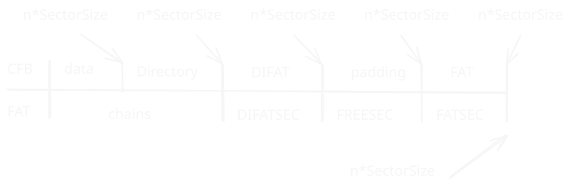

# Inro

Мне давно хотелось освоить Лисп. В качестве реализации мой выбор пал на Clojure, как чаще используем (в отличии от Common Lisp, Scheme), а так же за наличие interop с Java-кодом из коробки (легко переиспользовать существующие Java библиотеки коих много). Ну а в качестве практической задачи я взял ту, которую недавно решал на C++: Microsoft Compound File Binary. Начну эту статью с описание что это за такой Compound File Binary (CFB).

# Что такое CFB
Compound File Binary (CFB, он же OLE storage) это майкрософтский контейнер, похожий на файловую систему FAT. Данные хранятся в **stream**-ах (аналог файла), сами **stream**-ы хранятся секторами. Множество **stream**-ов упорядочено в древовидную структуру аналогично дереву директорий/файлов файловой системе (FAT). Аналог директории называется **storage**.

Кроме самого контента, CFB содержит следующие компоненты:

- Header
- FAT
- DIFAT
- Directory
- MiniFAT/MiniStream

Единственной таблицей с привязанным местоположением (начало контейнера) является Header.



## Header
Таблица содержащая ссылки на остальные таблицы. Находиться в начале контейнера (файла). Так же в заголовке находиться начало DIFAT таблицы. Заголовок это единственная таблица с конкретным местоположением.



## FAT
Используется для выделения места для контента и служебных таблиц (Directory, DIFAT), в том числе для себя самой же. Каждой записи соответствует сектор в CFB, каждой **n**-ой записи FAT-таблицы соответствует смещение `offset = (n + 1) × SectorSize` в контейнере (файле) (заголовок не участвует в нумерации секторов). Сектора занятые stream-ми представлены FAT-цепочками, каждая запись в цепочке содержит номер следующего сектора либо метку ENDOFCHAIN. 



Исключение таблица DIFAT, она храниться связным списком (подробней ниже), соответствующие ей в FAT сектора содержат значение **DIFATSECID** (0xFFFFFFFC).

FAT-таблица хранится секторами как и все остальное в CFB.
Секторам занятым самой FAT-таблицей соответствует соответствуют записи **FATSECID** (0xFFFFFFFD) в ней же.

Расположена FAT-таблица (в отличии ФС FAT32 которая распологается в начале раздела HDD) может быть в любом месте, в том числе **не**обязательно непрерывным массивом секторов. Для локации ее секторов используется таблица DIFAT.



## DIFAT
Описывает расположение секторов FAT-таблицы. Каждому сектору FAT-таблицы соответствует одна запись DIFAT-таблицы, содержащая номер сектора (FAT-таблицы). 



Первые 109 записей DIFAT-таблицы находяться в заголовке. Остальная часть DIFAT-таблицы храниться связным списком в DIFAT-секторах, последняя запись (4 байта) в DIFAT-секторе содержит номер следующего DIFAT-сектора. Номер первого сектора хвоста DIFAT-таблицы указан в заголовке.

Хвост таблицы DIFAT (начальная часть таблицы в заголовке), в отличии от остальных струкстур не описывается цепочками FAT, а хранится связным списком (последние 4 байта DIFAT сектора указывают на следующий сектор DIFAT), секторам занятым DIFAT соответствует записи DIFATSECID в FAT-таблице.




## Directory
В отличии FAT-системы на HDD, где директории хранятся как спец-файлы, тут единая структура на весь контейнер (CFB), описывающая все storage-ы (аналог в FAT32 каталог) и stream-ы (аналог файла).



В каждом storage его дочерние элементы (storage-ы и stream-ы) хранятся как красно-черное дерево, поле **CHILDID** storage содержит корень этого дерева (номер записи в Directory stream), номера записей дочерних нод дерева лежат в полях **LEFTID/RIGHTID** верхней/родительской ноды.

Directory хранится FAT-цепочкой аналогично stream, начало этой цепочки находиться в заголовке контейнера.

## MiniStream/MiniFAT
Это механизм оптимизации хранения коротких stream-в. Место в FAT-таблице выделяется кратно размеру сектора CFB, т.е. 512 или 4096 байт. Поэтому короткие stream-ы хранятся отдельно со своей отдельной таблицей MiniFAT, с размером чанка 64 байт. Оба компонента (MiniFAT/MiniStream) хранятся FAT-цепочками. Номер первого сектора MiniStream находится в корневой (Root Entry) ноде directory, номер первого сектора MiniFAT в заголовке.

Данный проект учебно-демонстрационный, поэтому реализацию MiniFAT/MiniStream я делать не буду.

# Serializer
Особенностью CFB является то, у этой задачки множество решений: расположить компоненты можно множеством способов. Я выберу удобный для себя:



Такой способ расположения позволят сгенерировать директорию за один проход (стартовые сектора стримов уже известны). Если же FAT-таблицу распологать в начале контейнера стартовые номера секторов стримов будут зависеть от их (стримов) размеров, т.к. записи описывающие саму таблицу будут расположены в начале FAT-таблица и их количество зависит от размера FAT-таблицы.

## FAT
Начнем с генерации FAT. Функция генерации одной цепочки:

```clojure
(defn make-fat-chain [start length]
  (let [start (inc start)
        end (+ start (dec length))]
    (conj (vec (range start end)) ENDOFCHAIN)))
```

Создание множества цепочке стримов. В качестве аргумента достаточно коллекции длин stream-ов.

```clojure
(defn make-proto-fat [sizes]
  (reduce (fn [[starts fat] size]
            (let [starts (conj starts (count fat))
                  chain (make-fat-chain (count fat) (calc-num-sector size))
                  fat (concat fat chain)]
              [starts fat]))
          [[] []] sizes))
```

Возвращает две коллекции:

- стартовые номера секторов FAT-цепочек
- плоскую коллекцию (все номера секторов в одной коллекции) "заготовку" FAT.

Вспомогательная функция `calc-num-sector`:

```clojure
(defn calc-num-sector
  ([length] (calc-num-sector length 1))
  ([length entry-size]
   (let [total-size (* length entry-size)
         num-full-sector (math/floor-div total-size SectorSize)]
     (if (zero? (mod total-size SectorSize))
       num-full-sector
       (inc num-full-sector)))))
```

Начало FAT есть, теперь сгенирируем окончательную таблицу:

```clojure
(defn calc-num-difat-sector [num-fat-sector]
  (if (<= num-fat-sector difat-entry-in-header)
    0
    (let [num-full-sector (math/floor-div (- num-fat-sector difat-entry-in-header) 127)]
      (if (zero? (mod (- num-fat-sector difat-entry-in-header) 127))
        num-full-sector
        (inc num-full-sector)))))

(def fat-entry-peer-sector (/ SectorSize u32size))

(defn make-fat [proto-fat]
  (loop [num-fat-sector (calc-num-sector (count proto-fat) u32size)
         num-difat-sector (calc-num-difat-sector num-fat-sector)]
    (if (> (+ num-fat-sector (count proto-fat) num-difat-sector)
           (* num-fat-sector fat-entry-peer-sector))
      (recur (inc num-fat-sector)
             (calc-num-difat-sector (inc num-fat-sector)))
      (let [num-total-fat-entry (* num-fat-sector fat-entry-peer-sector)
            num-used-fat-entry (+ num-fat-sector (count proto-fat) num-difat-sector)
            num-pad-entry (- num-total-fat-entry num-used-fat-entry)
            start (+ (count proto-fat) num-difat-sector num-pad-entry)
            start-difat (if (zero? num-difat-sector)
                          ENDOFCHAIN
                          (count proto-fat))]
        [(concat proto-fat
                 (long-array num-difat-sector DIFATSEC)
                 (long-array num-pad-entry FREESEC)
                 (long-array num-fat-sector FATSEC))
         start num-fat-sector start-difat num-difat-sector num-pad-entry]))))
```

Вычисляется в цикле, если текущее число секторов не помещаются все компоненты (chains, FATSECID, DIFATSEC) запускаем итерацию с увеличенным числом FAT-секторов. `make-fat` возвращает кроме самой FAT-таблицы число FAT-секторов, начало/длинну DIFAT-таблицы и число padding-секторов. Эти данные будут использоваться для формирования заголовка.

## Directory
В первую очередь нужна функция добаления ноды в дерево:

```clojure
(defn add-node [directory parent-id direction node]
  (let [new-id (count directory)
        parent-node (nth directory parent-id)
        upd-parent-node (assoc parent-node direction new-id)]
    [(conj (assoc directory parent-id upd-parent-node) node)
     new-id]))
```

Принимает текущую коллекцию нод, меняет родительскую (для добавляемой) ноду, прописывая в поле `:child/:left/:right` номер добавляемой ноды и возвращавает измененную колекцию.

Добавление ноды в бинарное дерево:

```clojure
(defn insert-in-tree [directory root-id node]
  (loop [root-id root-id
         parent-id nil
         direction nil]
    (if (nil? root-id)
      (add-node directory parent-id direction node)
      (let [{:keys [name left right]} (directory root-id)
            cmp-res (compare (:name node) name)]
        (cond
          (< cmp-res 0) (recur left root-id :left)
          (> cmp-res 0) (recur right root-id :right)
          :else [directory root-id])))))
```

Добавление ноды в storage:

```clojure
(defn insert-in-storage [directory storage-id node]
  (let [storage (nth directory storage-id)
        root-id (:child storage)]
    (if (nil? root-id)
      (add-node directory storage-id :child node)
      (insert-in-tree directory root-id node))))
```

Окончательная сборка директории:
```clojure
(defrecord Node [name child left right type size start])

(defn add-nodes-path [directory path]
  (let [[directory _] (reduce (fn [[directory storage-id] node]
                                (insert-in-storage directory storage-id node))
                              [directory 0] path)]
    directory))

(defn make-nodes-path [path size start]
  (let [path* (string/split path #"/")
        head (map #(map->Node {:name % :type StorageObject}) (drop-last path*))
        tail (map->Node {:name (last path*) :type StreamObject :size size :start start})]
    (concat head (list tail))))

(defn make-directory [items]
  (reduce (fn [directory [path size start]]
            (let [path* (make-nodes-path path size start)]
              (add-nodes-path directory path*)))
          [(map->Node {:name "Root Entry" :type RootStorageObject})] items))
```

## DIFAT
Начало таблицы (head), то что храниться заголовке:

```clojure
(defn make-difat-head [start length]
  {:pre [(<= length difat-entry-in-header)]}
  (concat (range start (+ start length))
          (long-array (- difat-entry-in-header length) FREESEC)))
```

Хвост таблицы (tail), то что храниться в DIAFT-секторах:

```clojure
(defn make-difat-tail [start-fat length start-difat]
  (let [arr (range start-fat (+ start-fat length))
        pad (long-array (calc-padding length 127) FREESEC)
        num-difat-sector (calc-num-difat-sector (+ length difat-entry-in-header))
        [res _ _] (->> (concat arr pad)
                       (partition 127)
                       (reduce (fn [[res current-difat-sector remaing] part]
                                 (let [next-difat-sector (if (zero? remaing)
                                                           ENDOFCHAIN
                                                           (inc current-difat-sector))]
                                   [(concat res part [next-difat-sector])
                                    (inc current-difat-sector)
                                    (dec remaing)]))
                               [[] start-difat (dec num-difat-sector)]))]
    res))
```

Связующая функция (вычисляет аргументы для двух предыдущих):

```clojure
(defn make-difat [start-fat length start-difat]
  (let [head-length (min length difat-entry-in-header)
        tail-length (if (< length difat-entry-in-header)
                      0
                      (- length difat-entry-in-header))]
    [(make-difat-head start-fat head-length)
     (make-difat-tail (+ start-fat difat-entry-in-header) tail-length start-difat)]))

```

## Serialization
Основные компоненты CFB вычислены, теперь осталось это сериализовать в файл.

Сериалиазция заголовка:

```clojure
(defn serialize-header [header]
  (let [^ByteBuffer buffer (ByteBuffer/allocate SectorSize)]
    (doto buffer
      (.order ByteOrder/LITTLE_ENDIAN)
      (.put (byte-array [0xD0 0xCF 0x11 0xE0 0xA1 0xB1 0x1A 0xE1])) ; Signature
      (.put (byte-array 16 (byte 0)))      ; CLSID
      (.putShort 0x003E)                   ; Minor version
      (.putShort 0x0003)                   ; Major version
      (.putShort (unchecked-short 0xFFFE)) ; Byte order
      (.putShort 0x0009)                   ; Sector size
      (.putShort 0x0006)                   ; Mini stream sector size
      (.putShort 0)                        ; Reserved
      (.putInt 0)                          ; Reserved
      (.putInt 0) ; Number of directory sector (not used for version 3)
      (.putInt (:num-fat-sector header)) ; Number of FAT sector
      (.putInt (:start-directory header)) ; Directory starting sector location
      (.putInt 0)                         ; Transaction signature
      (.putInt 0)                         ; Mini stream cutoff
      (.putInt (unchecked-int ENDOFCHAIN)) ; Mini FAT start sector location
      (.putInt 0)                          ; Number of mini FAT sector
      (.putInt (unchecked-int (:start-difat-sector header))) ; DIFAT start sector location
      (.putInt (:num-difat-sector header)))  ; Number of DIFAT sector
    (doseq [entry (:difat-head header)]
      (.putInt buffer (unchecked-int entry)))
    (.array buffer)))
```

Сериализация записи directory:

```clojure
(defn nil->default [default value]
  (if (nil? value) default value))

(def nil->0xFFFFFFFF (partial nil->default 0xFFFFFFFF))
(def nil->0 (partial nil->default 0))

(defn serialize-directory-entry [entry]
  (let [^ByteBuffer buffer (ByteBuffer/allocate DirectoryEntrySize)
        name (.getBytes (:name entry) "UTF-16LE")
        name-size (if (empty? name) 0 (+ (count name) 2))]
    (doto buffer
      (.order ByteOrder/LITTLE_ENDIAN)
      (.put name)
      (.putShort 0)                   ; Entry name terminator
      (.put (byte-array (- 64 (+ (count name) 2)) (byte 0))) ; Entry name padding
      (.putShort name-size) ; Entry name length with terminator
      (.put (:type entry))
      (.put (byte 0x01))             ; Color flag - black
      (.putInt (unchecked-int (nil->0xFFFFFFFF (:left entry))))
      (.putInt (unchecked-int (nil->0xFFFFFFFF (:right entry))))
      (.putInt (unchecked-int (nil->0xFFFFFFFF (:child entry))))
      (.put (byte-array 16 (byte 0x00))) ; CLSID
      (.putInt 0)                        ; State bits
      (.putLong 0)                       ; Creation time
      (.putLong 0)                       ; Modified time
      (.putInt (unchecked-int (nil->0 (:start entry))))
      (.putLong (unchecked-long (nil->0 (:size entry)))))
    (.array buffer)))
```

Сериализация массива integer (для FAT и DIFAT таблиц):

```clojure
(defn serialize-int-array [fat]
  (let [^ByteBuffer buffer (ByteBuffer/allocate (* (count fat) u32size))]
    (.order buffer ByteOrder/LITTLE_ENDIAN)
    (doseq [entry fat]
      (.putInt buffer (unchecked-int entry)))
    (.array buffer)))
```

И наконец окончательная сборка CFB:

```clojure
(defn make-cfb [output-path streams]
  (let [[starts strm-proto-fat] (make-proto-fat (map (comp count last) streams))
        directory (make-directory (map (fn [[path stream] start]
                                         [path (count stream) start]) streams starts))
        start-directory (count strm-proto-fat)
        num-directory-sector (calc-num-sector (count directory) DirectoryEntrySize)
        proto-fat (concat strm-proto-fat
                          (make-fat-chain start-directory num-directory-sector))
        [fat start-fat num-fat-sector
         start-difat num-difat-sector num-pad-sector] (make-fat proto-fat)
        [difat-head difat-tail] (make-difat start-fat num-fat-sector start-difat)
        header {:num-fat-sector num-fat-sector
                :start-directory start-directory
                :start-difat-sector start-difat
                :num-difat-sector num-difat-sector
                :difat-head difat-head}]

    (with-open [out (io/output-stream output-path)]
      (.write out (serialize-header header))
      (doseq [[_ content] streams]
        (.write out content)
        (.write out (byte-array (calc-padding (count content)) (byte 0))))
      (doseq [entry directory]
        (.write out (serialize-directory-entry entry)))
      (doseq [_ (range (calc-padding (count directory) DirectoryEntryPeerSector))]
        (.write out (serialize-directory-entry (map->Node {:name "" :type (byte 0x00)}))))
      (.write out (serialize-int-array difat-tail))
      (doseq [_ (range num-pad-sector)]
        (.write out (byte-array SectorSize (byte 0))))
      (.write out (serialize-int-array fat)))))
```

# Parser
Вспомогательные функции:

```clojure
(defn read-u8! [^ByteBuffer buffer]
  (-> buffer
      .get
      (bit-and 0xFF)))

(defn read-u16! [^ByteBuffer buffer]
  (-> buffer
      .getShort
      (bit-and 0xFFFF)))

(defn read-u32! [^ByteBuffer buffer]
  (-> buffer
      .getInt
      (bit-and 0xFFFFFFFF)))
```

Чтение заголовка:

```clojure
(defn shift-position! [^ByteBuffer buffer n]
  (.position buffer (+ (.position buffer) n)))

(defn read-header! [^FileChannel f]
  (let [buffer (ByteBuffer/allocate HeaderSize)
        signature (byte-array 8)]
    (.read f buffer)
    (doto buffer
      (.order ByteOrder/LITTLE_ENDIAN)
      (.rewind)
      (.get signature))
    (assert (java.util.Arrays/equals signature
                                     (byte-array [0xD0 0xCF 0x11 0xE0 0xA1 0xB1 0x1A 0xE1])))
    (shift-position! buffer 16) ; Skip CLSID
    (let [header (apply hash-map [:minor-version (read-u16! buffer)
                                  :major-version (read-u16! buffer)
                                  :byte-order (read-u16! buffer)
                                  :sector-shift (read-u16! buffer)
                                  :mini-sector-shift (read-u16! buffer)
                                  :num-fat-sector (do ; skip reserved and numdirectory sector
                                                    (shift-position! buffer 10)
                                                    (read-u32! buffer))
                                  :start-directory-sector (read-u32! buffer)
                                  :mini-stream-cutoff (do ; skip transaction signature
                                                        (shift-position! buffer 4)
                                                        (read-u32! buffer))
                                  :start-minifat (read-u32! buffer)
                                  :num-minifat-sector (read-u32! buffer)
                                  :start-difat-sector (read-u32! buffer)
                                  :num-difat-sector (read-u32! buffer)])

          difat (let [difat (transient [])]
                  (doseq [_ (range (min (:num-fat-sector header) 109))]
                    (conj! difat (read-u32! buffer)))
                  (persistent! difat))]

      (assert (= (:minor-version header) 0x003E))
      (assert (= (:major-version header) 0x0003))
      (assert (= (:byte-order header) 0xFFFE))
      (assert (= (:sector-shift header) 0x0009))
      (assoc header :difat difat))))
```

Чтение FAT/DIFAT. Для упрощения себе жизни они считываются полностью при открытии файла.

```clojure
(defn sector->offset [n]
  (* (+ n 1) SectorSize))

(defn read-difat-tail [f difat-sector]
  (if (= difat-sector ENDOFCHAIN)
    []
    (let [^ByteBuffer buffer (ByteBuffer/allocate SectorSize)
          res (transient [])]
      (.order buffer ByteOrder/LITTLE_ENDIAN)
      (.position f (sector->offset difat-sector))
      (.read f buffer)
      (.rewind buffer)
      (doseq [_ (range 127)]
        (conj! res (read-u32! buffer)))
      (concat (persistent! res) (read-difat-tail f (read-u32! buffer))))))

(defn read-fat [^FileChannel f difat num-fat-sector]
  (let [^ByteBuffer buffer (ByteBuffer/allocate SectorSize)
        fat (transient [])]
    (.order buffer ByteOrder/LITTLE_ENDIAN)
    (loop [remaing num-fat-sector
           difat difat]
      (let [sector (first difat)]
        (.position f (sector->offset sector))
        (.clear buffer)
        (.read f buffer)
        (.rewind buffer)
        (doseq [_ (range (/ SectorSize u32size))]
          (conj! fat (read-u32! buffer)))
        (if (> remaing 1)
          (recur (dec remaing) (rest difat)))))
    (persistent! fat)))
```

Чтение directrory, также как и FAT/DIFAT считывается полностью и парсится в дерево:

```clojure
(defn read-directory-entry-name! [^ByteBuffer buffer]
  (let [name (byte-array 64 (byte 0x00))]
    (.get buffer name)
    (let [len (read-u16! buffer)]
      (if (> len 0)
        (String. name 0 (- len 2) "UTF-16LE")
        (String.)))))

(defn read-directory-entry-type! [^ByteBuffer buffer]
  (let [type (read-u8! buffer)]
    (case type
      1 :storage
      2 :stream
      5 :root
      :unknown)))

(defn read-directory-sector! [^FileChannel f sector]
  (let [buffer (ByteBuffer/allocate 128)
        entries (transient [])]
    (.order buffer ByteOrder/LITTLE_ENDIAN)
    (.position f (sector->offset sector))
    (doseq [_ (range DirectoryEntryPeerSector)]
      (.clear buffer)
      (.read f buffer)
      (.rewind buffer)
      (let [entry (apply hash-map [:name (read-directory-entry-name! buffer)
                                   :type (read-directory-entry-type! buffer)
                                   :color (read-u8! buffer)
                                   :left (read-u32! buffer)
                                   :right (read-u32! buffer)
                                   :child (read-u32! buffer)
                                   :start (do (shift-position! buffer (+ 16 ; CLSID
                                                                         4 ; State bits
                                                                         8 ; Creation time
                                                                         8)) ; Modified time
                                              (read-u32! buffer))
                                   :size (read-u32! buffer)])]
        (conj! entries entry)))
    (persistent! entries)))

(defn read-directory-stream! [^FileChannel file fat start]
  (let [entries (transient [])]
    (loop [sector start]
      (if (= sector ENDOFCHAIN)
        (persistent! entries)
        (do
          (doseq [entry (read-directory-sector! file sector)]
            (conj! entries entry))
          (recur (nth fat sector)))))))

(defn parse-directory-stream
  ([directory-stream] (parse-directory-stream directory-stream 0))
  ([directory-stream root-id]
   (if (= root-id NOSTREAM)
     {}
     (let [obj (nth directory-stream root-id)
           entry (if (or (= (:type obj) :storage)
                         (= (:type obj) :root))
                   (merge {:type :storage} (parse-directory-stream directory-stream (:child obj)))
                   (select-keys obj [:type :start :size]))]
       (merge {(:name obj) entry}
              (parse-directory-stream directory-stream (:left obj))
              (parse-directory-stream directory-stream (:right obj)))))))
```

Для хранения в памяти FAT/DIFAT/Directory чтение реализовано как тип (`deftype`) реализующий соответствующий протокол. Открытие CFB и чтение стрима:

```clojure
(defn locate-first-sector [fat start offset]
  (loop [start start
         offset offset]
    (if (>= offset SectorSize)
      (recur (nth fat start)
             (- offset SectorSize))
      start)))

(defprotocol CFBStreamProtocol
  (read-stream [this] [this length] [this offset length]))

(deftype CFBStream [file fat start stream-size]
  CFBStreamProtocol
  (read-stream [this] (read-stream this 0 stream-size))
  (read-stream [this length] (read-stream this 0 length))
  (read-stream [this offset length]
    (let [result-buffer (byte-array length (byte 0))]
      (loop [result-buffer-pos 0
             remaing length
             sector (locate-first-sector fat start offset)
             offset (mod offset SectorSize)]
        (when (> remaing 0)
          (let [read-length (- (min remaing SectorSize) offset)
                fbuf (ByteBuffer/allocate read-length)]
            (.position file (+ (sector->offset sector) offset))
            (.read file fbuf)
            (.rewind fbuf)
            (.get fbuf result-buffer result-buffer-pos read-length)
            (recur (+ result-buffer-pos read-length)
                   (- remaing read-length)
                   (nth fat sector)
                   0))))
      result-buffer)))

(defprotocol CFBProtocol
  (open-stream [this path]))

(deftype CFB [file header fat directory]
  CFBProtocol
  (open-stream [this path]
    (let [p (string/split (str "Root Entry/" path) #"/")
          {:keys [start size]} (get-in directory p)]
      (CFBStream. file fat start size))))

(defn open-cfb [^String path]
  (let [p (Paths/get path (into-array String []))
        file (FileChannel/open p (into-array OpenOption [StandardOpenOption/READ]))
        header (read-header! file)
        difat (concat (:difat header) (read-difat-tail file (:start-difat-sector header)))
        fat (read-fat file difat (:num-fat-sector header))
        directory-stream (read-directory-stream! file fat (:start-directory-sector header))
        directory (parse-directory-stream directory-stream)]
    (CFB. file header fat directory)))

(defn dump-header [^String path]
  (let [p (Paths/get path (into-array String []))
        file (FileChannel/open p (into-array OpenOption [StandardOpenOption/READ]))]
    (read-header! file)))
```

# Retro
Когда я решал эту задачку на C++, объем сериализатора получился около 1500 строк. На Clojure это вышло чуть больше 200 строк.

Код [тут](https://github.com/dvetutnev/cfb-clj).
