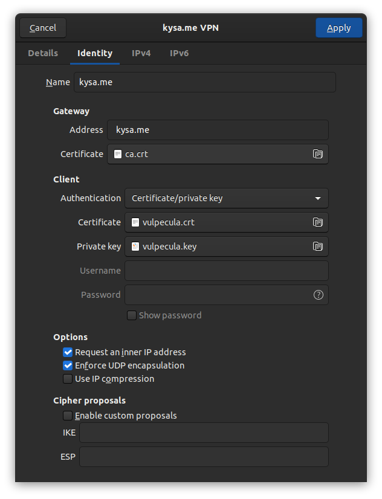

По сути это повторение вот [этой статьи](https://habr.com/ru/post/250859/?ref=kysa.me) и заметка для своей памяти. Конфиг сервера (/etc/ipsec.conf) вот такой:

```
config setup
    # strictcrlpolicy=yes
    # uniqueids = no

include /var/lib/strongswan/ipsec.conf.inc

conn vpn
    left=%any
    leftauth=pubkey
    leftcert=kysa.me.crt
    leftid=@kysa.me
    leftsendcert=always
    leftsubnet=0.0.0.0/0

    right=%any
    rightauth=pubkey
    rightsourceip=192.168.103.2/24-192.168.103.254/24
    rightdns=8.8.8.8

    keyexchange=ikev2
    auto=add
```

Конфигурация клиента:


