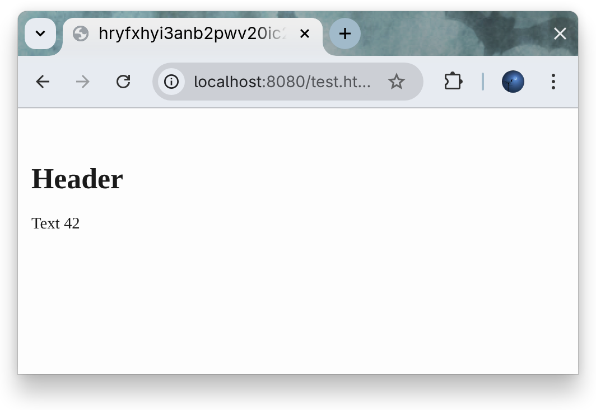
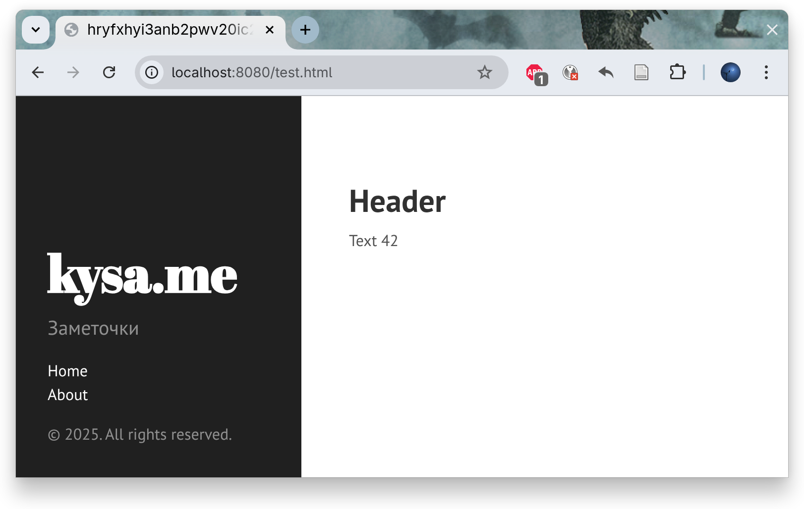
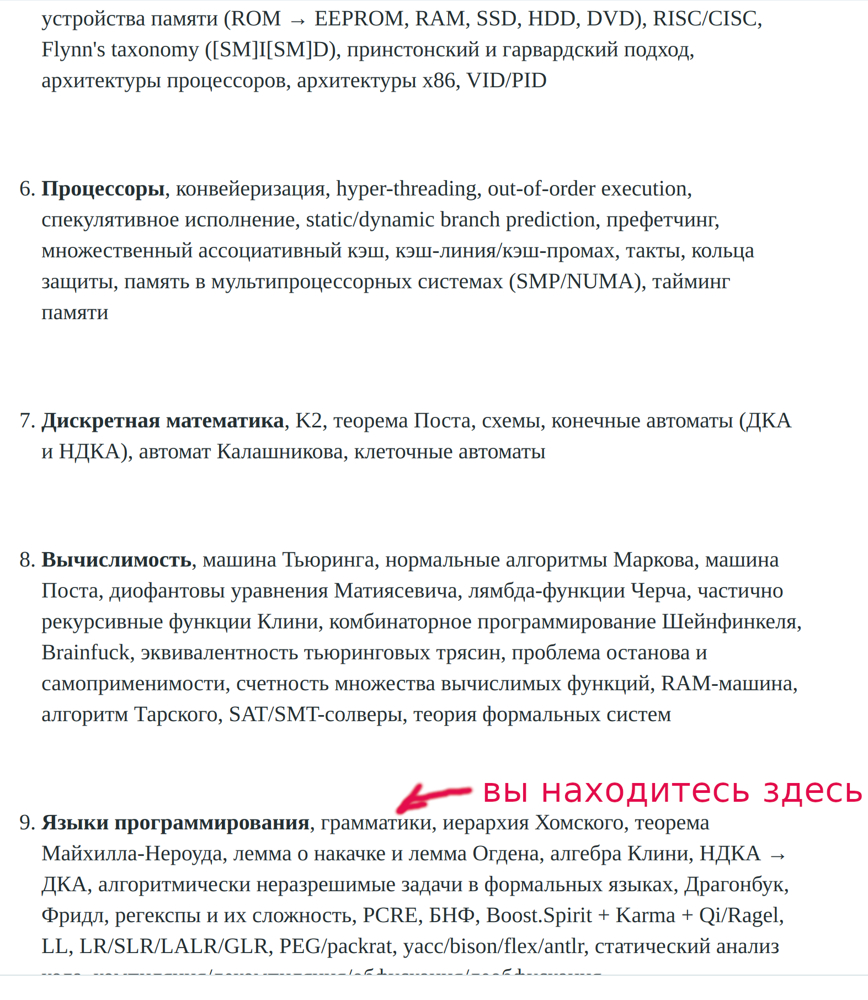
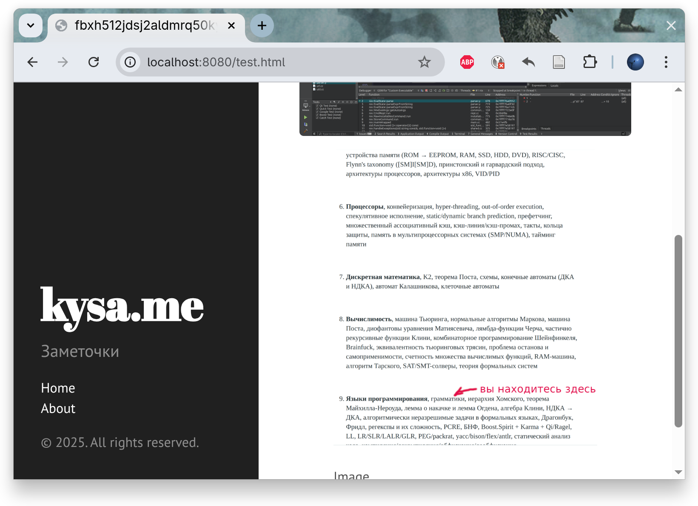
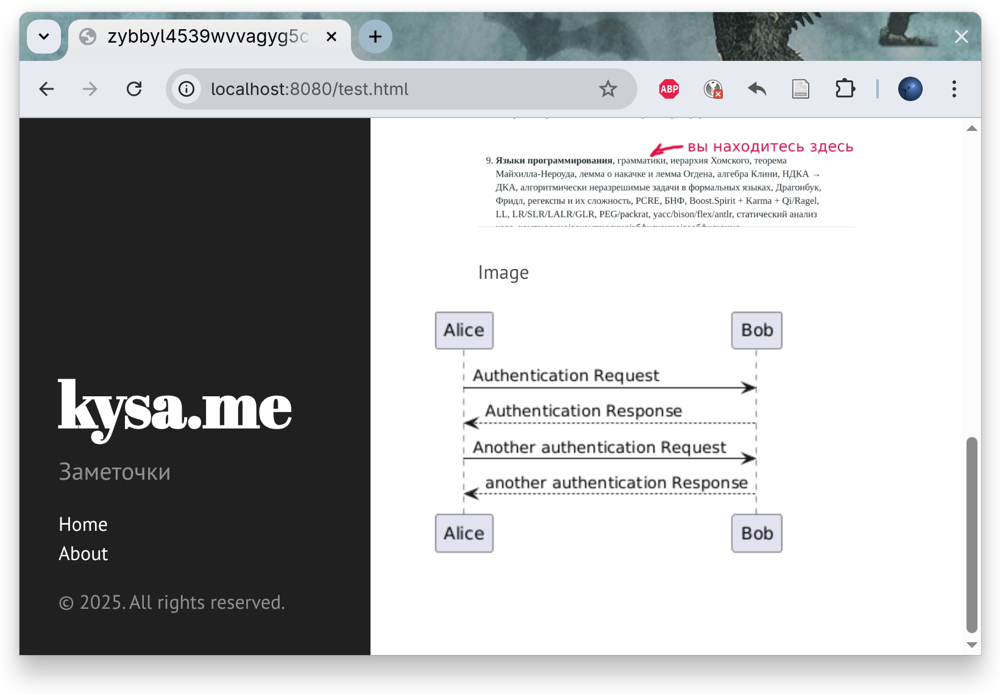

# Intro

В жизни наверно каждого домашнего инженерного блога наступает момент переезда на статически-сгенерированый сайт. Когда-то в качестве движка я выбрал Ghost (ссылка), т.к. он использовал в качестве бд SQLite и соответственно все его состояние хранилось в одной директории. Со временем авторы Ghost задеприкейтили (ссылка) поддержку SQLite для продуктового режима и пришлось мигрировать на MySQL. В итоге что мы имеем: текст храниться в полноценном сервере СУБД, раздается при помощи кучи постоянно запущенного JS-кода и в конце блоки кода раскрашиваются на стороне браузера при помощи Prism.js. Как-то слишком сложно для заметок написанах в Markdown. Опять же бэкапить все это...

Поэтому я наконец-то созрел до переделки блога на статический сгенерированный сайт. Сначала я хотел воспользоваться готовой разработкой [GitHub - styx-static/styx: Static site generator in Nix expression language.](https://github.com/styx-static/styx/), но провозившись с ним полчаса у меня так и не получилось заставить его работать и я решил реализовать свою задумку самостоятельно, утащив из Styx понравившеюся мне тему [Hyde](https://styx-static.github.io/styx-site/themes/hyde.html).

# How it is made

В качесте транслятор из Markdown в HTML я буду использовать [Pandoc](https://pandoc.org/), а запускающая обвязку (оркестрация) - [Nix](https://nixos.org/)

## Preview server

Для начала нам же как-то смотреть на свой разрабатываем сайт для этого нам потребуется вебсервер. В Styx для этого используется [Caddy](https://caddyserver.com/), я возьму такой же. Наша начальная снежинка (**flake**) будет такой:

```nix
{
  inputs.nixpkgs.url = "github:nixos/nixpkgs/nixos-unstable";

  outputs =
    { self, nixpkgs }:
    {
      apps."x86_64-linux".default =
        let
          pkgs = nixpkgs.legacyPackages."x86_64-linux";
          www_root = pkgs.writeTextDir "index.html" ''
            <!DOCTYPE html>
            <html>
            <head>
                <title>Hello World</title>
            </head>
            <body>
                <h1>Hello World</h1>
            </body>
            </html>
          '';
          config = pkgs.writeTextDir "Caddyfile" ''
            http://localhost:8080

            header +Cache-Control "no-cache, no-store, must-revalidate"

            log

            root * ${www_root}
            file_server
          '';
          previewServer = pkgs.writeShellApplication {
            name = "server";
            runtimeInputs = [ pkgs.caddy ];
            text = "caddy run --config ${config}/Caddyfile";
          };
        in
        {
          type = "app";
          program = nixpkgs.lib.getExe previewServer;
        };
    };
}
```

В ней я создаю директорию `www_root` с одним файлом `index.html`, содержащим *Hello world*. Конфигурационный файл `Caddyfile` для вэбсервера, в котором указывается на какой адрес биндится сервер, добавляются заголовки для отключения кеширования браузером и указывается директория-корень (`root * ${www_root}`) сайта.

## Трансляция Markdown -> HTML

После того, как сделали preview-сервер, следующий шаг генерация HTML из Markdown. Но сначала нам потребуется функция отрезающая префикс из пути к исходному Markdown-файлу, т.к. контет блога не будет лежать в корне репозитория (в корне будет расположен Nix-код) и не стоит в итоговых ссылках на HTML имя директории, где лежат исходные Markdown. Расположен контет будет приблизительно так:

```shell
[dvetutnev@lynx:~/kysa.me/dev_desc]$ tree .
.
├── content
│   └── test.md
├── flake.lock
└── flake.nix
```

URN на итоговый HTML раздаваемый Web-сервером я хочу видеть без префикса контент: `example.org/test.html`

При написании функции, отрезающей префикс, я применю свой любимый метод TDD. Тест для нее `strip-prefix/test.nix`:

```nix
{
  pkgs ? import <nixpkgs> { },
}:
let
  runTests = pkgs.lib.runTests;
  stripPrefix = pkgs.callPackage ./. { };
in
runTests {
  test1 = {
    expr = stripPrefix {
      path = ./content/dir/file.md;
      prefix = ./content;
    };
    expected = "dir/file.md";
  };

  test2 = {
    expr = stripPrefix {
      path = ./content/folder/nested/image.svg;
      prefix = ./content/folder;
    };
    expected = "nested/image.svg";
  };
}
```

Запускается тест так:

```shell
[dvetutnev@lynx:~/kysa.me/dev_desc]$ nix eval --impure --expr 'import strip-prefix/test.nix {}'
```

В случаи успеха эта команда возвращает пустой массив, в случаи ошибки в массиве будут указаны провалившиеся тесты.

Код функции, проходящий тесты `strip-prefix/default.nix`:

```nix
{ lib }:

{ path, prefix }:
let
  withoutPathPrefix = lib.path.removePrefix prefix path;
  withoutPrefix = lib.strings.removePrefix "./" withoutPathPrefix;
in
withoutPrefix
```

Тут мы отрезаем префик файлового пути и из полученной строки удаляем префикс текущей директории `./`.

Теперь мы добрались до написания минимального варианта функции `mkPage`:

```nix
{
  callPackage,
  runCommandLocal,
  pandoc,
  makeFontsConf,
  lib,
}:

{ path, prefix }:
let
  stripPrefix = callPackage ./strip-prefix { };

  destName = builtins.replaceStrings [ ".md" ] [ ".html" ] (stripPrefix {
    inherit path prefix;
  });

  html =
    runCommandLocal destName
      {
        FONTCONFIG_FILE = makeFontsConf { fontDirectories = [ ]; };
      }
      ''
        target=$out/${lib.escapeShellArg destName}
        mkdir -p "$(dirname "$target")"
        HOME="$(mktemp -d)" # for fontconfig

        ${lib.getExe pandoc} --standalone \
                             --to=html5 \
                             --output="$target" \
                             --verbose \
                             ${path}
      '';
in
html
```

Web-сервер раздает не отдельные файлы, а директорию, поэтому результирующее *derivation* у нас тоже директория.

Переменная среды `FONTCONFIG_FILE` нужна чтобы подавить warning-и fontconfig. Nix собирает/запускает пакеты в изолированном окружении и конфигурационного файла для fontconfig там нет, поэтому его мы подкладываем явно.

Т.к. мы используем снежинку (**flake**) и контроль версий, нужно добавить новые файлы (`strip-prefix/default.nix` и `mk-pagfe.nix`) в индекс Git, без этого Nix откажется использовать свежесозданные файлы.

Прикручиваем нашу функцию `mkPage` в снежинку:

```diff
--- a/dev_desc/flake.nix
+++ b/dev_desc/flake.nix
@@ -4,20 +4,21 @@
   outputs =
     { self, nixpkgs }:
     {
+      packages."x86_64-linux".default =
+        let
+          pkgs = nixpkgs.legacyPackages."x86_64-linux";
+          mkPage = pkgs.callPackage ./mk-page.nix { };
+          www_root = mkPage {
+            path = ./content/test.md;
+            prefix = ./content;
+          };
+        in
+        www_root;
+
       apps."x86_64-linux".default =
         let
           pkgs = nixpkgs.legacyPackages."x86_64-linux";
-          www_root = pkgs.writeTextDir "index.html" ''
-            <!DOCTYPE html>
-            <html>
-            <head>
-                <title>Hello World</title>
-            </head>
-            <body>
-                <h1>Hello World</h1>
-            </body>
-            </html>
-          '';
+          www_root = self.packages."x86_64-linux".default;
           config = pkgs.writeTextDir "Caddyfile" ''
             http://localhost:8080
```

Запускаем preview-сервер командой `nix run .#` и идем смотреть в браузер что из этого получилось:



Исходный Markdown такой:
```shell
[dvetutnev@lynx:~/kysa.me/dev_desc]$ cat content/test.md 
# Header

Text 42
```

Отлично, все генерация HTML из Markdown работает как и задумано.

## Оформление (CSS тема).

Как я уже говорил в начале, в качестве темы оформления я возму готовую тему [Hyde](https://styx-static.github.io/styx-site/themes/hyde.html) из Styx. Для ее прикручивания нам потребуется функция `addFile`, добавлящая css-файлы в директории доступные web-серверу и функция `mkSite`, собирающая директорию-композицию из директорий содержащих CSS и html-страницы.

Функция `addFile` будет создавать *derivation* с предсказуемым контентом, следовательно ее можно будет проверить автотестом. В **nixpksg** есть специальная функция для этого - [`testers.testEqualContents`](https://nixos.org/manual/nixpkgs/stable/#tester-testEqualContents). Она довольно проста: создает **derivation** [runCommand](https://nixos.org/manual/nixpkgs/stable/#tester-runCommand), а в качесте запускаемого скрипта используется проверка программой **diffoscope** контента в директории проверяемого **derivation**  директории с ожидаемым:

```nix
  testEqualContents =
    {
      assertion,
      actual,
      expected,
    }:
    runCommand "equal-contents-${lib.strings.toLower assertion}"
      {
        inherit assertion actual expected;
        nativeBuildInputs = [ diffoscopeMinimal ];
      }
      ''
        echo "Checking:"
        printf '%s\n' "$assertion"
        if ! diffoscope --no-progress --text-color=always --exclude-directory-metadata=no -- "$actual" "$expected"
        then
          echo
          echo 'Contents must be equal, but were not!'
          echo
          echo "+: expected,   at $expected"
          echo "-: unexpected, at $actual"
          false
        else
          echo "expected $expected and actual $actual match."
          echo OK
          touch -- "$out"
        fi
      '';
```

Тест для нащей функции *addFile* (`add-file/test.nix`):

```nix
{
  pkgs ? import <nixpkgs> { },
}:
with pkgs;
let
  testEqualContents = testers.testEqualContents;
  recurseIntoAttrs = lib.recurseIntoAttrs;

  contentPrefix = ./test_content;

  stripPrefix = callPackage ../strip-prefix { };
  addFile = callPackage ./. { inherit stripPrefix; };
in
recurseIntoAttrs {
  testRoot =
    let
      file = lib.path.append contentPrefix "file.md";
    in
    testEqualContents {
      assertion = "root";
      expected = writeTextDir "file.md" (builtins.readFile file);
      actual = addFile {
        path = file;
        prefix = contentPrefix;
      };
    };

  testNested =
    let
      file = lib.path.append contentPrefix "pages/about.md";
    in
    testEqualContents {
      assertion = "nested";
      expected = writeTextDir "pages/about.md" (builtins.readFile file);
      actual = addFile {
        path = file;
        prefix = contentPrefix;
      };
    };
}
```

Запускается тест такой комнадой:

```shell
[dvetutnev@lynx:~/kysa.me/dev_desc]$ nix build -L --impure --expr 'import add-file/test.nix {}'
equal-contents-root> Checking:
equal-contents-root> root
equal-contents-nested> Checking:
equal-contents-nested> nested
equal-contents-nested> expected /nix/store/3vgfdi3fypzbivsla5z9qmml1rdki2ck-about.md and actual /nix/store/0svwam4mfz8fqcv5hjvcn69lzx2wskz9-pages-about.md match.
equal-contents-nested> OK
equal-contents-root> expected /nix/store/fbv7pgyyi79gs02cihv6n77qvw4zd7wd-file.md and actual /nix/store/lgssyny3306q850pm23pc28n123i0ng9-file.md match.
equal-contents-root> OK
```

По сути запускаем сборку **derivation** в котором в качестве сборочного скрипта используется проверка при помощи **diffoscope**. Параметр `-L` включает печать лога сборки.

Код `addFile`, проходящий тесты (`add-file/default.nix`):

```nix
{
  stdenv,
  lib,
  stripPrefix,
}:

{ path, prefix }:
stdenv.mkDerivation rec {
  destName = stripPrefix { inherit path prefix; };
  name = builtins.toString destName;
  buildCommand = ''
    install -m 644 -D ${path} $out/${destName}
  '';
  preferLocalBuild = true;
  allowSubstituties = false;
}
```

В нем мы создаем **derivation**, в котором в качестве сборки выполняется запись требуемого файла командой `install` в директорию на которую указывает **derivation**. Параметр `-D` задает автоматическое создание промежуточных директорий в для итогового расположения файла.

Теперь напишем минимальный вариант функции `mkSite`, собирающей итоговую директорию-композицию с контентом для Web-сервера:

```nix
{
  callPackage,
  symlinkJoin,
}:

let
  stripPrefix = callPackage ./strip-prefix { };
  addFile = callPackage ./add-file { inherit stripPrefix; };
  mkPage = callPackage ./mk-page.nix { inherit stripPrefix; };

  css = [
    ./css/poole.css
    ./css/syntax.css
    ./css/hyde.css
    ./css/hyde-styx.css
    "https://fonts.googleapis.com/css?family=PT+Sans:400,400italic,700|Abril+Fatface"
  ];

  cssDrvs = map (
    p:
    addFile {
      path = p;
      prefix = ./.;
    }
  ) (builtins.filter (x: builtins.isPath x) css);

  html = mkPage {
    path = ./content/test.md;
    prefix = ./content;
  };

in
symlinkJoin {
  name = "www_root";
  paths = [ html ] ++ cssDrvs;
}
```

Кроме CSS, которые мы будем держать на своем сервере еще есть подгружаемый с гугловского сервера шрифт, поэтому фильтируем CSS-списк и добавляем только файловые пути.

Выносим из `mkPage` импорт функции `stripPrefix` (теперь она передается снаружи при иморте) в функцию `mkSite`, потому что она также нужна для функции `addFile` (испорт должее быть в одном месте):

```diff
--- a/dev_desc/mk-page.nix
+++ b/dev_desc/mk-page.nix
@@ -1,5 +1,6 @@
 {
-  callPackage,
+  stripPrefix,
+
   runCommandLocal,
   pandoc,
   makeFontsConf,
@@ -8,8 +9,6 @@
 
 { path, prefix }:
 let
-  stripPrefix = callPackage ./strip-prefix { };
-
   destName = builtins.replaceStrings [ ".md" ] [ ".html" ] (stripPrefix {
     inherit path prefix;
   });
```

Обновляем снежинку для использования свеже-написанной функции `mkSite`:

```diff
--- a/dev_desc/flake.nix
+++ b/dev_desc/flake.nix
@@ -7,11 +7,8 @@
       packages."x86_64-linux".default =
         let
           pkgs = nixpkgs.legacyPackages."x86_64-linux";
-          mkPage = pkgs.callPackage ./mk-page.nix { };
-          www_root = mkPage {
-            path = ./content/test.md;
-            prefix = ./content;
-          };
+          mkSite = pkgs.callPackage ./mk-site.nix { };
+          www_root = mkSite;
         in
         www_root;
```

Запускаем сборку и смотрим результат:

```shell
[dvetutnev@lynx:~/kysa.me/dev_desc]$ nix build -L .# && tree result
result
├── css
│   ├── hyde.css -> /nix/store/c2kmqa9hj04xynl7p8cxh2r7lfnzab7z-css-hyde.css/css/hyde.css
│   ├── hyde-styx.css -> /nix/store/p9sjs8pq0in1pykk5srbd7yvv817q59g-css-hyde-styx.css/css/hyde-styx.css
│   ├── poole.css -> /nix/store/21qjhzq40kamnn1gn2s418cx6fykivny-css-poole.css/css/poole.css
│   └── syntax.css -> /nix/store/w1ds49sm1jlr7iz63d1vrcz7zss7dpz8-css-syntax.css/css/syntax.css
└── test.html -> /nix/store/sxs2qm5bp8z7f87ma610ndfdra505d8a-test.html/test.html

2 directories, 5 files
```

Все работает как и ожидалось. Осталось научить pandoc использовать наши CSS. Научим функцию `mkPage` получать ссылки на CSS и применять их, а также вставлять контент панели навигации. Для этого нам потребуется изменить дефолтный шаблон HTML-шаблон pandoc чтобы CSS стили применялись к основному контенту страницы (телу документа). Изменения шаблона:

```diff
--- /home/dvetutnev/Downloads/default.html5     2025-06-14 15:17:48.335387805 +0300
+++ default.html5       2025-06-15 14:20:22.872268617 +0300
@@ -62,7 +62,11 @@
 $table-of-contents$
 </nav>
 $endif$
+<div class="content container">
+<div>
 $body$
+<div>
+<div>
 $for(include-after)$
 $include-after$
 $endfor$
```

Изменения `mkPage`:

```diff
--- a/dev_desc/mk-page.nix
+++ b/dev_desc/mk-page.nix
@@ -7,12 +7,19 @@
   lib,
 }:
 
+{ cssLinks, sideBar }:
+
 { path, prefix }:
 let
   destName = builtins.replaceStrings [ ".md" ] [ ".html" ] (stripPrefix {
     inherit path prefix;
   });
 
+  template = ./default.html5;
+
+  mkCmdArg = link: lib.escapeShellArg "--css=${link}";
+  cssArgs = lib.concatStringsSep " " (map mkCmdArg cssLinks);
+
   html =
     runCommandLocal destName
       {
@@ -25,8 +32,11 @@ let
         HOME="$(mktemp -d)" # for fontconfig
 
         ${lib.getExe pandoc} --standalone \
+                             --template=${template} \
                              --to=html5 \
                              --output="$target" \
+                             ${cssArgs} \
+                             --variable=include-before:${lib.escapeShellArg sideBar} \
                              --verbose \
                              ${path}
       '';
```

Затем преобразуем список CSS в форму пригодную для подстановки в аргументы командной строки pandoc. Изменения `mkSite`:

```diff
--- a/dev_desc/mk-site.nix
+++ b/dev_desc/mk-site.nix
@@ -6,7 +6,6 @@
 let
   stripPrefix = callPackage ./strip-prefix { };
   addFile = callPackage ./add-file { inherit stripPrefix; };
-  mkPage = callPackage ./mk-page.nix { inherit stripPrefix; };
 
   css = [
     ./css/poole.css
@@ -24,6 +23,24 @@ let
     }
   ) (builtins.filter (x: builtins.isPath x) css);
 
+  cssLinks = map (
+    x:
+    if builtins.isPath x then
+      stripPrefix {
+        path = x;
+        prefix = ./.;
+      }
+    else
+      x
+  ) css;
+
+  mkSideBar = callPackage ./mk-sidebar.nix { };
+  sideBar = mkSideBar (import ./navigation.nix);
+
+  mkPage = callPackage ./mk-page.nix { inherit stripPrefix; } {
+    inherit cssLinks sideBar;
+  };
+
   html = mkPage {
     path = ./content/test.md;
     prefix = ./content;
```

Добавляем функцию `mkSideBar`, генерящую контет для боковой панели (`mk-sidebar.nix`):

```nix
{ lib }:

navigation:
let
  mkNavEntry = { urn, name }: ''<li><a href="${urn}">${name}</a></li>'';

  navLinks = lib.strings.concatStrings (map mkNavEntry navigation);

  mkSideBar = navLinks: ''
    <div class="sidebar">
      <div class="container sidebar-sticky">
        <div class="sidebar-about">
          <a href="/"><h1>kysa.me</h1></a>
            <p class="lead">&Zcy;&acy;&mcy;&iecy;&tcy;&ocy;&chcy;&kcy;&icy;</p>
        </div>

        <ul class="sidebar-nav">
          ${navLinks}
        </ul>

        <p>&copy; 2025. All rights reserved.</p>
      </div>
    </div>'';
in
mkSideBar navLinks```

И список ссылок для боковой панели (`navigation.nix`):
```

И список ссылок для нее (`navigation.nix`):

```nix
[
  {
    urn = "home.html";
    name = "Home";
  }
  {
    urn = "about.html";
    name = "About";
  }
]
```

Запускаем preview-сервер и получаем такой результат:



## Сбор и публикация картинок

Эта часть оказалась самой сложной. Можно публиковать все картики из какой-нибудь директории, но это некрасиво. Поэтому я решил собирать список путей используемых изображений из AST исходного Markdown. AST (в нашем случаи JSON представление документа) будем получать при помощи самого **pandoc**.

Для получения путей всех избражений нам нужно обойти все AST. В импереативных эта задача решается циклом и рекурсивным вызовом функции обхода AST. В Nix же циклов нет, в функциональных языках эта задача решается [свертки списка (fold)](https://ru.wikipedia.org/wiki/%D0%A1%D0%B2%D1%91%D1%80%D1%82%D0%BA%D0%B0_%D1%81%D0%BF%D0%B8%D1%81%D0%BA%D0%B0). Эта функция принимает на вход функцию осуществляющею накопление результа коллекцию, которую будем сворчивать; Функция накопления в свою очередь на вход принимает аккумулятор и обрабатываемый очередной элемент коллекции и возвращет аккумулятор, к которому добавляется (или нет) обработаный элемент коллекции. Вырожденый пример - суммирование всех элементов последовательности.

Извлечение путей картинок разбито на две функции: получение узлов AST с картинками и преобразование документа в AST с пост-обработкой (достаем из нод AST непосредствено пути к картинкам).

Тест для функции получения AST узлов с картинками (входная коллекция списана с AST полученного при посмощи **pandoc**) (`extract-images-links/collect-images/test.nix`):

```nix
{
  pkgs ? import <nixpkgs> { },
}:

let
  runTests = pkgs.lib.runTests;
  collectImages = import ./.;

  blocks = [
    {
      t = "Image";
      c = "pic1.jpg";
    }
    {
      t = "Block";
      c = [
        1
        {
          t = "Header";
          c = "tEEExt";
        }
        {
          t = "Image";
          c = "pic3.jpg";
        }
        {
          t = "Block";
          c = [
            {
              t = "Text";
              c = "text";
            }
            {
              t = "Space";
            }
            {
              t = "Image";
              c = "pic4.jpg";
            }
          ];
        }
      ];
    }
    {
      t = "Figure";
      c = [
        [ ]
        [ ]
        [ ]
        [
          {
            t = "Plain";
            c = [
              {
                t = "Image";
                c = "pic_fig.png";
              }
            ];
          }
        ]
      ];
    }
  ];
in
runTests {
  test2 = {
    expr = collectImages blocks;
    expected = [
      {
        t = "Image";
        c = "pic1.jpg";
      }
      {
        t = "Image";
        c = "pic3.jpg";
      }
      {
        t = "Image";
        c = "pic4.jpg";
      }
      {
        t = "Image";
        c = "pic_fig.png";
      }
    ];
  };
}
```

Запуск теста `nix eval --impure --expr 'import ./extract-image-links/collect-images/test.nix {}'.

Код собирающий узлы с картинками и проходящий тест `extract-image-links/collec-images/default.nix`:

```nix
blocks:
let
  func =
    with builtins;
    blocks: # /
    foldl' (
      acc: elem: # /
      if isAttrs elem && elem.t == "Image" then
        acc ++ [ elem ]
      else if isAttrs elem && hasAttr "c" elem && isList elem.c then
        acc ++ (func elem.c)
      else if isList elem then
        acc ++ (func elem)
      else
        acc
    ) [ ] blocks;
in
func blocks
```

В нем четыре ветви:

1. Узел может является картинкой - добавляем узел к аккумулятору-результату.
2. Контент узла содержать массив - уходим в реурсию с этим массивом.
3. Узел может быть списком (например получили из предыдущей ветви) - уходим в рекурсию обрабатывая каждый элемент массива.
4. Для всех остальных вариантов ничего не делаем и просто возвращаем аккумулятор

Тест функции преобразующий, документ из которого собираем картинки в AST и достающей пути локальных картинок (`extract-image-links/test.nix`):

```nix
{
  pkgs ? import <nixpkgs> { },
}:

let
  runTests = pkgs.lib.runTests;
  extractImagePaths = pkgs.callPackage ./. { };
in
runTests {
  testExtractImagePaths = {
    expr = extractImagePaths ./test.md;
    expected = [
      "dir/picture.png"
      "image.svg"
    ];
  };
}
```

Содержимое тестового Markdown:

```markdown
# Header


```

Код проходящий тесты (`extracat-image-links/default.nix`):

```nix
{
  runCommand,
  pandoc,
  lib,
}:

file:
let
  json =
    runCommand "md2ast"
      {
        preferLocalBuild = true;
        allowSubstitutes = false;
      }
      ''
        ${lib.getExe pandoc} --to=json \
                             --output=$out \
                             ${file}
      '';
  ast = with builtins; fromJSON (readFile json);

  collectImages = import ./collect-images;
  images = collectImages ast.blocks;

  allPaths = with builtins; map (e: head (elemAt e.c 2)) images;
  relativeImagePaths = builtins.filter (e: !lib.strings.hasPrefix "http" e) allPaths;
in
relativeImagePaths
```

Часть картинок может быть вставлена абсолютными ссылками, поэтому их мы не включаем в итоговый результат.

Изменения `mkPage`:

```diff
--- a/dev_desc/mk-page.nix
+++ b/dev_desc/mk-page.nix
@@ -1,10 +1,13 @@
 {
   stripPrefix,
+  addFile,
 
+  callPackage,
   runCommandLocal,
+  lib,
   pandoc,
+  symlinkJoin,
   makeFontsConf,
-  lib,
 }:
 
 { cssLinks, sideBar }:
@@ -15,12 +18,14 @@ let
     inherit path prefix;
   });
 
-  template = ./default.html5;
+  html =
+    let
+      template = ./default.html5;
 
-  mkCmdArg = link: lib.escapeShellArg "--css=${link}";
-  cssArgs = lib.concatStringsSep " " (map mkCmdArg cssLinks);
+      mkCmdArg = link: lib.escapeShellArg "--css=${link}";
+      cssArgs = lib.concatStringsSep " " (map mkCmdArg cssLinks);
 
-  html =
+    in
     runCommandLocal destName
       {
         nativeBuildInputs = [ pandoc ];
@@ -40,5 +45,21 @@ let
                              --verbose \
                              ${path}
       '';
+
+  extractImageLinks = callPackage ./extract-image-links { };
+  imageLinks = extractImageLinks path;
+  imageDrvs = map (
+    p:
+    addFile {
+      path = (prefix + "/${p}");
+      inherit prefix;
+    }
+  ) imageLinks;
+
 in
-html
+symlinkJoin {
+  name = destName;
+  paths = [
+    html
+  ] ++ imageDrvs;
+}
```

Теперь `mkPage` аналогчино `mkSite` собирается композиция из **deirvation** HTML и **derivation**s картинок. Добавляем в тестовый Markdown ссылки на картинки:

```diff
--- a/dev_desc/content/test.md
+++ b/dev_desc/content/test.md
@@ -1,3 +1,7 @@
 # Header
 
-Text 42
\ No newline at end of file
+Text 42
+
+
+
+
```

Запускаем preview-сервер (не забываем добавить наши картинки в индекс Git) и браузере видим наши картинки:



Все работает так как нам нужно.

## Генерация Plantuml диаграмм

Эта часть на удивление оказалось самой простой. Для **pandoc** уже есть [фильтр](https://github.com/timofurrer/pandoc-plantuml-filter/tree/master), вытаскивающий блоки кода, помеченного *plantuml*, генерящий картинки-диаграмы из этого кода и подставляющий вместо plantuml-блоков ссылки на сгенерированные диаграммы.  Этот фильтр уже включен в **nixpkgs**, мне же остается переиспользовать его. Изменения `mkPage`:

```diff
--- a/dev_desc/mk-page.nix
+++ b/dev_desc/mk-page.nix
@@ -7,6 +7,8 @@
   lib,
   pandoc,
   symlinkJoin,
+  plantuml,
+  pandoc-plantuml-filter,
   makeFontsConf,
 }:
 
@@ -28,7 +30,11 @@ let
     in
     runCommandLocal destName
       {
-        nativeBuildInputs = [ pandoc ];
+        nativeBuildInputs = [
+          pandoc
+          plantuml
+          pandoc-plantuml-filter
+        ];
         FONTCONFIG_FILE = makeFontsConf { fontDirectories = [ ]; };
       }
       ''
@@ -42,8 +48,15 @@ let
                              --output="$target" \
                              ${cssArgs} \
                              --variable=include-before:${lib.escapeShellArg sideBar} \
+                             --filter pandoc-plantuml \
                              --verbose \
                              ${path}
+
+        if [ -d "plantuml-images" ]; then
+           echo "Install plantuml images"
+           mkdir -p $out/plantuml-images
+           find plantuml-images -type f -name '*.png' -exec install -m 644 {} $out/{} \;
+        fi
       '';
 
   extractImageLinks = callPackage ./extract-image-links { };
```

Добавляем в `test.md` диаграмму:

```diff
--- a/dev_desc/content/test.md
+++ b/dev_desc/content/test.md
@@ -5,3 +5,12 @@ Text 42
 
 
 
+
+
+```plantuml
+Alice -> Bob: Authentication Request
+Bob --> Alice: Authentication Response
+
+Alice -> Bob: Another authentication Request
+Alice <-- Bob: another authentication Response
+```
```

Заускаем preview-сервер и видим отрендереную диаграмму:



## Сбор и трансляция всех Markdown

Теперь осталой научить функцию `mkSite` собирать все Markdown-файлы в 
единую композицию для раздачи Web-сервером. Изменения `mkSite`:

```diff
--- a/dev_desc/mk-site.nix
+++ b/dev_desc/mk-site.nix
@@ -1,8 +1,10 @@
 {
   callPackage,
   symlinkJoin,
+  lib,
 }:
 
+contentPath:
 let
   stripPrefix = callPackage ./strip-prefix { };
   addFile = callPackage ./add-file { inherit stripPrefix; };
@@ -41,13 +43,20 @@ let
     inherit cssLinks sideBar;
   };
 
-  html = mkPage {
-    path = ./content/test.md;
-    prefix = ./content;
-  };
-
+  mdDrvs =
+    let
+      hasSuffix = suffix: path: lib.strings.hasSuffix suffix (builtins.toString path);
+      mdFiles = builtins.filter (x: (hasSuffix ".md" x)) (lib.fileset.toList contentPath);
+    in
+    map (
+      x:
+      mkPage {
+        path = x;
+        prefix = contentPath;
+      }
+    ) mdFiles;
 in
 symlinkJoin {
   name = "www_root";
-  paths = [ html ] ++ cssDrvs;
+  paths = mdDrvs ++ cssDrvs;
 }

 }
```

Но у нас все еще в отрендереных страницых ссылки на другие документа в виде MArkdown ссылок. Их нам нужно исправить на HTML, заменив суфикс с `.md` ->`.html` Сделаем мы это lua-фильтром для **pandoc** `replace-extensions-md2html.lua`:

```lua
return {
   Link = function(link)
      if not string.find(link.target, "^https?://") then
	 link.target = string.gsub(link.target, ".md$", ".html")
      end
      return link
   end,
}
```

Подключаем фильтр к функции `mkPage`:

```diff
--- a/dev_desc/mk-page.nix
+++ b/dev_desc/mk-page.nix
@@ -23,6 +23,7 @@ let
   html =
     let
       template = ./default.html5;
+      replace-extensions-md2html = ./replace-extensions-md2html.lua;
 
       mkCmdArg = link: lib.escapeShellArg "--css=${link}";
       cssArgs = lib.concatStringsSep " " (map mkCmdArg cssLinks);
@@ -48,6 +49,7 @@ let
                              --output="$target" \
                              ${cssArgs} \
                              --variable=include-before:${lib.escapeShellArg sideBar} \
+                             --lua-filter ${replace-extensions-md2html} \
                              --filter pandoc-plantuml \
                              --verbose \
                              ${path}
```

# Retro

Теперь весь контент это просто текстовые файлы, с небольшой примесью картинок, лежащий в Git-репозитории. Который в свою очередь можно расположить на любом (и нескольких) Git-хостинге (GitHub, GitLab и.д.), что автоматически решает проблему с бэкапом.