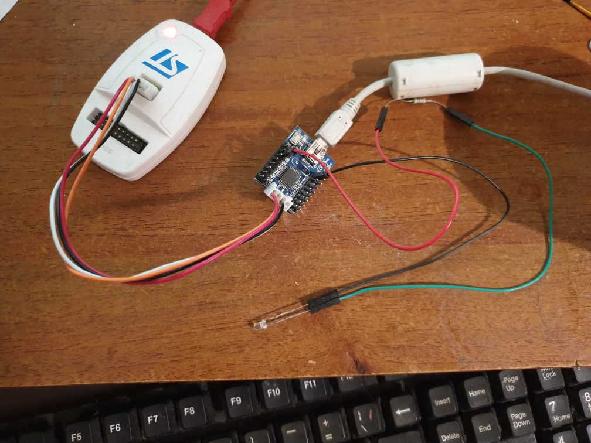
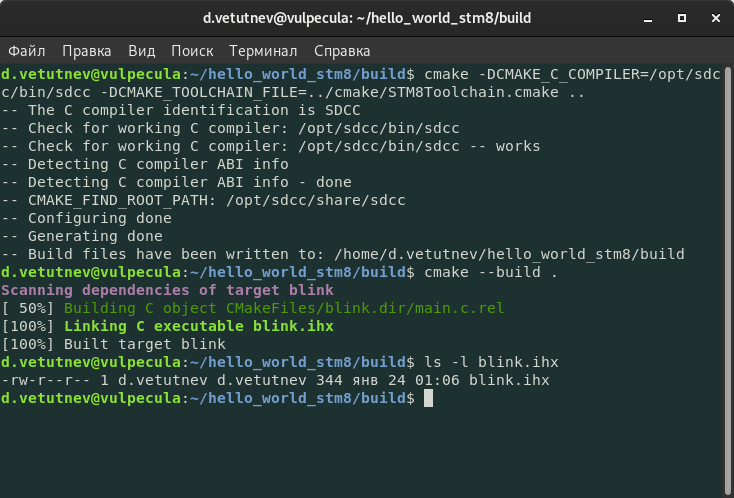
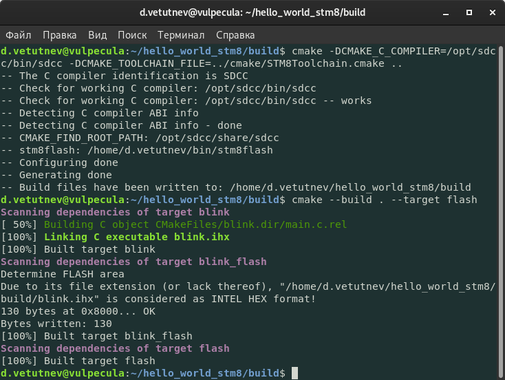
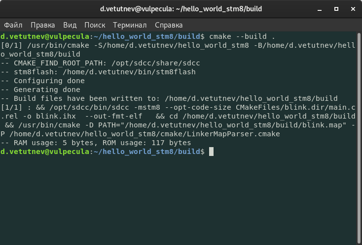
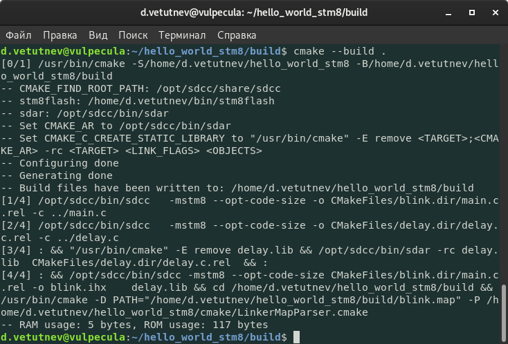

Осваиваем микроконтроллеры семейства [STM8](https://www.st.com/en/microcontrollers-microprocessors/stm8-8-bit-mcus.html?ref=kysa.me). Софт буду писать на C используя компилятор [SDCC](http://sdcc.sourceforge.net/?ref=kysa.me). Заливка прошивки в микроконтроллер производится китайским программатором ST-LINK V2,  софт для управления программатором - [stm8flash](https://github.com/vdudouyt/stm8flash?ref=kysa.me).



## Первый запуск

Полный исходник будет таким:

```c
#include <stdint.h>


typedef struct SGPIO
{
    volatile uint8_t ODR;
    volatile uint8_t IDR;
    volatile uint8_t DDR;
    volatile uint8_t CR1;
    volatile uint8_t CR2;
} GPIO;

#define GPIOB_BaseAddress 0x5005
#define GPIOB ((GPIO*) GPIOB_BaseAddress)


void delay(uint32_t t) {
    while (t--)
        ;
}

void main(void) {
    GPIOB->DDR = 0xFF;
    GPIOB->CR1 = 0xFF;
    GPIOB->CR2 = 0xFF;

    for (;;) {
        GPIOB->ODR = 0xFF;
        delay(10000UL);
        GPIOB->ODR = 0;
        delay(10000UL);
    }
}
```

Структура GPIO описывает порт микроконтроллера, у STM8 он состоит из пяти 8-битных регистров (по одному биту на каждый вывод). ODR - регистор вывода, IDR - регистор ввода, DDR - регистор направления, CR1 и CR2 - управляющие регистры (подтяжка входа, переключение выхода в режим открытого коллектора, разрешение прерываний). Поля структуры помечены как `volatile` для того, что бы компилятор не оптимизировал обращение к регистрам.  
Следующие два макроопределения указывают, что по адресу 0x5005 (по которому у STM8 расположен порт B) находится структура типа GPIO. Это дает возможность обращаться к каждому 8-битному регистру порта как к октету (байту).  
В начале функции `main` производиться инициализация порта B (все пины - выход, режим push-pull). Дальше запускается бесконечный цикл, в котором с задержкой пины порта переключаются между единицей и нулем.

Компилируем и прошиваем выходный бинарник в микроконтроллер (подразуменвается, что в переменной окружения PATH указаны пуди до компилятора и программатора):

```
sdcc -mstm8 main.c
stm8flash -c stlinkv2 -p stm8s103?3 -w main.ihx
```

Цепляем на порт B светодиод и наблюдаем наш hello world.

## Сборка при помощи CMake

Пишем toolchain-файл для CMake (у меня он размещен в cmake/STM8Toolchain.cmake):

```cmake
set(CMAKE_SYSTEM_NAME Generic)

get_filename_component(SDCC_LOCATION "${CMAKE_C_COMPILER}" DIRECTORY)
get_filename_component(SDCC_PREFIX "${SDCC_LOCATION}" DIRECTORY)
set(CMAKE_FIND_ROOT_PATH ${SDCC_PREFIX}/share/sdcc)

set(CMAKE_FIND_ROOT_PATH_MODE_PROGRAM NEVER)
set(CMAKE_FIND_ROOT_PATH_MODE_LIBRARY ONLY)
set(CMAKE_FIND_ROOT_PATH_MODE_INCLUDE ONLY)

set(CMAKE_C_FLAGS_INIT " -mstm8 --opt-code-size")
set(CMAKE_EXE_LINKER_FLAGS_INIT "")
```

Минимальный вариант CMakeLists.txt

```cmake
cmake_minimum_required(VERSION 3.9)
project(blink C)

message(STATUS "CMAKE_FIND_ROOT_PATH: ${CMAKE_FIND_ROOT_PATH}")

add_executable(blink main.c)
```

Запускаем сборку и получаем бинарник в формате Intel HEX. Путь к toolchain-файлу нужно обязательно передавать снаружи (переменная CMAKE_TOOLCHAIN_FILE). Так же требуется указать путь к бинарнику компилятор (переменная CMAKE_C_COMPILER).



Теперь добавим возможность прошивки микроконтроллера из CMake. Добавляем скрипт (cmake/stm8flash.cmake):

```cmake
find_program(STM8FLASH_PROGRAM stm8flash)
message(STATUS "stm8flash: ${STM8FLASH_PROGRAM}")
if(NOT STM8FLASH_PROGRAM)
    message(WARNING "stm8flash not found!")
endif()

add_custom_target(flash)
macro(stm8flash target)
    add_custom_target("${target}_flash" COMMAND ${STM8FLASH_PROGRAM} -c stlinkv2 -p stm8s103?3 -w $<TARGET_FILE:${target}>)
    add_dependencies("${target}_flash" ${target})
    add_dependencies(flash "${target}_flash")
endmacro()
```

В этом скрипте осущевляется поиск исполняемого файла **stm8flash** (у меня он лежит в $HOME/bin), добавляется цель **flash** и определяется макрос **stm8flash**. Макросе **stm8flash** добавляется цель-команда для запуска программатора и указываются зависимости (для того, что бы заливку (и соответственно сборку) прошивки можно было осуществить командой **cmake --build . --target flash**).  
Далее добавдяем в CMakeLists.txt подключение скрипта **stm8flash** и вызываем из него одноименный макрос с параметром имя основной цели (blink).  
CMakeLists.txt принимает такой вид:

```cmake
cmake_minimum_required(VERSION 3.9)
project(blink C)

message(STATUS "CMAKE_FIND_ROOT_PATH: ${CMAKE_FIND_ROOT_PATH}")
set(CMAKE_MODULE_PATH ${CMAKE_SOURCE_DIR}/cmake ${CMAKE_MODULE_PATH})
include(stm8flash)

add_executable(blink main.c)
stm8flash(blink)
```

Запускаем построение проекта, прошивку микроконтроллера и наблюдаем наш мигающий светодиод:



Исходники лежат [тут](https://github.com/dvetutnev/hello_world_stm8/tree/first_run?ref=kysa.me).

## Занятость RAM/ROM

Компоновщик SDCC формирует и сохраняет карту памяти при генерации итогового бинарника. Добавляем прасер этой карты, вычисляющий используемость RAM и ROM (cmake/LinkerMapParser.cmake)

```cmake
set(RAM_ADDR "0x00000000")
set(ROM_ADDR "0x00008000")
    
math(EXPR ram_addr ${RAM_ADDR} OUTPUT_FORMAT DECIMAL)
math(EXPR rom_addr ${ROM_ADDR} OUTPUT_FORMAT DECIMAL)
    
file(STRINGS ${PATH} content)
    
set(ram_usage 0)
set(rom_usage 0)
    
set(hex8digit_re "[0-9A-F][0-9A-F][0-9A-F][0-9A-F][0-9A-F][0-9A-F][0-9A-F][0-9A-F]")
foreach(line ${content})
    if(${line} MATCHES "^[A-Z]+[ \t]+(${hex8digit_re})[ \t]+${hex8digit_re} =[ \t]+([0-9]+)\\.")
        set(addr ${CMAKE_MATCH_1})
        set(size ${CMAKE_MATCH_2})
        math(EXPR addr "0x${addr}" OUTPUT_FORMAT DECIMAL)
        if(addr GREATER_EQUAL ram_addr AND addr LESS rom_addr)
            math(EXPR ram_usage "${ram_usage} + ${size}" OUTPUT_FORMAT DECIMAL)
        else()
            math(EXPR rom_usage "${rom_usage} + ${size}" OUTPUT_FORMAT DECIMAL)
        endif()
    endif()
endforeach()
    
message(STATUS "RAM usage: ${ram_usage} bytes, ROM usage: ${rom_usage} bytes")

```

Макрос для запуска этого парсера. Запуск осуществляется после каждой сборки итогового бинарника. (cmake/stm8size.cmake)

```cmake
macro(stm8size target)
    add_custom_command(
        TARGET ${target} POST_BUILD
        COMMAND ${CMAKE_COMMAND} -D PATH="$<TARGET_FILE_DIR:${target}>/${target}.map" -P ${CMAKE_SOURCE_DIR}/cmake/LinkerMapParser.cmake
    )
endmacro()
```

Подключаем в основной CMakeLists.txt:

```cmake
include(stm8size)
add_executable(blink main.c)
stm8size(blink)
```

Добавляем несколько глобальных переменных в main.c и запускаем сборку:



Обновленные исходники [тут.](https://github.com/dvetutnev/hello_world_stm8/tree/usage_resources?ref=kysa.me)

## Сборка статической библиотеки

В новых версиях SDCC заменили утилиту для сборки библиотеки с sdcclib на sdar. Так же у нее немного изменился интерфейс. CMake об этих изменениях не знает. Добавляем скрипт для обновления переменных **CMAKE_AR** и **CMAKE_C_CREATE_STATIC_LIBRARY** (cmake/AdjustAR.cmake):

```cmake
function(adjustAR var)
    if(NOT DEFINED ${var} OR ${var} MATCHES ".*-NOTFOUND$")
        find_program(SDAR_EXECUTABLE sdar PATHS "${SDCC_LOCATION}" NO_DEFAULT_PATH)

        message(STATUS "sdar: ${SDAR_EXECUTABLE}")
        set(${var} ${SDAR_EXECUTABLE} PARENT_SCOPE)
        message(STATUS "Set ${var} to ${SDAR_EXECUTABLE}")

        set(value
            "\"${CMAKE_COMMAND}\" -E remove <TARGET>"
            "<CMAKE_AR> -rc <TARGET> <LINK_FLAGS> <OBJECTS> "
        )
        set(CMAKE_C_CREATE_STATIC_LIBRARY ${value} PARENT_SCOPE)
        message(STATUS "Set CMAKE_C_CREATE_STATIC_LIBRARY to ${value}")
    endif()
endfunction()
```

Подключаем к основному CMakeLists.txt:

```cmake
include(AdjustAR)
adjustAR(CMAKE_AR)
```

Для проверки функция **delay** была вынесена в библиотеку. Лог сборки:



Обновленный проект [тут](https://github.com/dvetutnev/hello_world_stm8/tree/build_library?ref=kysa.me).
