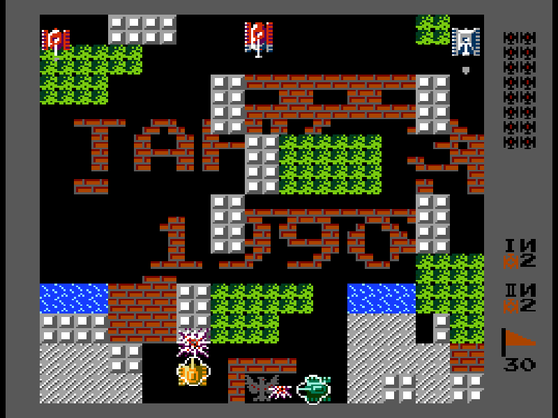
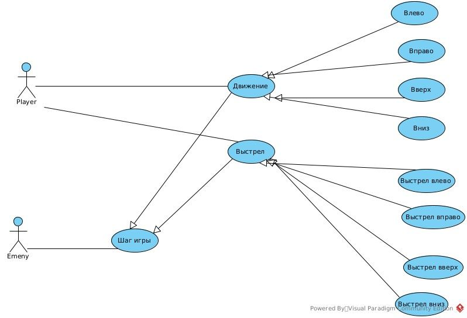
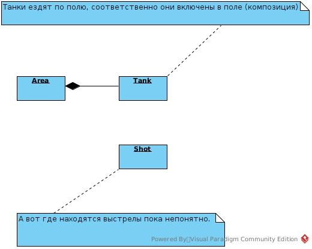
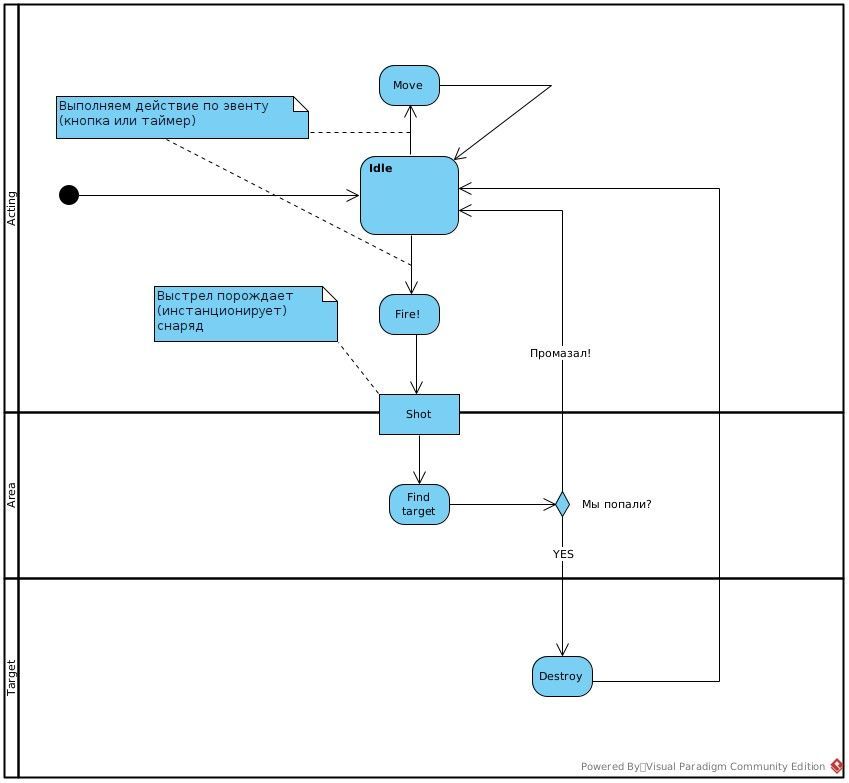
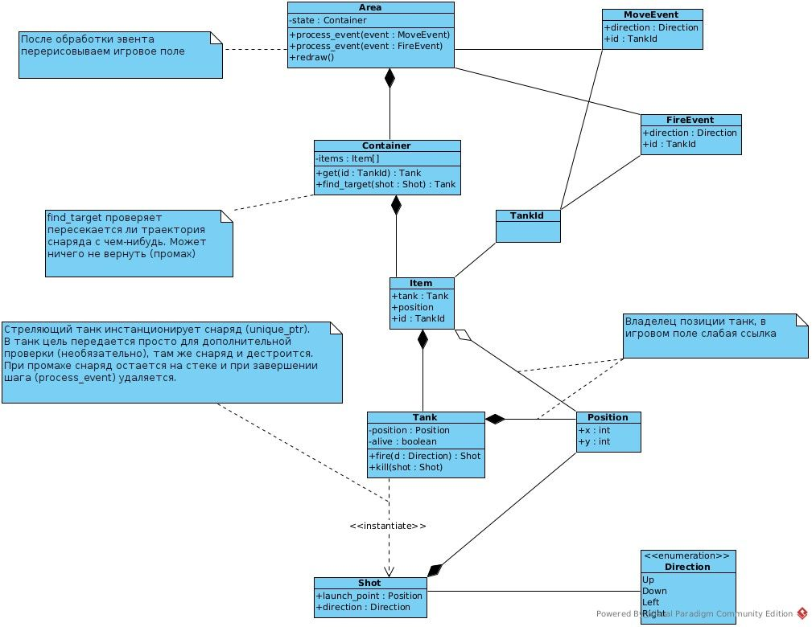
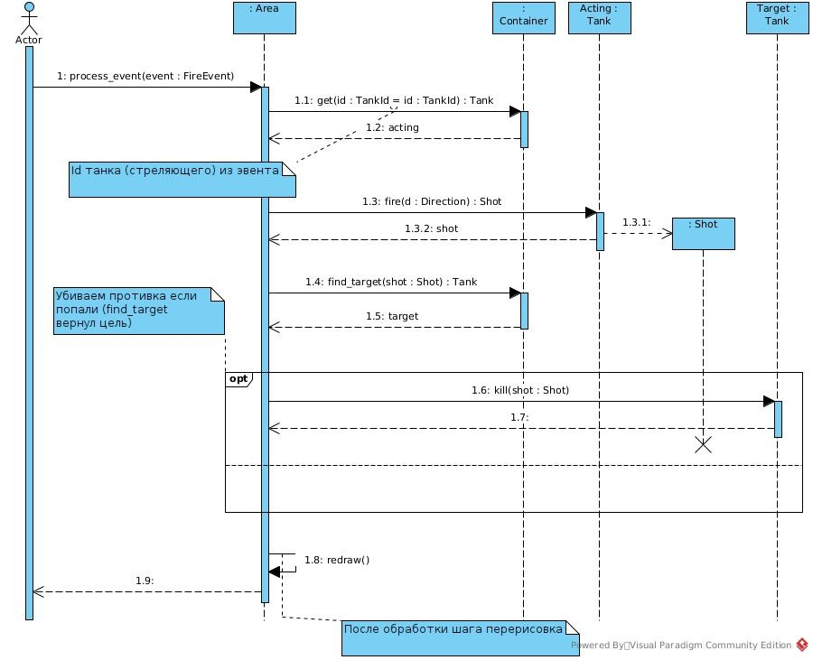

## Условия задачи.

Разработать игру “танчики” на языке С++.

- Игра состоит из игрового поля. На поле располагаются танки и препятствия.
- Танки делятся на два вида: игровые и танки противника.
- Игровые танки управляются игроком при помощи клавиатуры. Их может быть не более двух.
- Танки противника передвигаются по полю в произвольном порядке и открывают огонь с различным интервалом времени.
- Танки могут быть трех видов: легкий,средний, тяжелый. Скорость и броня обратно пропорциональна классу танка, т.е. легкий движется быстрее всех, но при первом попадании разрушается, тяжелый разрушается от трех попаданий но его скорость самая низкая.
- Игровые препятствия могут быть двух видов. Разрушаемые и не разрушаемые ( например,стена кирпичная и из сверхпрочного материала). Попадание по разрушаемому препятствию приводит к его частичному уничтожению.  
    В игре один уровень.
- При уничтожении всех танков игрока- поражение. При уничтожении всех танков противника - победа.

Дополнительно:

У игрока имеется охраняемый объект, окруженный со всех сторон кирпичной стеной. При одном попадании по объекту ( после разрушения охраняющей его стены) игра завершается - игрок проиграл. Если все танки противника уничтожены, то засчитывается победа игрока. Переход следующий уровень.

## А что вообще происходит?

По заветам [Кренга Лармана](http://www.williamspublishing.com/Books/978-5-8459-1185-8.html?ref=kysa.me) выделим волеизъявителей (акторы) и сценарии, которые они запускают (use case). И так, в игре в первую очередь изменяются танки (двигаются, стреляют). Танки управляются пользователем и компьютером-противником. Танки компьютера можно наделить волей (собственный контекст исполнения), но боюсь закопаться в многопоточности, поэтому пусть они управляются из единого центра.

Компьютеры у нас дискретные, поэтому общий случай действия противника будет _шаг игры_, какой конкретно будет вычисляться по ходу (random). Реализовывать будем сценарий выстрела.

## Чем оперируем.

Читаем условия задачки и выделяем существительные. Это будут объекты между которыми происходит взаимодействия. И так, у нас есть:

- Поле битвы
- Танки
- Летящие снаряды (они могут быть или не быть, они обладают направлением)

Для упрощения о стенах и орлах (охраняемый объект) забудем.

## Движуха.

Как уже говорилось выше, действия у нас дискретные. Шаг запускается либо нажатием кнопки (игроком), либо сигналом таймера (ход/действие компьютера). Танк может стоять (Idle), двигаться (Move) и стрелять (Fire). Движение пока не будем проектировать вглубь, разработаем происходящее при выстреле. Когда танк открывает огонь инстанционируется снаряд, вычисляется есть ли на траектории снаряда цель, и если она есть, то отмечаем попадание.

## Распределяем состояние игры.

Начнем с простого - со снаряда. У него есть точка запуска, у него есть направление, по этим данным строим луч и проверяем пересекает ли этот луч какую-нибудь цель. Для упрощения у него будет бесконечная скорость (чтобы не рассчитывать его позицию).  Танк знает свою позицию (для точки запуска снаряда), у танка есть флажок жив/убит (этот флажок в дальнейшем можно расширить до поля [HP](https://en.wikipedia.org/wiki/Health_\(game_terminology\)?ref=kysa.me)). Игровое поле я планирую использовать как точку входа и маршрутизатор эвентов, соответственно в нем должны быть танки. По игровому полю вычисляется попадание/промах выстрела. Можно конечно перебирать все (противника) танки в поле и смотреть попадает ли положение танка на луч снаряда, но это такое себе. Так что в игровом поле должны быть еще и позиции всех танков. Дублировать позицию в танке и в поле плохая идея - обновлять нужно в двух местах, возможен разъезд данных. Поэтому вынесем позицию в отдельную сущность, а в игровое поле и танк вставим ссылку на позицию.

## Целься, пли!

При приходе эвента выстрела находим в игровом поле стреляющий танк (ключ - поле Id танка в эвенте). Дальше танк на основе своей позиции и направления выстрела  (содержится в эвенте) создает снаряд. Игровое поле проверяет есть ли на пути снаряда цель, если есть, то цель помечается  убитой (метод kill танка-цели).

---

Заглавная картинка взята [отсюда](https://playminigames.ru/en/game/tank-1990?ref=kysa.me).