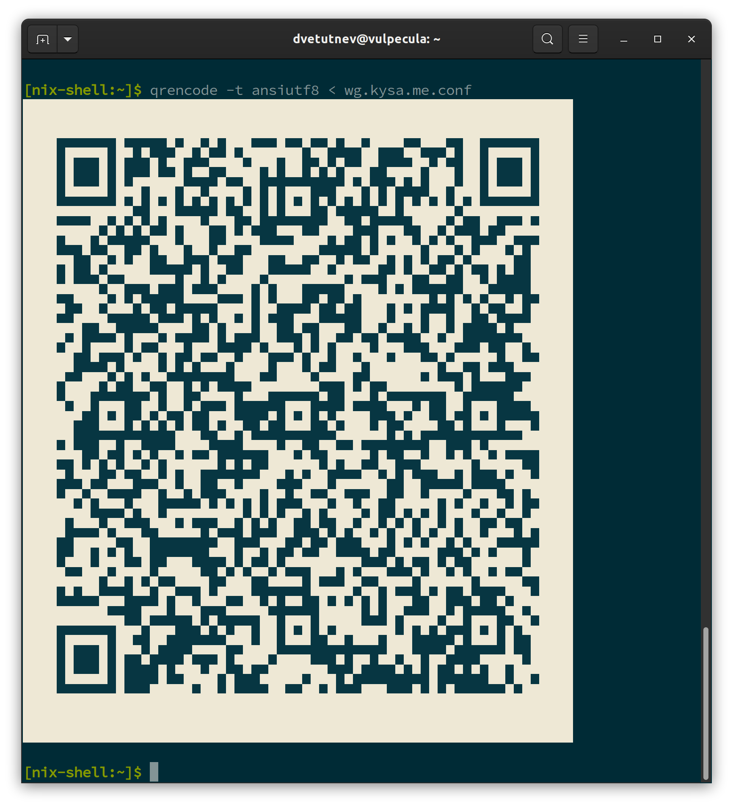
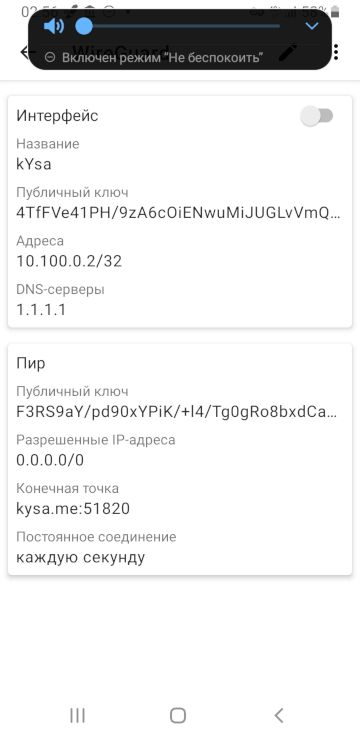

[WireGuard](https://wireguard.org/?ref=kysa.me) хоть и называется VPN-ом, но по сути это просто туннель между двумя узлами. Ключи и адреса нужно указывать на обоих сторонах туннеля, т.к. функционала передачи параметров и ключей в нем нет. Дальше маршрутизацией на клиентской стороне трафик заворачивается в туннель, а на серверной стороне включается маскарадинг сетевых адресов (NAT). За счет отказа от функционала передачи ключей и параметром получается довольно простая настройка.

## Генерация ключей

Окружение [Nix](https://nixos.org/?ref=kysa.me):

```bash
user@machine:~$ nix-shell -p wireguard-tools
```

Генерируем пару ключей, публичный ключ генерируется из приватного:

```bash
[nix-shell:~]$ wg genkey
KFowPfMqvcfF0Zz/VuuxugZxwQ1GosKJzkyKjpBC3lY=

[nix-shell:~]$ echo -n KFowPfMqvcfF0Zz/VuuxugZxwQ1GosKJzkyKjpBC3lY= | wg pubkey
vzC6SdkNri5nWHi2sAK7QRJDsdggtEyszMMPA36yySo=
```

## Сервер на [NixOS](https://nixos.wiki/wiki/WireGuard?ref=kysa.me)

```nix
{
  ...
  
  # enable NAT
  networking.nat.enable = true;
  networking.nat.externalInterface = "ens3";
  networking.nat.internalInterfaces = [ "wg0" ];
  
  networking.firewall.allowedUDPPorts = [ 51820 ];

  networking.wireguard.interfaces = {
    # "wg0" is the network interface name. You can name the interface arbitrarily.
    wg0 = {
      # Determines the IP address and subnet of the server's end of the tunnel interface.
      ips = [ "10.100.0.1/24" ];

      # The port that WireGuard listens to. Must be accessible by the client.
      listenPort = 51820;

      # This allows the wireguard server to route your traffic to the internet and hence be like a VPN
      # For this to work you have to set the dnsserver IP of your router (or dnsserver of choice) in your clients
      postSetup = ''
        ${pkgs.iptables}/bin/iptables -t nat -A POSTROUTING -s 10.100.0.0/24 -o ens3 -j MASQUERADE
      '';

      # This undoes the above command
      postShutdown = ''
        ${pkgs.iptables}/bin/iptables -t nat -D POSTROUTING -s 10.100.0.0/24 -o ens3 -j MASQUERADE
      '';

      privateKey = "server_private_key";

      peers = [
        {
          publicKey = "home_pc_public_key";
          allowedIPs = [ "10.100.0.2/32" ];
        }
        {
          publicKey = "phone_public_key";
          allowedIPs = [ "10.100.0.3/32" ];
        }
      ];
    };
  };

}
```

## Клиент

Поднятие и настройка туннеля осуществляется утилитой [wq-quick](https://git.zx2c4.com/wireguard-tools/about/src/man/wg-quick.8?ref=kysa.me). Для нее нужно написать небольшой конфиг:

```ini
[Interface]
Address = 10.100.0.2/32
PrivateKey = home_pc_private_key
DNS = 1.1.1.1, 8.8.8.8

[Peer]
EndPoint = kysa.me:51820
PublicKey = server_public_key
AllowedIPs = 0.0.0.0/0
PersistentKeepalive = 1
```

Опция `allowedIPs = [ "0.0.0.0/0" ]` - заворачивает весь трафик в туннель (используя маршрутизацию на основе меток пакетов).  Рассмотрим это на примере лога поднятия туннеля при помощи [wq-quick](https://git.zx2c4.com/wireguard-tools/about/src/man/wg-quick.8?ref=kysa.me):

```shell-session
user@machine:~$ nix-shell -p wireguard-tools
[nix-shell:~]$ sudo `which wg-quick` wg.kysa.me.conf
[#] ip link add wg.kysa.me type wireguard
[#] wg setconf wg.kysa.me /dev/fd/63
[#] ip -4 address add 10.100.0.2/32 dev wg.kysa.me
[#] ip link set mtu 1420 up dev wg.kysa.me
[#] resolvconf -a wg.kysa.me -m 0 -x
[#] wg set wg.kysa.me fwmark 51820
[#] ip -4 route add 0.0.0.0/0 dev wg.kysa.me table 51820
[#] ip -4 rule add not fwmark 51820 table 51820
[#] ip -4 rule add table main suppress_prefixlength 0
[#] sysctl -q net.ipv4.conf.all.src_valid_mark=1
[#] iptables-restore -n
```

Трафик интерфейса **wg.kysa.me** помечается меткой **51820** (строка 8) чтобы в дальнейшем различать wireguard-пакеты и отправлять их по обычному маршруту. Добавляется таблица маршрутизации с именем **51820**, в нее помещается дефолтный маршрут, указывающий в качестве шлюза интерфейс **wg.kysa.me** (строка 9). Трафик без метки **51820** (не wireguard-пакеты) отправляется в таблицу **51820** (строка 10). Следующая строка (11) добавляет правило поиска маршрута сначала в таблице **main** и если таковой найден с префиксом нулевой длинны (default route), то отбросить его и использовать следующие правила (таблица **51820**). Если же префикс маршрута, найденного в таблице **main** длиннее (нуля), то он используется для маршрутизации. Это правило обеспечивает работу уже существующих маршрутов (например еще один VPN). Итоговая таблица правил маршрутизации выглядит так:

```shell-session
[nix-shell:~]$ ip rule
0:	from all lookup local
32764:	from all lookup main suppress_prefixlength 0
32765:	not from all fwmark 0xca6c lookup 51820
32766:	from all lookup main
32767:	from all lookup default
```

Строки 3 и 4 добавлены при поднятия туннеля утилитой [wg-quick](https://git.zx2c4.com/wireguard-tools/about/src/man/wg-quick.8?ref=kysa.me). Правило в строке 3 обеспечивает  работу существующих специфичных маршрутов, правило в строке 4 отправляет **НЕ** wireguard-трафик  в таблицу **51820**. Подробней об маршрутизации можно почитать [тут](https://stackoverflow.com/a/68988919?ref=kysa.me).

Опция `PersistentKeealive = 1` включает периодическую (в данном случаи раз в секунду) отправку пакета для поддержания соединения. Т.к. WireGuard работает через _state-less_ протокол UDP, а клиенты как правило находятся за NAT (домашний роутер, NAT провайдера), то для получения пакетов от сервера, в таблице трансляции NAT все время должна присутствовать запись, указывающая на какой узел за NAT отправлять входящие пакеты. Эта запись добавляется при первой отправке пакета от клиента к серверу и удаляется спустя некоторое время (10-25 секунд) простоя. Включение этой опции не дает туннелю простаивать и решает проблему удаления записи из таблицы трансляции NAT.

## Android клиент

Клиент вот [этот](https://play.google.com/store/apps/details?id=com.wireguard.android&ref=kysa.me). Настраивается аналогично компу. Еще в нем есть возможность считать настройки из QR-кода. Для этого в линуксе есть утилитка с незамысловатым названием **qrencode**.

```shell-session
user@machine:~$ nix-shell -p qrencode
[nix-shell:~]$ cat phone.wg.kysa.me.conf 
[Interface]
Address = 10.100.0.2/32
PrivateKey = KFowPfMqvcfF0Zz/VuuxugZxwQ1GosKJzkyKjpBC3lY=
DNS = 1.1.1.1, 8.8.8.8

[Peer]
EndPoint = kysa.me:51820
PublicKey = vzC6SdkNri5nWHi2sAK7QRJDsdggtEyszMMPA36yySo=
AllowedIPs = 0.0.0.0/0
PersistentKeepalive = 1

[nix-shell:~]$ qrencode -t ansiutf8 < phone.wg.kysa.me.conf
```



